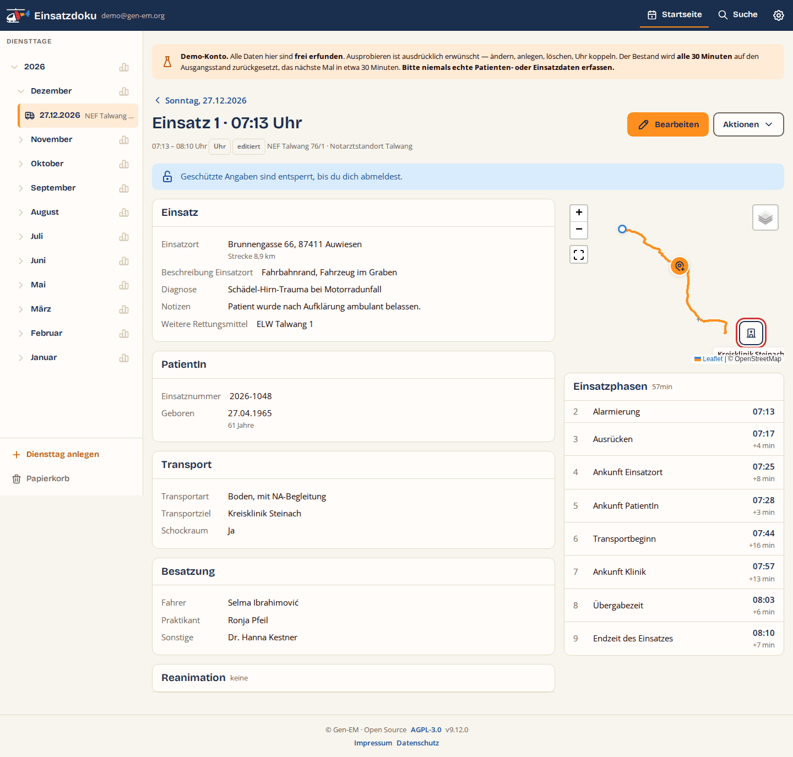
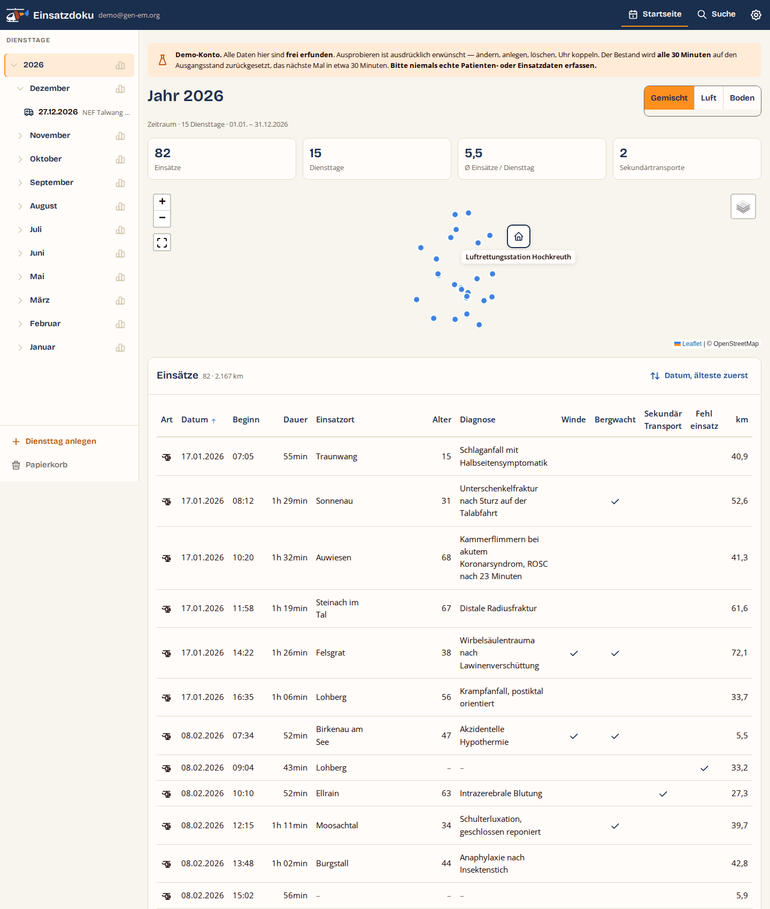

# Einsatzdoku

Dokumentation von Notarzteinsätzen — **luftgebunden wie bodengebunden**
(RTH, NEF, NAW). Eine Uhr-App (derzeit für Garmin-Uhren: Fenix 6 Pro,
Forerunner 945, Venu 3s) erfasst Einsatzphasen, GPS-Tracks und
Reanimations-Ereignisse und lädt sie auf einen eigenen Server; die Web-App
(PHP/MySQL) zeigt **Diensttage**, Einsätze und Rea-Protokolle und erlaubt
Nachtragen/Bearbeiten. Diagnose, Alter und Einsatzort sind
**Ende-zu-Ende-verschlüsselt** (Schlüssel aus dem Login-Passwort,
Wiederherstellungsschlüssel als Rettungsanker); ein verschlüsseltes
**Backup** (.edbak) sichert alle Daten in eine Datei.

Zum Ausprobieren gibt es ein **Demo-Konto** mit erfundenen Daten
(`demo@gen-em.org` / `nadokudemo0815`), das sich alle 30 Minuten selbst
zurücksetzt. Es ist die **einzige** Stelle, an der die
Ende-zu-Ende-Verschlüsselung bewusst ausgesetzt ist — sein Schlüsselmaterial
liegt auf dem Server, damit die Rücksetzung funktioniert. Näheres im Handbuch
(Abschnitt 3.2) und in `docs/Technik.md` 4.99a.

## So sieht es aus

| | |
|---|---|
|  | **Tagesübersicht**, 1440 px: links die Diensttage nach Jahr und Monat, oben die Angaben des Tages, darunter Karte und Einsatztabelle. |
|   | **Dasselbe bei 390 px.** Aus der Tabelle wird eine Kachelliste, aus der Leiste eine Schublade hinter dem Menüknopf. Keine Seite läuft waagerecht aus dem Bild — in keiner der acht geprüften Breiten. |
|  | **Einsatzansicht:** Phasen, Karte, geschützte Angaben. Diagnose, Alter und Einsatzort werden erst im Browser entschlüsselt. |
|  | **Zeitraum:** Kennzahlen je Jahr oder Monat, darunter dieselbe Einsatztabelle wie in der Suche. |

## Dokumentation

| Dokument | Inhalt |
|---|---|
| [`docs/Handbuch.md`](docs/Handbuch.md) | Vorstellung und Bedienung aller Funktionen (Uhr + Web) |
| [`docs/Technik.md`](docs/Technik.md) | Architektur, Datenmodell, Abläufe, Build, Deployment, **Betrieb/Runbook** |
| [`docs/CHANGELOG.md`](docs/CHANGELOG.md) | Änderungshistorie |
| [`docs/JSON-Vertrag.md`](docs/JSON-Vertrag.md) | Schnittstelle Uhr/Fremdquellen → Server |
| [`docs/Backup-Format.md`](docs/Backup-Format.md) | Aufbau der `.edbak` und was **nicht** darin steht |
| [`docs/Export-Format.md`](docs/Export-Format.md) | CSV- und Excel-Export, Rückimport |
| [`docs/Backlog.md`](docs/Backlog.md) | bewusst offene Punkte, Nummern sind dauerhaft |
| [`docs/Design.md`](docs/Design.md) | Gestaltungsrichtlinie: Farben, Token, Schwellen, Symbole, Bausteine, Seitentypen — verbindlich für jede Oberflächenänderung |
| [`docs/Lizenzen.md`](docs/Lizenzen.md) | Bibliotheken, Schriften, Symbole und Dienste — Herkunft, Version, Lizenz |
| [`docs/Geraete-Eingabe.md`](docs/Geraete-Eingabe.md) | gemessenes Eingabeverhalten je Uhrmodell |
| [`docs/Uhr-Layout_Regeln.md`](docs/Uhr-Layout_Regeln.md) | Layoutregeln der Uhr-Oberflächen |
| [`docs/konzepte/erledigt/Konzept-S1-Sicherung-Import.md`](docs/konzepte/erledigt/Konzept-S1-Sicherung-Import.md) | Konzept der Phase S1 (Sicherung und Rückspielweg) |
| [`docs/konzepte/erledigt/Pruefdokument-S1-Sicherung-Import.md`](docs/konzepte/erledigt/Pruefdokument-S1-Sicherung-Import.md) | Prüfdokument dazu: was geprüft ist, was noch zu tun bleibt |
| [`docs/konzepte/erledigt/Konzept-P2-Terminologie.md`](docs/konzepte/erledigt/Konzept-P2-Terminologie.md) | Konzept der Phase P2 (neutraler Wortlaut Land/Luft) |
| [`docs/konzepte/erledigt/Pruefdokument-P2-Terminologie.md`](docs/konzepte/erledigt/Pruefdokument-P2-Terminologie.md) | Prüfdokument dazu |
| [`docs/konzepte/erledigt/Pruefung-Sofortpaket-22.md`](docs/konzepte/erledigt/Pruefung-Sofortpaket-22.md) | Prüfdokument des Sofortpakets zu Backlog Nr. 22 (Web 7.2.1) |
| [`tools/referenzdatensatz/LIESMICH.md`](tools/referenzdatensatz/LIESMICH.md) | erfundener Beispielbestand: Demo-Konto **und** Regressionsreferenz |
| [`tools/wortliste/LIESMICH.md`](tools/wortliste/LIESMICH.md) | zählt nach, ob Oberfläche und Dokumentation neutral von Land und Luft sprechen |

## Schnellstart

**Server:** `server/` auf den Webspace, leere MySQL-DB bereitstellen,
`index.php` aufrufen → der Installer führt durch die Einrichtung
(Details: Technik-Doku, Abschnitt Betrieb).

**Uhr (Garmin, Connect IQ):** `watch/` mit VS Code + Monkey-C-Erweiterung +
Connect-IQ-SDK bauen (Ziele `fenix6pro`, `fr945`, `venu3s`; vorher die
Server-Domain in `properties.xml` eintragen), `.prg` per USB nach
`GARMIN/Apps/`, dann **per Code koppeln**: Web → Einstellungen → Geräte →
Code erzeugen; auf der Uhr: Sync-Seite → Gerät koppeln → Code eintippen
(Details: Handbuch, Abschnitte 10 und 12; Tastenwege je Uhr in 2.0).

**Deployment:** Push auf `main` deployt `server/` automatisch per FTPS
(GitHub Actions). Nach DB-Änderungen als Admin `update.php` aufrufen.
