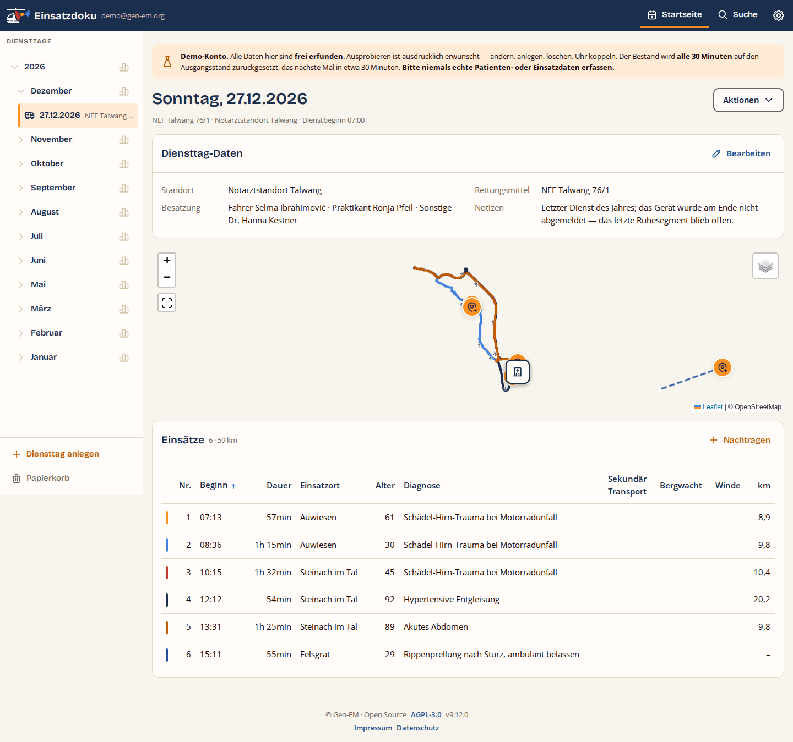
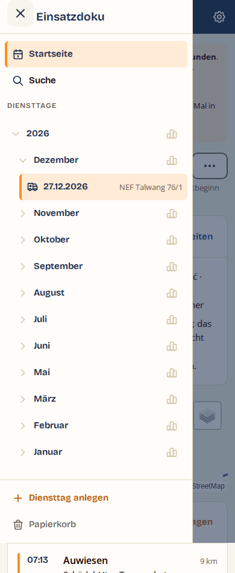
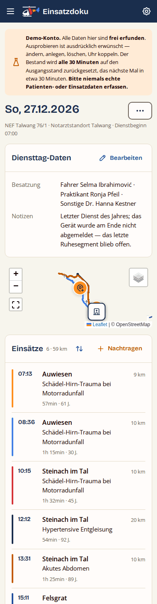

# Einsatzdoku — Handbuch

*Stand: 24.08.2026 · Für die technische Struktur siehe `Technik.md`, für
Änderungen `CHANGELOG.md`.*

## 1. Was ist die Einsatzdoku?

Die Einsatzdoku dokumentiert Notarzteinsätze direkt vom Handgelenk — luft-
gebunden wie bodengebunden (RTH, NEF, NAW): Eine Uhr-App (derzeit für
Garmin-Uhren: Fenix 6 Pro, Forerunner 945, Venu 3s) erfasst Einsatzphasen
mit Zeitstempeln, GPS-Tracks und
Reanimations-Ereignisse und lädt alles automatisch auf einen eigenen Server.
Die Web-Oberfläche zeigt Diensttage mit Karte, Einsatz-Details
und Reanimations-Protokollen — und erlaubt Nachtragen und Bearbeiten von Hand.

**Patientendaten sind geschützt.** Nachname, Vorname, Geburtsdatum, Alter,
Diagnose, der Einsatzort und seine Beschreibung werden
**Ende-zu-Ende-verschlüsselt** gespeichert:
Der Browser ver- und entschlüsselt sie mit einem Schlüssel aus deinem
Login-Passwort, der Server sieht nur Chiffretext (Abschnitt 5). Notizen und
Freitextfelder sind davon **nicht** erfasst — dort gehören keine
Patientendaten hinein.

---

## 2. Die Uhr-App

### 2.0 Unterstützte Uhren und ihre Bedienung

Die App läuft auf der **Fenix 6 Pro**, der **Forerunner 945** und der
**Venu 3s**. Fenix und Forerunner werden gleich bedient. Die Venu 3s hat nur
zwei Tasten, die Apps überhaupt erreichen — die mittlere ist von Garmin
belegt — und wird deshalb zusätzlich über den Touchscreen bedient:

| Auf Fenix / Forerunner | Auf der Venu 3s |
|---|---|
| kurz UP / DOWN | nach oben / unten wischen |
| kurz START | kurz Action (Taste oben rechts) |
| lang START | lang Action **oder** lang Zurück |
| lang UP / lang DOWN | nicht verfügbar — die Ereignisse liegen im Rea-Untermenü |
| BACK | kurz Zurück (Taste unten rechts) oder nach rechts wischen |

Der lange Druck liegt auf der Venu bewusst doppelt: Sollte die Uhr den langen
Druck der Action-Taste für ihr eigenes Steuerungsmenü abfangen, bleibt die App
über den langen Zurück-Druck vollständig bedienbar.

**Auch die Kopplung folgt dieser Tabelle.** Sie startet auf der Sync-Seite mit
*lang START* (Abschnitt 2.2) — auf der Venu 3s also mit lang Action oder lang
Zurück. Die Weboberfläche und Abschnitt 12 beschreiben den Ablauf gerätefrei
und verweisen für den Tastenweg hierher.

**Tippen auf den Bildschirm bewirkt auf den Hauptseiten nichts.** Das ist
Absicht — unter Einsatzbedingungen soll eine versehentliche Berührung nichts
auslösen. In Menüs kann ein Tippen den gerade markierten Eintrag auswählen.

Uhren mit Touchscreen **und** UP/DOWN-Tasten (Fenix 7 und neuer) werden noch
nicht ausgeliefert. Für sie gibt es in den App-Einstellungen bereits den
Schalter **„Touchbedienung verwenden"**; auf der Venu 3s hat er keine Wirkung,
weil sie ohne Touch unbedienbar wäre.

### 2.1 Dienst beginnen und beenden

Beim Öffnen der App erscheint **„Dienst beginnen?"**. Erst ein Druck auf
**START** aktiviert die App und die GPS-Aufzeichnung — vorher passiert nichts.
Der Diensttag läuft, bis du ihn über das Schnellmenü mit **„Einsatztag beenden"**
(Sicherheitsabfrage) schließt; dabei werden Restdaten hochgeladen. Das Datum
des Diensttags ist das Datum des Dienstbeginns — auch bei Diensten über
Mitternacht.

**Jeder Druck auf START erzeugt einen eigenen Diensttag.** Zwei Dienste an einem
Kalendertag sind damit möglich und vorgesehen — etwa ein Hubschrauberdienst am
Tag und ein NEF-Nachtdienst am Abend. Beide erscheinen im Web als getrennte
Zeilen, unterschieden durch die Uhrzeit des Dienstbeginns.

Wurde die App während **eines** Dienstes versehentlich mehrfach gestartet, sind
daraus mehrere Diensttage geworden. Im Web lassen sie sich wieder
zusammenführen (Abschnitt 4.5a).

**Die Uhr kennt die Einsatzart nicht.** Sie fragt weder nach Standort noch nach
Rettungsmittel; beides trägst du im Web nach. Bis dahin ist der Diensttag
*neutral* — Zeiten, Phasen, Track und Reanimation werden trotzdem vollständig
erfasst.

Ein Neustart der Uhr oder der App mitten im Dienst ist unkritisch: Phase,
Track und eine laufende Reanimation werden nahtlos fortgesetzt.

### 2.2 Die Oberflächen

Mit **kurz UP/DOWN** blätterst du im Kreis durch: **Uhr → Tempo → Statistik →
Sync → Reanimation**.

**Uhr (Hauptanzeige):** groß die Uhrzeit, darunter klein das Datum, darunter
die aktuelle Phase (Zahl + Name). Läuft eine Reanimation, umschließt ein roter
Ring die Anzeige — auf einen Blick erkennbar.

- **kurz START** schaltet zur nächsten Phase (mit Zeitstempel und Position):
  1 Frei → 2 Alarmierung (= Einsatzbeginn) → 3 Ausrücken → 4 Ankunft Einsatzort →
  5 Ankunft PatientIn → 6 Transportbeginn → 7 Ankunft Klinik →
  8 Übergabezeit → 9 Endzeit → 10 Beendigung (= Einsatzende, zurück zu 1).

  Phase 3 hieß bis Uhr 1.7.0 „Abflug", Phase 7 „Landung Krankenhaus". Seit
  1.8.0 sind beide neutral benannt, weil dieselbe Uhr auch am NEF läuft.
  Nummerierung, Bedeutung und Reihenfolge sind unverändert.
- **lang START** öffnet das **Schnellmenü**: eine Phase direkt anspringen
  (erneutes Setzen erzeugt einen *zusätzlichen* Zeitstempel — nichts wird
  überschrieben), „Einsatzübersicht Zeiten" (Liste aller Zeitstempel) und
  „Einsatztag beenden".
  Drückst du während des langen START-Drucks zusätzlich eine andere Taste,
  bleibt das Menü zu — die App erkennt daran die **Tastensperre** der Uhr. So
  kollidiert das Sperren nicht mehr mit dem Schnellmenü.
- **BACK** fragt nach, bevor die App verlassen wird.

**Tempo:** aktuelle Geschwindigkeit (km/h) groß, darunter die im Einsatz
zurückgelegten Kilometer.

**Statistik:** Kennzahlen des laufenden Dienstes.

**Sync:** Beantwortet die Frage, ob alles beim Server angekommen ist. Die
Seite kennt dafür drei Antworten:

| Anzeige | heißt |
|---|---|
| Grün „Sync vollständig" mit Haken | Alles übertragen — und die Uhr *kann* übertragen |
| Orange Zahl, darunter „Pakete offen" | So viele abgeschlossene Pakete warten noch |
| Rot „Nicht eingerichtet" | Die Uhr kann gar nicht senden; darunter steht, was fehlt |

Der dritte Fall ist der Zustand vor der Einrichtung. Darunter steht der
nächste Schritt — entweder „Erst Server-Adresse setzen" (das geschieht in
Garmin Connect, nicht auf der Uhr) oder der Tastenweg zum Koppeln. Die
Reihenfolge ist zwingend: Ohne Server-Adresse ist Koppeln nicht möglich.

**Grün gibt es also nur, wenn beides steht** — Adresse und Kopplung. Bis Uhr
1.10.0 erschien „Sync vollständig" auch vor der ersten Einrichtung, weil die
Seite nur zählte, was zum Senden bereitlag; vor dem ersten Dienst ist das zu
Recht nichts. Die Aussage war trotzdem falsch: Sie sprach über einen Weg, den
die Uhr nie benutzt hatte.

Über der Antwort steht die **GPS-Güte**: „GPS gut" oder „GPS ausreichend"
(grün) heißt, dass Positionen aufgezeichnet werden; „GPS zu schwach" (rot)
bedeutet, dass die Uhr gerade keine Punkte speichert. Außerhalb eines Dienstes
steht dort „GPS aus". Unten die App-Version, bei Problemen der Fehlergrund;
mit **START gedrückt halten** startest du hier die Geräte-Kopplung.

**Reanimation:** siehe 2.3.

### 2.3 Reanimationsmodus

Zwei Timer: oben im schwarzen Kopfbalken die **Gesamtdauer** seit Rea-Beginn,
mittig groß der **2:00-Countdown** für den Zyklus, darunter ein
Fortschrittsbalken. Bei 0:00 vibriert die Uhr fünfmal kräftig; der Countdown
bleibt rot auf 0:00 stehen, bis er neu gestartet wird.

| Taste | Wirkung |
|---|---|
| kurz START, **keine** Rea läuft | Reanimation **beginnen** |
| kurz START, Rea **läuft** | **Untermenü** öffnen |
| lang START, Rea **läuft** | Countdown **neu starten** (2:00) |
| lang START, **keine** Rea läuft | ohne Funktion |
| lang UP | **Adrenalingabe** dokumentieren |
| lang DOWN | **Rhythmuskontrolle** dokumentieren (setzt Countdown auf 2:00) |
| kurz UP/DOWN | Oberfläche wechseln (Timer laufen weiter) |
| BACK | zurück zur Hauptanzeige (Timer laufen weiter) |

Der häufigste Griff während einer laufenden Reanimation ist das Dokumentieren
eines Ereignisses. Deshalb liegt das Untermenü auf dem **kurzen** Druck — der
lange Druck ist dem Countdown vorbehalten.

**Untermenü** (farbcodiert, endlos scrollbar, in derselben Darstellung wie das
Schnellmenü der Hauptanzeige) in dieser Reihenfolge:

| Eintrag | Wirkung |
|---|---|
| Timer neu starten | setzt den Countdown auf 2:00 — **ohne** Zeitstempel |
| Rhythmuskontrolle | Zeitstempel **und** Countdown-Neustart |
| Defibrillation | Zeitstempel **und** Countdown-Neustart |
| Adrenalin | Zeitstempel |
| Amiodaron | Zeitstempel |
| Zugang | Zeitstempel |
| Intubation | Zeitstempel |
| Sonographie | Zeitstempel |
| ROSC | Zeitstempel |
| Tod | Zeitstempel |
| Rea BEENDEN | hält die Reanimation an und öffnet die Übersicht (s. u.) |
| Übersicht | zeigt alle Zeiten der laufenden Rea |

Das Menü öffnet auf „Timer neu starten". Ein Schritt **nach oben** landet auf
„Übersicht", zwei Schritte auf „Rea BEENDEN".

**Reanimation beenden — zweistufig.** „Rea BEENDEN" schließt die Rea nicht
sofort, sondern **hält sie an** und öffnet die Übersicht. Ganz oben stehen dort
zwei Einträge:

- **Rea fortsetzen** — weiter mit frischem 2:00-Zyklus.
- **Rea beenden** — die Reanimation ist endgültig abgeschlossen.

So fällt die Entscheidung mit den dokumentierten Zeiten vor Augen, und ein
Vertippen schließt nichts mehr versehentlich. Triffst du keine Entscheidung
und gehst mit BACK zurück, bleibt die Rea **pausiert** — alle Seiten zeigen
das an, der rote Ring der Hauptanzeige wird gelb. Der Zustand übersteht auch
einen Neustart der Uhr.

Während der Pause steht der Countdown. Die **Gesamtdauer läuft weiter**: Sie
ist die tatsächlich verstrichene Reanimationszeit und würde sonst zu kurz
dokumentiert.

Nach dem Beenden startet **kurz START** eine *neue* Reanimation — mehrere pro
Einsatz sind möglich, jede bekommt im Web ihre eigene Tabelle. Bei Einsatzende
wird eine laufende oder pausierte Rea automatisch geschlossen.

### 2.4 Datenübertragung

Die Uhr lädt selbstständig hoch: Einsätze beim Abschluss des Einsatzes, den Ruhe-Track etwa
stündlich, den Rest beim Dienstende. Ohne Verbindung puffert die Uhr sicher im
Speicher und sendet später nach — gelöscht wird lokal erst, wenn der Server
den vollständigen Empfang bestätigt hat. Den aktuellen Stand zeigt die
**Sync-Seite**.

---

## 3. Die Web-Oberfläche — Überblick

Die Kopfleiste zeigt links das Logo und den Namen **Einsatzdoku**; am breiten
Bildschirm steht der eigene Name daneben (im Profil setzbar, sonst die
E-Mail-Adresse). Rechts stehen **Startseite**, **Suche** (Abschnitt 4.6) und
das Zahnrad für die **Einstellungen**. Sie bleibt beim Scrollen oben stehen.
Nach 30 Minuten ohne Aktivität meldet das System automatisch ab.



**Auf schmalen Geräten** — Handy und Tablet im Hochformat — zeigt die
Kopfleiste stattdessen links einen Knopf mit drei Strichen. Er öffnet die
**Schublade**: dieselbe Leiste, die am breiten Bildschirm dauerhaft links
steht, hier von links hereingeschoben. Ganz oben liegen Startseite und Suche,
darunter der Teil, der zur Seite gehört (Diensttage, Einstellungen oder die
Filter der Suche). Schließen lässt sie sich auf drei Wegen: über das × oben
links, über die abgedunkelte Fläche daneben oder mit der Esc-Taste.

**Das Zahnrad führt auf die Einstellungs-Übersicht.** Sie listet Profil,
**Standorte**, **Rettungsmittel**, Geräte, Backup und Import / Export; Admins
finden darunter einen zweiten Block **Administration** mit NutzerInnen,
**Stammdaten systemweit**, Sicherungen, **Sicherungsziele**, **Rechtstexte**,
Demo-Konto und Wartung (Abschnitt 11). Abmelden steht getrennt am Ende und
fragt sicherheitshalber nach. Bis Web 6.3.0 hieß der Punkt für Standorte und
Rettungsmittel zusammen „Standortdaten"; der alte Link führt weiterhin zu
„Standorte".



Die **Diensttage-Leiste** begleitet alle Inhaltsseiten — auch Einsatzansicht
und Formular. Sie ist nach Jahr und Monat gruppiert (Abschnitt 4.4).

**Handlungen an einer Zeile** — bearbeiten, verschieben, löschen — stehen am
Schreibtisch als Knöpfe am rechten Zeilenrand. Auf schmalen Geräten steht dort
**ein** Knopf mit drei Punkten (**⋯**); er öffnet ein Blatt von unten, in dem
dieselben Handlungen untereinander stehen, „Löschen" rot und abgesetzt. Das
gilt überall: Stammdaten, Geräte, NutzerInnen, Papierkorb.

**Ganz unten auf jeder Seite** steht die Fußzeile — auch vor der Anmeldung.
Sie ist zweizeilig: oben Lizenz und Versionsnummer, darunter die Verweise auf
**Impressum** und **Datenschutz**. Beide Seiten sind ohne Anmeldung erreichbar;
was darin steht, hinterlegt die Administration (Abschnitt 11.3).

Die einzige Seite ohne diese Verweise ist der **Einrichter**: Er läuft, bevor
die Anwendung eine Datenbank hat, und die beiden Rechtstextseiten brauchen
eine.

**Wenn ein Link ins Leere führt.** Ein Lesezeichen auf einen gelöschten
Einsatz, eine Adresse aus einer alten E-Mail, ein Diensttag im Papierkorb:
Dann erscheint eine Seite mit der Kopfleiste, einem kurzen Satz („Einsatz nicht
gefunden.") und einem Rückweg zur Übersicht. Seit Web 7.2.0 sieht das überall
gleich aus; vorher stand dort nur der Satz auf weißem Grund, ohne Menü und ohne
Weg zurück.

### 3.1 Anmelden und Passwort

Anmeldung mit E-Mail-Adresse und Passwort. Über **„Passwort vergessen oder
erstmalig setzen"** kommt ein Link per E-Mail (1 Stunde gültig) — derselbe Weg
dient auch der Erst-Einrichtung nach dem Anlegen durch den Admin. Beim
Zurücksetzen wird zusätzlich der Wiederherstellungsschlüssel abgefragt
(Abschnitt 5); bei der Erst-Einrichtung entfällt das, weil noch keine
verschlüsselten Daten vorliegen.

**Es gilt immer nur der zuletzt verschickte Link.** Forderst du einen neuen an,
wird der vorherige damit ungültig. Nimm also die neueste E-Mail — eine ältere
führt zu „Link ungültig oder abgelaufen".

**Die Passwortstärke** zeigt sich beim Tippen als Balken aus vier Segmenten:
je mehr gefüllt, desto besser. Rot heißt zu kurz oder zu leicht zu raten,
Orange geht, Dunkelblau ist gut. Die Stärke des Passworts ist unmittelbar die
Stärke der Verschlüsselung — es schützt nicht nur den Zugang, sondern leitet
den Schlüssel ab, mit dem Diagnose, Alter und Einsatzort verschlüsselt werden
(Abschnitt 5).

**Nach mehreren Fehlversuchen wird die Anmeldung vorübergehend gesperrt.** Die
Meldung nennt, ab wann es wieder geht. Die Sperre gilt für das Konto, nicht für
den Browser: Ein anderes Gerät oder ein neues Fenster hilft nicht. Sobald die
Anmeldung einmal gelingt, ist die Zählung zurückgesetzt.

Dasselbe gilt für „Passwort vergessen": Wer den Knopf zu oft drückt, bekommt
eine Zeit lang keine weitere E-Mail. Die Seite antwortet dabei unverändert —
sie verrät nie, ob es zu einer Adresse ein Konto gibt.

**Wenn eine Fehlermeldung eine Kennung nennt** — acht Zeichen aus Ziffern und
Buchstaben —, dann notiere sie. Der vollständige Fehlertext steht unter dieser
Kennung im Fehlerprotokoll des Webspace; ohne sie ist er dort nicht
wiederzufinden. Auf dem Bildschirm steht er bewusst nicht: Solche Texte nennen
Interna der Datenbank, die niemanden etwas angehen.

**Groß- und Kleinschreibung der E-Mail-Adresse spielt keine Rolle.**
`Max@Beispiel.de` und `max@beispiel.de` sind dasselbe Konto.

**Der Link aus der E-Mail braucht Cookies.** Beim ersten Öffnen nimmt die Seite
ihn aus der Adresszeile — er soll weder im Verlauf des Browsers noch in
Serverprotokollen stehen bleiben. Wer Cookies für die Seite blockiert, bekommt
statt der Passwortseite den Hinweis „Cookie nötig". Ein neuer Link hilft dann
nicht; die Einstellung muss geändert werden.

**Ein Passwortwechsel meldet alle anderen Sitzungen ab.** Wer sein Passwort
ändert, ist danach überall sonst ausgeloggt — auf dem zweiten Rechner, auf dem
Tablet, in einem anderen Browser. Am Gerät, an dem der Wechsel stattfindet,
bleibt man angemeldet. Wer den Verdacht hat, dass jemand anders Zugriff hat,
erreicht damit genau das Gewünschte. Noch offene Links zum Zurücksetzen werden
gleichzeitig ungültig.

Die abgemeldete Seite sagt, warum: „Das Passwort dieses Kontos wurde geändert."
Ebenso, wenn ein Konto von der Verwaltung gelöscht wurde — dann endet die
Sitzung beim nächsten Klick, nicht erst beim nächsten Anmelden.

**Schlägt ein Passwortwechsel fehl, ändert sich nichts.** Bis Web 4.5.1 konnte
ein abgelehnter Versuch — falsches aktuelles Passwort, zu lange offenes
Formular — dazu führen, dass die geschützten Angaben im selben Tab nicht mehr
lesbar waren, bis man sich neu anmeldete. Das ist behoben.

**Rollenänderungen wirken sofort.** Wird jemandem die Admin-Rolle gegeben oder
genommen, gilt das ab dem nächsten Klick; ein Ab- und Anmelden ist nicht nötig.

---

### 3.1a Profil: Name, Adresse und Logo

Unter dem Zahnrad → **Profil** stehen dein Anzeigename (er erscheint in der
Kopfleiste neben der Marke), deine Anmelde-Adresse und seit Web 9.7.0 die
**Logo-Wahl**.

Die Anwendung bringt zwei Logos mit — einen Hubschrauber und ein Fahrzeug.
Welches du siehst, entscheidest du selbst:

| Wahl | Bedeutung |
|---|---|
| **Standard der Installation** | folgt der Vorgabe dieser Installation. Was das gerade ist, steht rechts daneben. Das ist die Voreinstellung. |
| **Hubschrauber (RTH)** | immer der Hubschrauber |
| **Fahrzeug (NEF)** | immer das Fahrzeug |
| **Wechselnd** | bei jeder Anmeldung neu ausgewürfelt |

Die Wahl gilt für die **Kopfleiste und das Symbol im Browser-Tab** — beide
wechseln gemeinsam. Sie wirkt sofort nach dem Speichern; abmelden musst du
dich dafür nicht.

„Wechselnd" heißt **je Anmeldung**, nicht je Seite: Innerhalb einer Sitzung
bleibt das Logo, wie es ist. Ein Logo, das beim Blättern springt, wäre keine
Abwechslung, sondern Unruhe.

Die **Anmeldeseite** zeigt immer den Standard der Installation. Dort ist noch
niemand angemeldet, und die Wahl hängt am Konto. (Bis Web 9.9.0 zeigte sie
stattdessen immer den Hubschrauber, gleich wie der Standard eingestellt war.)

Den **Standard der Installation** setzt die Administration unter
Einstellungen → Wartung. Er wirkt sofort, auch für bereits angemeldete Konten —
aber nur bei denen, die hier „Standard der Installation" stehen haben. Eine
getroffene eigene Wahl bleibt unberührt.

### 3.2 Demo-Konto — ausprobieren, ohne etwas kaputtzumachen

Es gibt ein Konto, in dem sich alles gefahrlos ausprobieren lässt:

| | |
|---|---|
| Adresse | `demo@gen-em.org` |
| Passwort | `nadokudemo0815` |

**Alle Daten darin sind frei erfunden.** Die Orte, Kliniken, Rettungsmittel
und Besatzungsnamen gibt es nicht; die Diagnosen gehören zu niemandem. Der
Datensatz ist so gebaut, dass jede Funktion der Anwendung darin vorkommt —
Luft- und Bodeneinsätze, Windeneinsätze, Bergwacht, Reanimationen, ein Dienst
über Mitternacht, ein Diensttag ohne Einsatz, ein gefüllter Papierkorb.

**Ausprobieren ist ausdrücklich erwünscht.** Ändere Einsätze, lege neue an,
lösche welche, pflege Stammdaten, koppele eine Uhr. Es geht nichts verloren,
was jemandem fehlen würde.

**Alle 30 Minuten setzt sich das Konto selbst zurück.** Danach ist der
Ausgangsstand wieder da und deine Änderungen sind fort — auch die, die du
gerade noch gebraucht hättest. Ein Banner am oberen Rand erinnert daran und
nennt, wann es das nächste Mal so weit ist.

**Was im Demo-Konto nicht geht:** E-Mail-Adresse und Passwort lassen sich
nicht ändern, und „Passwort vergessen" führt für diese Adresse zu nichts.
Beides ist Absicht — die Zugangsdaten sind öffentlich und müssen es bleiben,
damit die nächste Person hereinkommt. Alles andere ist offen.

**Und in der Administration** (seit Web 12.4.1): Auf der Kontoseite des
Demo-Kontos sind Ändern, Sichern, Einspielen, Freigeben und Löschen
**gesperrt**, die Karte „Sicherungen" fehlt dort ganz, und der Anzeigename
lautet **„Demo NutzerIn"**. Verwaltet wird das Konto ausschließlich über den
Reiter **Demo-Konto**: anlegen, zurücksetzen, entfernen. Der Grund ist der
Reset — was auf der Kontoseite eingetragen würde, wäre spätestens nach dreißig
Minuten wieder weg, und zwar ohne Hinweis. **Die Geräte bleiben offen:** Eine
Uhr zu koppeln ist gerade der Sinn dieses Kontos, und der Reset räumt das
selbst wieder ab.

> **Niemals echte Patienten- oder Einsatzdaten in diesem Konto erfassen.**
> Es ist die einzige Stelle der Anwendung, an der die Verschlüsselung bewusst
> ausgesetzt ist: Das Schlüsselmaterial liegt dort auf dem Server, damit die
> Rücksetzung funktioniert. Für erfundene Daten ist das unproblematisch — für
> echte wäre es das nicht.

Wird das Konto gerade von sehr vielen gleichzeitig genutzt, ist die Anmeldung
vorübergehend gesperrt. Die Meldung sagt, ab wann es wieder geht; ein eigenes
Konto ist davon nicht betroffen.

## 4. Einsätze ansehen und bearbeiten

### 4.1 Tagesübersicht



Startseite nach der Anmeldung. Links die Liste der Diensttage; der neueste ist
vorausgewählt. Liegen mehrere Diensttage auf einem Kalendertag, steht bei jedem
zusätzlich die Uhrzeit des Dienstbeginns — sonst ließen sie sich nicht
unterscheiden. Vor dem Datum steht ein Zeichen für die Art: ein Hubschrauber
für luftgebunden, ein Rettungswagen für bodengebunden, ein gestrichelter Kreis
für „noch ohne Zuordnung". Der Name des Rettungsmittels steht rechts daneben.
(Bis Web 8.0.1 waren das Emoji — sie sahen auf jedem Betriebssystem anders
aus; seit Web 9.0.0 sind es gezeichnete Symbole, die sich mitfärben.)

Über allem steht die **Titelzeile** (seit Web 9.2.0): Wochentag und Datum
als Überschrift, darunter Rettungsmittel, Standort und Dienstbeginn in
einer Zeile. Rechts daneben öffnet der Knopf **„···"** das Aktionsblatt des
Tages mit **„Einsatz nachtragen"**, **„Diensttag-Daten bearbeiten"**,
**„Datum ändern"** (Abschnitt 4.2a), **„Anderen Diensttag aufnehmen"**
(Abschnitt 4.5a), **„Spuren als GPX"** (Abschnitt 4.1a) und **„Tag löschen"**
(Abschnitt 8). Auf dem Handy fährt
das Blatt von unten herein, am Desktop steht es als Menü am Knopf; Escape
schließt es, die Tastatur bedient es vollständig.

Pro Tag:

- **Diensttag-Daten**: Die Karte zeigt Standort, Rettungsmittel, Besatzung
  und Notizen als **Leseansicht**. Erst **„Bearbeiten"** (in der Kopfzeile
  oder im Aktionsblatt) klappt an derselben Stelle das Formular auf;
  Speichern — oder ein zweiter Klick auf „Bearbeiten" — klappt zurück.
  Solange noch nichts eingetragen ist, sagt die Karte das („Noch keine
  Angaben") statt leere Zeilen zu zeigen.

  Welche **Besatzungsrollen** im Formular stehen, ergibt sich aus dem
  gewählten Rettungsmittel: luftgebunden
  Pilot 1, Pilot 2, HEMS-TC, Flugretter und Sonstige,
  bodengebunden Fahrer, Praktikant und Sonstige.
  Ein Diensttag ohne Rettungsmittel zeigt keine Rollen — trag Standort und
  Rettungsmittel nach, dann erscheinen sie.
- **Karte** mit allen Einsätzen des Tages (jeder in eigener Farbe, beginnend
  mit Orange/Blau/Rot) und dem Ruhe-Track in gedämpftem Graublau. Kleine
  **Richtungspfeile** auf den Spuren zeigen die Bewegungsrichtung.
  Der **Standort** steht als Haus-Schild auf der Karte, der **Einsatzort**
  als oranger Kreis; Dienstbeginn und -ende tragen Ringe am Standort-Schild.
  **Transportziele zeigt diese Karte nicht** (seit Web 12.3.2): Sie
  beantwortet, wo das Rettungsmittel an diesem Tag unterwegs war, und acht
  Klinik-Schilder zwischen acht Spuren beantworten eine andere Frage. Das
  Transportziel steht in der Einsatzansicht, wo es zu **einem** Einsatz
  gehört.
  Einsätze ohne aufgezeichneten Track verbindet eine **gestrichelte
  Luftlinie** in der Farbe des Einsatzes — gestrichelt heißt immer: gerade
  Verbindung, kein aufgezeichneter Weg. Die Karte zoomt automatisch so, dass
  alles sichtbar ist. Auf dem Handy liegt sie kompakt über der Einsatzliste,
  auf sehr breiten Bildschirmen (ab 1600 px) rückt sie neben Daten und
  Tabelle. Oben links lässt sich die Karte per Klick auf **Vollbild**
  stellen (erneuter Klick oder ESC verlässt den Vollbildmodus wieder), oben
  rechts zwischen vier Kartenebenen umschalten: **Standard**, **Wanderkarte**
  (mit Höhenlinien), **Topographisch** und — seit Web 7.0.0 —
  **Satellitenbild**. Das Luftbild zeigt, was Höhenlinien nicht leisten: ob
  der Einsatzort auf einer Wiese, im Wald oder auf einem Parkplatz lag. Es ist
  bewusst nicht der Standard, weil es deutlich größere Kacheln lädt. Beide
  Controls stehen auf allen drei Kartenseiten der Anwendung zur Verfügung.
- **Einsätze**: Die Kopfzeile der Karte nennt Anzahl und Kilometersumme des
  Tages und trägt rechts **„+ Nachtragen"** — das öffnet das
  Eingabeformular für diesen Tag.

  Auf dem Handy (unter 720 px) erscheint jeder Einsatz als **dreizeilige
  Kachel**: Farbstreifen und Beginn, der **Einsatzort** fett mit der
  Kilometerzahl, die **Diagnose**, darunter Dauer und Alter samt Plaketten
  (Winde, Bergwacht, Sekundär, Fehleinsatz, „kein Ende"). Das ist die
  Antwort auf den alten Zustand, in dem Ort und Diagnose auf schmalen
  Bildschirmen schlicht verschwanden. Sortiert wird über das
  Pfeilsymbol im Kopf: Es öffnet ein Blatt mit denselben Spalten wie am
  Desktop, die Reihenfolge ist dieselbe.

  Ab 720 px steht die **Tabelle**: Nr., Beginn, Dauer, **Einsatzort**
  (Ortschaft aus der verschlüsselten Adresse), **Alter**, **Diagnose**,
  Winde, Bergwacht, Sekundärtransport, Kilometer. Winde und Bergwacht
  stehen nur an einem Diensttag, dessen Rettungsmittel sie führt. Den
  **Fehleinsatz** führt diese Tabelle bewusst nicht — er steht im Einsatz
  selbst und auf der Kachel; auswerten lässt er sich in der
  Zeitraum-Übersicht und der Suche. Zahlenspalten stehen rechtsbündig,
  Haken zentriert; ein Klick auf eine Zeile öffnet den Einsatz, ein Klick
  auf einen Spaltenkopf sortiert. Die Dauer rechnet von der Alarmierung bis
  Phase 9; fehlt Phase 9, steht dort die Plakette „kein Ende".
  Eine Spalte **abw. Crew** gab es von Web 5.4.0 bis 5.9.0; sie ist wieder
  entfallen, weil der Haken an den allermeisten Tagen in keiner Zeile stand.
  Ob für einen Einsatz eine vom Diensttag abweichende Besatzung eingetragen ist,
  steht vollständig in der Einsatzansicht unter **Besatzung** — mit „(abw.)"
  an der betroffenen Rolle (Abschnitt 5). Das Feld selbst ist unverändert.

### 4.1a Spuren des Diensttages

Erreichbar über **„···" → „Spuren als GPX"**. Die Seite zeigt oben die Karte
des Tages und darunter **jede aufgezeichnete Spur als eigene Zeile**, in der
Reihenfolge, in der der Tag verlaufen ist: Ruhezeit, Einsatz, Ruhezeit,
Einsatz. Einsätze tragen ihre Nummer. Je Zeile stehen Zeitraum, Punktzahl und,
wo zutreffend, die Plakette **„ausgedünnt"**.

Wer auf eine Zeile zeigt, sieht auf der Karte, welche Linie gemeint ist; ein
Klick zoomt auf sie. **GPX** lädt genau diese Spur herunter.

**Mehrere auf einmal.** Links in jeder Zeile steht ein Kästchen. Sobald eines
angekreuzt ist, erscheint unten eine Leiste — sie sagt, wie viele Spuren
ausgewählt sind, und **„Auswahl als GPX"** lädt sie als *eine* Datei herunter.
Die Karte zeigt dabei mit: Was ausgewählt ist, bleibt kräftig, der Rest tritt
zurück.

In der Datei bleibt jede Spur ein eigener Track — Kartenprogramme zeigen sie
getrennt an und ziehen keine Verbindungslinie vom Ende der einen zum Anfang
der nächsten. Der Dateiname nennt Tag und Anzahl,
z. B. `diensttag_2026-05-10_4-spuren_original.gpx`; sind Original- und
ausgedünnte Spuren gemischt, heißt er `…_gemischt.gpx`, und jede Spur trägt
ihre Kennzeichnung in der Datei bei sich.

Ein Eintrag ohne Aufzeichnung steht in der Liste, hat aber ein abgeschaltetes
Kästchen und keinen Abruf — es gibt an ihm nichts herunterzuladen.

Diese Seite ist die einzige Stelle, an der auch die **Ruhezeiten** einzeln
greifbar sind — auf der Tagesübersicht sind sie nur eine schwarze Linie auf
der Karte.

> **Eine Spur zeigt den Weg, also auch den Einsatzort.** Die Datei ist damit
> so zu behandeln wie die geschützten Angaben selbst, obwohl sie ohne
> Schlüssel lesbar ist. Der Hinweis steht auf der Seite über der Liste.

### 4.2 Einsatzansicht

Über dem Titel steht der **Rückweg** „‹ Sonntag, 27.12.2026" zurück zur
Tagesübersicht. Der Titel heißt „Einsatz N · Uhrzeit" (N = Nummer des Tages
nach Alarmierungszeit; auf dem Handy nur „Einsatz N"). Rechts daneben:
**„Bearbeiten"** als oranger Hauptknopf und das Aktionsblatt mit
**Verschieben**, **Spur als GPX** und **Löschen** (mobil „···", am Desktop
„Aktionen"; Escape schließt, die Tastatur bedient es vollständig — seit
Web 9.3.0 dasselbe Blatt wie auf der Startseite). **Spur als GPX** erscheint
nur, wenn der Einsatz überhaupt eine Spur hat, und lädt sie als GPX-Datei
herunter — lesbar von jedem Kartenprogramm. In der Unterzeile stehen Zeitspanne — ohne
Phase 9 „… Uhr – kein Ende" —, das **Herkunftskennzeichen** als Plakette,
Rettungsmittel und Standort:

| Kennzeichen | Bedeutung |
|---|---|
| **Uhr** | Von der Uhr aufgezeichnet |
| **manuell** | Von Hand nachgetragen (Abschnitt 4.5/4.3) |
| **importiert** | Über Import/Export eingespielt |

Trägt der Einsatz eine Spur, steht dort außerdem, wie viele Punkte sie hat —
und ob sie noch die **Originalspur** ist oder bereits **ausgedünnt** (das
geschieht sechs Monate nach dem Einsatz, siehe Abschnitt 9). Bei einer
ausgedünnten Spur nennt die Plakette beide Zahlen: „Spur ausgedünnt · 113 von
443 Punkten".

Wurde der Einsatz nach dem Anlegen verändert, erscheint zusätzlich das
Bearbeitungskennzeichen **„editiert"** — unabhängig von der Herkunft. Ein von
der Uhr aufgezeichneter, später bearbeiteter Einsatz zeigt also „Uhr" **und**
„editiert", nicht „manuell": „manuell" beschreibt ausschließlich, **wie** ein
Einsatz entstanden ist, „editiert" ob er danach verändert wurde.

**Solange die Verschlüsselung gesperrt ist**, steht über den Karten eine
blaue Meldung mit dem **Entsperren**-Knopf. Sind gespeicherte Angaben mit dem
aktuellen Schlüssel nicht lesbar, steht dort stattdessen eine deutliche
Fehlermeldung.

**Nach dem Entsperren verschwindet die Meldung** (seit Web 12.3.1). Eine
Bestätigung, die von da an auf jedem Einsatz steht, sagt beim zwanzigsten
Mal nichts mehr; sichtbar ist der Zustand ohnehin daran, dass die geschützten
Angaben dastehen. **Entsperrt bleibt es bis zur Abmeldung** — das Passwort
ist danach nicht noch einmal nötig.

**Welche Angaben geschützt sind, sagen die Karten selbst:** Die Blöcke
**Einsatz** und **PatientIn** tragen im Kopf die blaue Plakette
**„verschlüsselt"**, und die einzelnen geschützten Zeilen — Einsatzort,
Beschreibung, Diagnose, Name, Geburtsdatum — tragen daneben ein kleines
**Schloss**. Die Plakette sagt „hier stehen verschlüsselte Angaben", das
Schloss sagt „diese hier".

Die Angaben selbst stehen in **vier Karten**:

- **Einsatz**: Einsatzort (darunter klein Höhe — sofern luftgebunden und aus
  dem Track ermittelbar —, Luftlinie und Strecke), Beschreibung des
  Einsatzorts, Diagnose, Notizen, weitere Rettungsmittel. Am Fuß der Karte
  stehen **Plaketten**: Winde (mit Cycles), Bergwacht (mit Bereitschaft),
  Sekundär, Fehleinsatz — nur was zutrifft.
- **PatientIn**: Einsatznummer, Name, Geburtsdatum mit Alter. Diese
  geschützten Angaben erscheinen **nur hier**, nicht in den Übersichten.
- **Transport**: Transportart (mit NA-Begleitung in derselben Zeile), Ziel,
  Schockraum.
- **Besatzung**: die für **diesen Einsatz** gültige Besatzung — normalerweise
  die des Diensttags, bei einer abweichenden Besatzung (Abschnitt 4.3) die
  abweichende Person, klein gekennzeichnet mit „(abweichend vom Diensttag)".
  Rollen ohne Eintrag werden weggelassen; ohne Besatzung entfällt die Karte.

Leere Felder werden nicht angezeigt; eine Karte ganz ohne Inhalt erscheint
nicht. Die **Karte** (auf dem Handy kompakt zwischen den Angaben und den
Phasen, ab 1200 px rechts oben und beim Rollen klebend) zeigt den Track mit
**Richtungspfeilen**, den Standort als Haus-Schild, das Transportziel als
Klinik-Schild und den Einsatzort als orangen Kreis. **Die Schilder tragen
keinen Namen** (seit Web 12.3.2) — nur das Symbol; der Name erscheint als
Kurzinfo, wenn der Mauszeiger darauf steht. **Start und Ende der
Aufzeichnung** tragen einen blauen bzw. roten Ring — am Schild des Ortes,
an dem die Spur beginnt oder endet, sonst als eigener Ringpunkt; beides am
selben Ort ergibt einen Doppelring. Einsätze ohne Track zeigt die
gestrichelte Luftlinie. Auf dem Track sitzen an den GPS-Positionen der
Zeitstempel **Phasen-Nummern**, die standardmäßig **ausgeblendet** sind —
ein Control auf der Karte („Einsatzphasen anzeigen") blendet sie ein,
sofern mindestens eine Phase über GPS-Koordinaten verfügt; der Zustand wird
nicht gespeichert, nach einem Neuladen ist er wieder aus.

Die Karte **Einsatzphasen** nennt im Kopf die Gesamtdauer und je Zeile
Nummer, Name, Uhrzeit und den **Minutenabstand** zur vorigen Phase. Zeigt
man auf eine Zeile (am Handy: antippen), leuchtet sie orange und ihr
**Teilstück des Tracks** — von der vorigen Phase bis zu ihr — färbt sich
blau auf der Karte; ein eingeblendeter Phasenpunkt leuchtet ebenso.

**Reanimation** steht als eigene Karte: ohne Sitzung schlicht „keine",
sonst je Reanimation die Ereignisliste mit Uhrzeiten.

### 4.2a Falsche Tageszuordnung korrigieren

Es lassen sich zwei Dinge korrigieren: ein Einsatz, der beim falschen
Tag gelandet ist, und ein ganzer Diensttag, der am falschen Datum steht. Das sind
**zwei verschiedene Fälle**, und die Wahl entscheidet darüber, was mit den
Uhrzeiten passiert.

**Ein einzelner Einsatz gehört zum falschen Tag.** Seine Uhrzeiten stimmen —
nur die Zuordnung nicht. Der klassische Fall ist der Dienst über Mitternacht:
Beim Nachtragen landet ein Einsatz auf dem Kalendertag, an dem er begann,
obwohl er zum Diensttag davor gehört. Auf der Einsatzseite: **Aktionen →
Verschieben**, Zieltag wählen, fertig. Die **Uhrzeiten bleiben unverändert**.

Liegt der Zieltag im Papierkorb, wird die Verschiebung abgelehnt; hol ihn erst
zurück. Ein späterer Upload derselben Uhr zieht den Einsatz nicht wieder auf den
alten Tag.

**Gewählt wird ein Diensttag, nicht mehr ein Datum.** Seit Web 6.0.0 können auf
einem Kalendertag mehrere Diensttage liegen — das Datum benennt den Zieltag
also nicht mehr eindeutig. Die Auswahl nennt deshalb je Tag Datum und
Dienstbeginn, Rettungsmittel, Standort und die Zahl der dort liegenden
Einsätze.

**Die Uhr war falsch gestellt.** Dann sind Datum *und* Uhrzeit falsch, und der
ganze Tag steht am falschen Datum. In der Tagesübersicht: **Aktionen → „Datum
ändern"**.
Hier **wandern alle Zeitstempel mit** — Einsätze, Ruhesegmente, Phasenzeiten,
Reanimationsprotokolle und die GPS-Spur. Die abgelesenen Uhrzeiten bleiben
dabei stehen; verschoben wird nur das Datum, auch über eine Zeitumstellung
hinweg.

Bevor etwas geschieht, zeigt die Seite, was betroffen ist: wie viele Einsätze,
Ruhesegmente und Trackpunkte, und ob Einträge aus dem Papierkorb dabei sind
(die wandern mit). Danach kommt die übliche Rückfrage. Alles davon geschieht
**gemeinsam oder gar nicht** — bricht etwas ab, steht der Tag unverändert am
alten Datum.

**Ein belegtes Zieldatum ist kein Hindernis mehr.** Bis Web 5.10.0 wurde die
Änderung abgelehnt, wenn dort schon ein Tag stand — der Kalendertag war der
Schlüssel. Seit Web 6.0.0 sind mehrere Diensttage an einem Datum der vorgesehene
Fall; sie stehen danach in der Leiste links untereinander, unterschieden durch
die Uhrzeit des Dienstbeginns. Sollen die beiden **ein** Dienst werden, ist das
ein eigener Vorgang: Abschnitt 4.5a.

### 4.3 Einsätze nachtragen und bearbeiten

Das Formular dient beidem. Über allem: der **Rückweg** (beim Bearbeiten zum
Einsatz, beim Nachtragen zum Diensttag) und der Titel „Einsatz N bearbeiten"
bzw. „Einsatz nachtragen" mit dem Diensttag in der Unterzeile. Die Felder
stehen seit Web 9.4.0 in **Karten** (am Desktop ab 1200 px in zwei Spalten),
in dieser Reihenfolge:

1. **PatientIn** — Einsatznummer, Nachname, Vorname, Geburtsdatum, Alter,
   Diagnose, **Einsatzort**, Beschreibung des Einsatzorts, Abfahrtort
   (alles gemeinsam Ende-zu-Ende-verschlüsselt)
2. **Einsatz** — Sekundärtransport, Fehleinsatz, Windeneinsatz und Bergwacht
   als **Schalter**; die Detailfelder eines eingeschalteten Schalters
   (Cycles, Bereitschaft …) erscheinen eingerückt hinter einer orangen Linie
3. **Transport** — Transportart, NA-Begleitung, Transportziel, Schockraum
4. **Weitere Rettungsmittel** — Rettungsmittel (RTW, NEF, RTH …), weiterer
   Notarzt
5. **Abweichende Besatzung** — zugeklappt mit der Vorschau „vom Diensttag";
   mit gespeicherter Abweichung offen
6. **Notizen**
7. **Einsatzphasen**
8. **Reanimation** — zugeklappt („keine"), mit Bestand offen

Windeneinsatz und Bergwacht fehlen ganz, wenn der Diensttag die jeweilige
Fähigkeit nicht mitbringt und im Einsatz nichts dazu eingetragen ist.

**Kein Feld „Einsatzdatum" mehr.** Es stand früher direkt unter dem Diensttag
und zeigte in aller Regel dasselbe Datum ein zweites Mal. Der Fall, für den es
gedacht war — der Einsatz **nach Mitternacht** an einem Dienst, der am Vortag
begann —, wird jetzt erkannt: Liegt die erste Phase vor dem Beginn des Dienstes,
gehört der Einsatz dem Folgetag. Weicht das Einsatzdatum vom Datum des Dienstes
ab, steht es oben ausdrücklich daneben. Beim **Bearbeiten** bleibt das
gespeicherte Datum unangetastet; verschoben wird ein Einsatz über
**Aktionen → Verschieben**.

Phasen werden als Zeilen erfasst (Phase wählen, Uhrzeit eintragen, Zeilen
hinzufügen/entfernen — auch dieselbe Phase mehrfach). Die Reihenfolge musst
du nicht selbst einhalten: **Die Liste sortiert sich, sobald du ein Zeitfeld
verlässt** (seit Web 9.4.0); Zeilen ohne Uhrzeit bleiben hinten. Der Kopf der
Karte zählt mit („8 von 9"). Zeiten nach Mitternacht werden automatisch dem
Folgetag zugerechnet. Der Block steht seit Web 7.0.0 **unten**, direkt über
der Reanimation: Beim Bearbeiten — dem häufigeren Fall — stehen die Phasen
meist schon vollständig da und schoben alles andere nach unten.

**NA-Begleitung ist bei „Luft" vorbelegt.** Ein Lufttransport ohne Notarzt an
Bord ist die Ausnahme. Der Haken setzt sich, sobald du „Luft" wählst — und nur,
solange du ihn nicht selbst angefasst hast: Deine ausdrückliche Entscheidung
gilt danach dauerhaft.

Das gilt beim Nachtragen **und** beim Bearbeiten. Ein gespeicherter Wert wird
dabei nie überschrieben: Der Haken setzt sich ausschliesslich, wenn du die
Transportart gerade umstellst — beim blossen Öffnen eines Einsatzes passiert
nichts.

Uhrzeiten stehen immer im **24-Stunden-Format `HH:MM`**, unabhängig davon, wie
dein Gerät sonst eingestellt ist. Du kannst einfach die Ziffern tippen: aus
`930` wird `09:30`, aus `9` wird `09:00`, der Doppelpunkt setzt sich von
selbst. Ergibt die Eingabe keine gültige Uhrzeit, färbt sich das Feld rot, und
gespeichert wird sie nicht. Datumsfelder bleiben die gewohnten Kalenderfelder
deines Geräts.

Gespeichert wird über die **Speichern-Leiste**, die am unteren Rand erscheint,
sobald du etwas geändert hast (seit Web 9.4.0) — vorher gibt es nichts zu
speichern und keinen Knopf. Einen „Verwerfen"-Knopf gibt es bewusst nicht:
Der Rückweg oben genügt, und beim Verlassen mit ungespeicherten Änderungen
fragt der Browser nach. **Strg-Enter** (bzw. Cmd-Enter auf macOS) speichert
ohne Maus — in Notizen bleibt einfaches Enter ein Zeilenumbruch.

**Geschützte Angaben** (Abschnitt 5) stehen gesammelt in der Karte
„PatientIn" — Person, Diagnose, Einsatzort, Beschreibung, manueller
Abfahrtort. Ist der Schlüssel in dieser Sitzung gesperrt, sind alle diese
Felder gesperrt — die übrigen bleiben bedienbar. Beim Geburtsdatum reicht
auch eine zweistellige Jahreszahl (z. B. „23.04.33") — die Anwendung ergänzt
automatisch das plausible Jahrhundert. Der Einsatzort sucht beim Tippen: Ab
drei Buchstaben erscheinen Adressvorschläge (OpenStreetMap); die Auswahl
eines Vorschlags speichert die Koordinaten und setzt den Pin auf den Karten.
Freitext ohne Vorschlag geht auch — dann ohne Pin.

Neben dem Feld stehen seit Web 9.4.0 zwei Knöpfe: Die **Lupe** stößt die
Suche ausdrücklich an — sie ersetzt das frühere zweite Suchfeld
(„Lokalisation …") auch am Transportziel, wo ein Treffer weiterhin **nur die
Koordinaten** übernimmt und den eingetragenen Namen nie überschreibt. Der
**Pin** öffnet ein Blatt mit zwei Wegen: **„Meine Position übernehmen"**
(Standort des Geräts; der Browser fragt nach der Freigabe) und **„Auf der
Karte wählen"** — eine Karte mit Fadenkreuz in der Mitte; verschieben, bis
das Kreuz auf dem Ort steht, dann „Übernehmen". In beiden Fällen holt die
Anwendung zur Koordinate eine Adresse (Photon/OpenStreetMap-Umkehrsuche);
sie füllt das Feld nur, wenn es leer ist. Die Anfrage trägt ausschließlich
die Koordinate — nie Namen, Diagnose oder andere Inhalte.

**Gespeicherte Koordinaten stehen unter dem Feld.** Sobald Koordinaten gesetzt
sind — egal ob über einen Adressvorschlag oder über eine der unten genannten
Eingabeformen —, erscheinen sie darunter als kleines Feld mit einem Kreuz zum
Entfernen, genau wie bei den weiteren Rettungsmitteln. Das Textfeld bleibt
davon unberührt: Du kannst dort weiterschreiben, ohne die Koordinaten zu
verlieren.

**Solange Koordinaten gesetzt sind, sucht das Feld nicht mehr.** Es ist dann
reines Bezeichnungsfeld: keine Adressvorschläge, keine Erkennung weiterer
Koordinatenformate. Andernfalls würde ein Klick auf einen Vorschlag die
bestätigten Koordinaten stillschweigend überschreiben. Entfernst du sie über
das Kreuz, arbeitet die Suche ab dem nächsten Tastenanschlag wieder wie gewohnt.

Alternativ zur Adresse erkennt das Feld beim Tippen auch vier weitere
Formate — die Umwandlung erfolgt lokal im Browser, es wird dabei keine
Anfrage an einen externen Server gestellt. Wie bei einer Adresse erscheint
dann ein Eintrag in der Vorschlagsliste (z. B. „Koordinaten übernehmen
(Dezimalgrad): 47.72610, 10.31700"); erst mit dessen Auswahl werden
Koordinaten und Pin übernommen. **Das Textfeld wird dabei geleert** — es
gehört ab dann der Bezeichnung, die du selbst einträgst (z. B. „Talstation
Nebelhorn", „Wanderweg 401, Ostrachtal"). Ohne diese Bezeichnung lässt sich
der Einsatz nicht speichern; in den Listen stünde sonst nur eine Zahlenreihe
statt eines Ortsnamens. Bei einem Adressvorschlag bleibt es beim gewohnten
Verhalten: Das Label steht im Feld und gilt als Bezeichnung.

Die vier Formate:
- **Dezimalgrad**, z. B. `47.7261, 10.3170`
- **Grad/Dezimalminuten**, z. B. `47°43.57'N 010°19.02'E`
- **Grad/Minuten/Sekunden**, z. B. `47°39'11.6"N 10°21'34.3"E`
- **Plus Code** (Open Location Code), aber nur als **Vollcode**,
  z. B. `8FWH4HJM+7Q` — Kurzformen (z. B. `4HJM+7Q Kempten`) werden
  erkannt, aber nicht als Vorschlag angeboten; die Statuszeile weist dann
  darauf hin, den Vollcode einzugeben (in der Karten-App ohne Ortsangabe
  kopieren). Werte außerhalb des gültigen Bereichs (z. B. eine Breite über
  90°) werden ebenso als ungültig gemeldet statt als Vorschlag angeboten.

Direkt darunter steht **Beschreibung Einsatzort** (Zufahrt, Besonderheiten,
Lage vor Ort). Das Feld gehört seit Web 3.3.0 zum verschlüsselten Block: Bei
gesperrter Verschlüsselung ist es deaktiviert und bleibt beim Speichern
unverändert, und die Suche findet seinen Inhalt erst nach dem Entsperren.
Ausfüllen ist freiwillig.


**Abfahrtort.** Unmittelbar unter dem Einsatzort steht, von wo aus ausgerückt
wurde — **aber nur, wenn dieser Einsatz keine GPS-Aufzeichnung hat** (seit
Web 7.0.0). Liegt ein Track vor, zeichnet die Karte den tatsächlich
zurückgelegten Weg; die Auswahl bliebe dann folgenlos und steht deshalb gar
nicht erst da. Eine früher gespeicherte Regel bleibt in den Daten erhalten.

Gespeichert wird dabei nicht die Koordinate, sondern die **Regel**:

| Auswahl | Woher die Koordinate kommt |
|---|---|
| Standort | Koordinaten des Standorts dieses Diensttags |
| Letzter Einsatzort | Einsatzort des vorherigen Einsatzes desselben Diensttags |
| Letzte Zielklinik | Zielklinik des vorherigen Einsatzes desselben Diensttags |
| Manueller Ort | eigene Adresssuche, wie beim Einsatzort |
| *(nichts gewählt)* | keine Linie |

Die beiden Vorgänger-Auswahlen bilden zwei verschiedene Abläufe ab: Nach einem
Transport steht das Rettungsmittel an der **Zielklinik** des Vorgängers, ohne
Transport noch an dessen **Einsatzort**. Fehlt die jeweilige Koordinate, entsteht
schlicht keine Linie — es wird **nicht** stillschweigend auf eine andere Quelle
ausgewichen, weil eine falsche Linie schlechter wäre als keine.

Liegt **kein** aufgezeichneter Track vor und sind Abfahrtort und Einsatzort
bekannt, zeichnet die Karte eine **gestrichelte Luftlinie** zwischen beiden, bei
belegter Zielklinik mit Koordinaten über drei Punkte. Ihre Länge steht an der
Linie und ist ausdrücklich als Luftlinie benannt. Ein echter Track hat immer
Vorrang; trifft er später ein, bleibt die Abfahrtortangabe gespeichert und wird
nur nicht mehr gezeichnet. In **keine** Kachel und **keinen** Filter fließt die
Luftlinienlänge ein — eine Luftlinie und eine gefahrene Strecke sind nicht
dieselbe Größe.

**Transport.** Die **Transportart** (Luft, Boden, Ambulant) — bis Web 6.3.0
schlicht „Transport" — steuert, was darunter erscheint: Bei Luft und Boden die **NA-Begleitung**, die **Zielklinik** samt
Koordinaten und den **Schockraum**; bei „Ambulant" — die Patientin wurde nicht
transportiert — entfallen alle drei. Ein zuvor eingetragenes Transportziel wird
dabei geleert, und die Änderung ist sichtbar: Ein Transportziel an einem Einsatz
ohne Transport wäre ein Widerspruch in den Daten.

Dazu die weiteren Zusatzfelder: **Fehleinsatz / Storno / Abbruch** (ein Haken,
ohne Unterauswahl), **Windeneinsatz** (Haken öffnet Cycles,
Cycles mit Patient, Luftverladung), **Bergwacht** (Haken öffnet Bereitschaft
aus den Stammdaten plus Namen/Infos), Sekundärtransport, Anderer
Notarzt, **Weitere Rettungsmittel** (Abschnitt 9.2) und Notizen.

**Winde und Bergwacht erscheinen nur**, wenn das Rettungsmittel des Diensttags
sie führt (Abschnitt 9.1). Wird ein Haken dort später abgewählt, verlieren
bereits dokumentierte Einsätze nichts: Ihr Diensttag hat die Fähigkeit beim
Anlegen eingefroren.

**Abweichende Besatzung.** Normalerweise gilt für jeden Einsatz die Besatzung
des Diensttags — sie wird einmal am Tag eingetragen und muss am Einsatz nicht
wiederholt werden. Wechselt jedoch während des Dienstes jemand (typisch: ein
Pilotenwechsel oder Fahrerwechsel am Nachmittag), setzt du am betroffenen
Einsatz den Haken **„Abweichende Besatzung"**. Darunter erscheint je Rolle des Diensttags ein
Textfeld mit Vorschlagsliste: Sobald du hineinklickst oder zu tippen beginnst, schlägt das
Feld deine Besatzungs-Vorbelegungen und die zentralen Stammdaten der jeweiligen
Rolle vor (Abschnitt 9.1 bzw. 9.4).

**Seit Web 5.5.0 ist jeder Name eintragbar**, auch einer, der nicht in den
Stammdaten steht. Das ist der eigentliche Anlass für dieses Feld: Wer aushilft,
ist oft niemand, der regelmäßig auf diesem Rettungsmittel arbeitet. Die
Vorschläge bleiben die bequeme Abkürzung, sie sind nur keine Schranke mehr.

Gezeigt werden **nur die Rollen, die der Diensttag führt** — dieselben, die auch
oben in den Diensttag-Daten stehen. Ein NEF zeigt Fahrer, Praktikant und
Sonstige, ein Hubschrauber mit Pilot 1 und HEMS-TC nur diese beiden. Ein
Diensttag ohne Rettungsmittel zeigt keine. Steht in einer eigentlich nicht
vorgesehenen Rolle bereits ein Eintrag — etwa weil der Diensttag nachträglich auf
ein anderes Rettungsmittel umgestellt wurde —, bleibt sie sichtbar, damit du sie
weiterhin ändern kannst.

Es müssen **nur die tatsächlich abweichenden Rollen** ausgefüllt werden. Alle
übrigen bleiben leer und werden weiterhin vom Diensttag übernommen — so steht
dieselbe Person nie doppelt in der Datenbank. Entfernst du den Haken wieder,
werden die Felder geleert und der Einsatz erbt vollständig die Tagescrew.
In der Einsatzansicht (Abschnitt 4.2) zeigt der Block „Besatzung" immer das
Ergebnis beider Ebenen.

Ist eine früher eingetragene Person inzwischen aus den Stammdaten entfernt
worden, bleibt ihr Name im Feld trotzdem stehen und geht beim nächsten
Speichern nicht verloren.

**Reanimation.** Ganz unten im Formular steht der Abschnitt **Reanimation** —
seit Web 5.5.0, vorher konnten diese Zeiten nur von der Uhr kommen. „+
Reanimation hinzufügen" legt einen Block an: oben der **Reanimationsbeginn**,
darunter „+ Ereignis hinzufügen" für jedes weitere Ereignis, jeweils Art
(Zugang, Adrenalingabe, Rhythmuskontrolle, Defibrillation, Intubation,
Amiodaron, Sonographie, ROSC, Tod) und Uhrzeit. Das Kreuz am Beginn entfernt
die ganze Reanimation, das Kreuz an einer Ereigniszeile nur diese.

Gab es an einem Einsatz **mehrere Reanimationen**, legst du einfach mehrere
Blöcke an. Eine Zeile ohne Uhrzeit wird nicht gespeichert — du musst eine
versehentlich hinzugefügte Zeile also nicht erst wieder entfernen. Zeiten nach
Mitternacht werden wie bei den Phasen automatisch dem Folgetag zugerechnet.
In der Einsatzansicht erscheinen die Einträge in derselben Tabelle wie die von
der Uhr gelieferten; ein Unterschied ist dort nicht zu sehen und auch keiner
vorhanden.

**Abbrechen.** Unter dem Speichern-Knopf steht **Abbrechen** — beim Bearbeiten
führt es zurück zum Einsatz, beim Nachtragen zur Tagesansicht. Hast du im
Formular etwas eingetragen, fragt es vorher nach; ein unverändertes Formular
verlässt du ohne Rückfrage. Dasselbe gilt beim Anlegen eines Diensttags.

Beim Bearbeiten eines **Uhr-Einsatzes** gilt: Nach dem Speichern überschreibt
die Uhr ihn nicht mehr (nur der GPS-Track wird weiter ergänzt), und die
Einsatzansicht zeigt zusätzlich zum Herkunftskennzeichen „Uhr" das
Bearbeitungskennzeichen „editiert" (Details siehe Abschnitt 4.2). Das
Formular weist vorher darauf hin. Das betrifft auch die Reanimationszeiten:
Trägst du sie im Formular ein, bleiben sie so stehen — eine später
nachliefernde Uhr ersetzt sie nicht mehr.

Nach dem **Neuanlegen** eines Einsatzes zeigt die Einsatzansicht den Button
„Weiteren Einsatz nachtragen" — er öffnet die Neuanlage direkt für denselben
Diensttag. Beim Bearbeiten eines bestehenden Einsatzes erscheint er nicht.

### 4.4 Diensttage-Leiste, Jahres- und Monatsübersicht

Die Leiste ist nach **Jahr → Monat → Tage** gruppiert. Es ist immer nur ein
Jahr geöffnet und darin ein Monat (standardmäßig der jüngste); ein anderes
Jahr anzuklicken schließt das vorherige automatisch. Springst du auf einen Tag
in einem anderen Zeitraum, klappt die Leiste automatisch dorthin auf. Auf
schmalen Geräten liegt sie in der Schublade (Abschnitt 3).

**Die ganze Zeile klappt auf und zu** — Jahreszahl wie Monatsname. Der Weg in
die Übersicht des Zeitraums ist das kleine Balkensymbol am rechten Rand
derselben Zeile. Bis Web 8.0.1 war es umgekehrt: Der Text war der Link, und nur
das kleine Dreieck davor klappte auf; mit dem Finger war beides nicht
auseinanderzuhalten.

Jeder Tag trägt vorn ein Zeichen für seine Art — Hubschrauber für
luftgebunden, Rettungswagen für bodengebunden, ein gestrichelter Kreis für
einen Diensttag ohne Rettungsmittel. Rechts daneben steht der Name des
Rettungsmittels; ist er zu lang, wird er abgekürzt, und der volle Name
erscheint, wenn der Mauszeiger darauf steht. Auf schmaleren Bildschirmen
entfällt er ganz.

Ein Klick auf das **Balkensymbol** neben Jahreszahl oder Monatsname öffnet eine
Übersicht dieses Zeitraums. Unter dem Titel steht, wie viele Diensttage er hat
und über welche Spanne er läuft; darunter die Statistik-Kacheln, dann eine
Karte und schließlich alle Einsätze — am Schreibtisch als Tabelle mit Datum
statt Tagesnummer, auf schmalen Geräten als Kacheln. Die Durchschnittswerte
rechnen mit **allen angelegten Diensttagen** des Zeitraums, auch mit
einsatzfreien. Solange du in einer Übersicht stehst, ist der betreffende
Monat bzw. das Jahr in der Leiste markiert.

Auf der Karte steht das **Standort-Haus** jedes Diensttags, sobald für ihn
Koordinaten hinterlegt sind — dafür brauchst du die Verschlüsselung nicht zu
entsperren, denn der Standort ist keine geschützte Angabe. Die Einsatzorte
kommen als Punkte dazu, sobald du entsperrt hast.

**Getrennt nach Art.** Liegen im Zeitraum luft- *und* bodengebundene
Diensttage, steht neben dem Titel eine Wahl mit drei Schaltern: **Gemischt**
(voreingestellt), **Luft** und **Boden**; auf dem Handy stehen sie vollbreit
darunter. Die Wahl gilt für alles zugleich — Kacheln, Einsatzliste und Karte.
Liegt nur eine Art vor, gibt es keine Wahl; dann bestimmt diese Art allein die
Beschriftung.

| Ansicht | Kacheln |
|---|---|
| **Luft** | Einsätze, Flugtage, Ø Einsätze/Flugtag, Sekundärtransporte, Flugkilometer gesamt, längste Flugstrecke, längste Einsatzdauer, höchster Einsatzort — dazu Anzahl und Ø Winden-Cycles, sofern im Zeitraum tatsächlich Windeneinsätze dokumentiert sind |
| **Boden** | Einsätze, Diensttage, Ø Einsätze/Diensttag, Sekundärtransporte, **Fehleinsätze**, Einsatzkilometer gesamt, längste Einsatzstrecke, längste Einsatzdauer |
| **Gemischt** | Einsätze, Diensttage, Ø Einsätze/Diensttag, Sekundärtransporte |

Die Luftansicht behält die gewohnte Flugterminologie; für eine rein
luftgebundene Nutzung sieht die Auswertung aus wie immer.

**Warum „Gemischt" nur vier Kacheln hat** (seit Web 9.6.0): Kilometer, Dauern
und Fehleinsätze standen dort bis dahin mit — als Summe über beide Arten. Eine
Flugstrecke von 61 km und eine Fahrstrecke von 12 km stehen aber für ganz
verschiedene Einsätze, und ihre Summe beantwortet keine Frage, die jemand
stellt. Was über beide Arten trägt, sind Anzahl, Diensttage, ihr Verhältnis
und die Sekundärtransporte. Die übrigen Zahlen findest du unverändert in den
beiden Artenansichten. Höchster Einsatzort und Windenzahlen standen aus
demselben Grund nie in „Gemischt".

**Auf dem Handy** sind von jedem Satz vier Kacheln sichtbar; der Rest steht
hinter **„Weitere Statistik (n)"**. In der Luftansicht sind es Einsätze,
Flugtage, Flugkilometer und Winden-Cycles, in der Bodenansicht Einsätze,
Diensttage, Einsatzkilometer und die längste Einsatzdauer — „Gemischt" hat
ohnehin nur vier und braucht den Knopf nicht.

**Diensttage ohne Zuordnung** zählen in „Gemischt" mit — die Summe der beiden
Artenansichten ist dann kleiner. Genau deshalb weist „Gemischt" ihre Anzahl
aus und verlinkt auf das Nachtragen; ohne den Hinweis wäre die Abweichung
nicht erklärbar.

Die gewählte Ansicht steht im Adressteil hinter dem `#` und bleibt beim Teilen
eines Links erhalten.

Die Kacheln **„Längste Einsatzstrecke"** (in der Luftansicht: „Längste
Flugstrecke") und **„Längste Einsatzdauer"** sind bedienbar, in der Luftansicht
zusätzlich **„Höchster Einsatzort"**. Sie tragen einen kleinen Punkt oben
rechts und nennen in der Beschriftung den **Tag** des betreffenden Einsatzes
(„Längste Flugstrecke · 14.08.") — oft ist die Frage damit schon beantwortet.
Zeigt man auf die Kachel, leuchten der zugehörige Karten-Punkt und die
zugehörige Zeile auf; ein Klick hält die Hervorhebung fest und springt zur
Zeile. Ein zweiter Klick auf dieselbe Kachel oder ein Klick auf eine freie
Stelle der Seite löst sie wieder.

Die Hervorhebung ist seit Web 9.6.0 **orange** statt rot. Rot bedeutet in
dieser Oberfläche „Achtung" — Fehler, Löschen; ein Höchstwert ist aber kein
Fehler, sondern nur eine Auskunft.

Jede Zeile der Einsatztabelle führt zum Einsatz; ein Klick auf das
**Dreieck** davor klappt dagegen nur die Unterpunkte auf oder zu.

#### Statistik rechnet nach Diensttag, die Suche nach Einsatzdatum

Das ist der wichtigste Unterschied zwischen den beiden Seiten, und er fällt nur
bei **Diensten über Mitternacht** auf.

Ein Einsatz um 01:30 Uhr, der zu einem am Vortag begonnenen Dienst gehört, zählt
in der **Statistik zum Vortag** — dorthin, wo der Dienst begann. Die
**Einsatzsuche** findet denselben Einsatz unter seinem **echten Datum**, also
dem des Folgetags.

Beides ist beabsichtigt. Eine Dienststatistik, die einen Nachtdienst auf zwei
Kalendertage aufteilt, wäre unbrauchbar; eine Suche, die einen Einsatz nicht
unter dem Tag findet, an dem er stattfand, ebenso. Wer beide Zahlen
nebeneinanderlegt und einen Unterschied sieht, hat also keinen Fehler gefunden.

**Zeitraum-Übersicht oder Suche?** Die beiden Seiten zeigen dieselbe
Einsatztabelle, beantworten aber verschiedene Fragen. Die Zeitraum-Übersicht
ist auf *einen* Monat oder *ein* Jahr festgelegt und liefert dafür Karte und
Kennzahlen — sie beantwortet „wie war dieser Zeitraum?". Die **Suche**
(Abschnitt 4.6) geht über den gesamten Bestand, kennt rund 30 Filter bis hin zu
Diagnose, Besatzung und Alter, hat dafür aber weder Karte noch Kennzahlen — sie
beantwortet „wo war nochmal der eine Einsatz mit …?". Ein Zeitraum lässt sich
in der Suche über „Datum von / bis" nachbilden; Kennzahlen dazu gibt es aber
nur in der Zeitraum-Übersicht.

### 4.5 Diensttag von Hand anlegen

Lief die Uhr an einem Tag nicht, legst du den Diensttag über **+ Diensttag
anlegen** unten in der Diensttage-Leiste an. Neben dem Datum gehören dort
**Standort** und **Rettungsmittel** hin; daraus ergeben sich Art, Rollen und die
sichtbaren Einsatzfelder. Beides ist freiwillig — ohne sie bleibt der Diensttag
neutral und funktioniert trotzdem —, aber mit ihnen entsteht alles sofort statt
später beim Nachtragen.

Weil mehrere Dienste an einem Kalendertag möglich sind, gehört zu jedem eine
**Uhrzeit des Dienstbeginns**; ohne Angabe gilt 00:00. Nur an ihr lassen sich
zwei Diensttage desselben Datums in der Leiste auseinanderhalten.

### 4.5a Zwei Diensttage zusammenführen

Wurde die App während eines Dienstes versehentlich mehrfach gestartet, sind aus
einem tatsächlichen Dienst mehrere Diensttage geworden. Sie lassen sich wieder
zu einem machen.

Der Einstieg liegt **im Zieltag**: Öffne den Diensttag, der bleiben soll, und
wähle **Aktionen → „Anderen Diensttag aufnehmen"**. Damit ist die Richtung
eindeutig — wichtig, weil der Vorgang **nicht umkehrbar** ist.

Danach in zwei Schritten:

1. **Aus der Liste** der zeitlich benachbarten Diensttage (drei Tage vor und
   nach diesem) den auszuwählen, der aufgenommen werden soll. Zu jedem stehen
   Rettungsmittel, Standort und die Zahl der Einsätze, Ruhesegmente und
   Uhr-Kennungen — daran lassen sich zwei Bruchstücke desselben Dienstes
   auseinanderhalten. Liegt der gesuchte Tag weiter entfernt, korrigiere zuerst
   sein Datum (Abschnitt 4.2a).
2. **Vorschau bestätigen.** Sie zeigt den entstehenden Zeitraum, die Art und
   was alles wandert. Widersprechen sich die beiden Tage bei Rettungsmittel,
   Standort oder Besatzung, wählst du hier, was gelten soll; vorbelegt ist
   immer der Tag, der bleibt.

Danach hängen Einsätze, Ruhesegmente und Uhr-Kennungen am Zieltag, sein Zeitraum
umschließt beide, und Notizen sind aneinandergehängt — nichts wird
überschrieben. Ein späterer Upload der Uhr mit einer Kennung des aufgenommenen
Tages landet von selbst richtig.

**Was nicht geht, und warum:**

- **Luftgebunden und bodengebunden lassen sich nicht zusammenführen.** Ein
  Einsatz mit Windendokumentation verlöre an einem bodengebundenen Diensttag
  seine Felder. Ein Diensttag *ohne* Zuordnung passt dagegen zu beidem und
  übernimmt die Art des anderen.
- **Es gibt keinen Weg zurück und keinen Papierkorb.** Dort läge ein leerer
  Tag, dessen Wiederherstellung die Einsätze nicht zurückholen könnte — sie
  hängen dann am aufnehmenden Tag.
- **Aufteilen gibt es nicht.** Ein versehentlich zusammengeführter Tag lässt
  sich nur von Hand wieder trennen, indem einzelne Einsätze verschoben werden
  (Abschnitt 4.2a).

Eine Rolle, die der gewählte Besatzungssatz nicht besetzt, der andere aber
schon, wird von dort übernommen: Ein eingetragener Name geht nicht verloren.

### 4.6 Suche

Über **Suche** in der Kopfleiste durchsuchst du deinen gesamten Bestand — nicht
nur einen Tag oder einen Zeitraum. Die Trefferliste hat dieselben Spalten wie
die Zeitraum-Übersicht, lässt sich genauso über die Spaltenköpfe sortieren, und
ein Klick auf eine Zeile öffnet den Einsatz. Die Zeile hebt sich dabei hervor,
sobald der Zeiger darüber steht. Ohne Maus geht es auch: Mit der Tabulatortaste
springst du von Zeile zu Zeile, Enter oder Leertaste öffnen den Einsatz. Ganz
links trägt jede Zeile einen **Farbstreifen** — es ist die Farbe, in der die
Spur dieses Einsatzes auf der Karte seines Diensttags gezeichnet ist.

**Auf schmalen Geräten** (unter 720 px) wird aus jeder Zeile eine **Kachel**,
wie auf der Tagesübersicht: oben Artzeichen und Datum, darunter Ort und
Diagnose, unten die Kennzeichen. Sortiert wird dann über den Knopf **Sortieren**
im Kopf der Trefferkarte — er zeigt an, wonach gerade geordnet ist, und öffnet
dieselbe Spaltenliste, die am Schreibtisch der Tabellenkopf ist.

**Suchbegriff.** Das obere Feld durchsucht Einsatznummer, Name, Geburtsdatum,
Diagnose, Einsatzort, Transportziel, Beschreibung des Einsatzorts,
Bergwacht-Bereitschaft und -Infos, weiteren Notarzt, weitere Rettungsmittel,
Standort, Rettungsmittel, Besatzung und Notizen. Groß- und Kleinschreibung spielt
keine Rolle, Wortteile genügen. Gibst du mehrere Wörter ein, müssen **alle**
vorkommen — aber nicht im selben Feld. „müller kempten" findet also auch einen
Einsatz, bei dem Müller die Besatzung und Kempten das Transportziel ist. Das
Geburtsdatum findest du in beiden Schreibweisen, „12.03.1985" ebenso wie
„1985-03-12".

**Und / Oder / Nicht.** Seit Web 7.0.0 lassen sich Begriffe verknüpfen. Wer das
nicht braucht, merkt nichts davon — ohne Operator verhält sich die Suche exakt
wie bisher.

| Eingabe | Bedeutung |
|---|---|
| `sturz fraktur` | beide Begriffe — das Leerzeichen heißt UND |
| `sturz ODER fraktur` | mindestens einer (`OR` und <code>&#124;</code> ebenso) |
| `bergwacht -winde` | der erste ja, der zweite nicht (`NICHT`, `NOT`, `!` ebenso) |
| `"zwei wörter"` | genau diese Folge, Leerzeichen eingeschlossen |
| `(sturz ODER fraktur) oberstdorf` | Klammern binden zusammen |

Ohne Klammern bindet **UND stärker als ODER**: `a b ODER c` heißt
`(a UND b) ODER c` — die Lesart, die man aus Suchmasken kennt. Ein Minus zählt
nur dann als Ausschluss, wenn es frei vor einem Begriff steht; „St.-Anna" bleibt
ein Wort. Eine halbfertige Eingabe wird **nicht bemängelt** — die Trefferliste
rechnet bei jedem Tastendruck neu, und `(sturz` ist auf dem Weg zu
`(sturz ODER fraktur)` unvermeidlich; sie wird gedeutet, so gut es geht. Die
Erklärung steht seit Web 9.5.0 hinter **Und / Oder / Nicht verknüpfen** unter
dem Suchfeld — sie ist für den zweiten Besuch da, nicht für jeden.

**Treffer sind hervorgehoben.** Steht dein Suchwort in Einsatzort oder
Diagnose, ist es dort gelb hinterlegt. Eine Zeile ohne Markierung ist trotzdem
richtig: Gesucht wird auch in Notizen, Besatzung und Rettungsmitteln, und die
stehen nicht in der Liste — wo der Treffer sitzt, zeigt dann der Einsatz
selbst. Verneinte Begriffe (`-winde`) werden nicht markiert; sie bezeichnen
nichts, was dastehen soll.

**Weitere Filter.** In der linken Leiste — dort, wo auf den anderen Seiten die
Diensttage stehen. Auf der Suchseite gibt es die nicht, weil es hier gerade um
den Gesamtbestand geht. Seit Web 9.5.0 ist es dieselbe Leiste wie überall: Am
Schreibtisch steht sie links, auf Tablet und Handy (unter 1024 px) liegt sie
als Schublade hinter dem Knopf **Filter** neben dem Suchfeld. Vorher hatte die
Suche als einzige Seite eine eigene Filterspalte — auf dem Handy stand die
komplett **vor** dem Ergebnis.

Die Filter liegen seit Web 7.0.0 in fünf Blöcken, die danach schneiden,
**worüber** gefiltert wird:

| Block | Enthält |
|---|---|
| **Einsatz** | Datum, Alarmzeit, Wochentag, Strecke, Einsatzdauer, Fehleinsatz |
| **PatientIn** | Alter von / bis |
| **Transport** | Transportart, NA-Begleitung, Transportziel, Sekundärtransport, Schockraum |
| **Beteiligte** | Standort, Rettungsmittel, Art, Besatzung je Rolle, weiteres Rettungsmittel |
| **Bergrettung** | Bergwacht, Bereitschaft, Winde samt Cycles und Luftverladung |

Vorher waren es sechs, darunter ein Block „Werte" mit Alter, Strecke und Dauer —
das war nie ein Gegenstand, sondern eine Datenart. Alter gehört zur Patientin,
Strecke und Dauer zum Einsatz. Die Kurznamen in geteilten Links sind unverändert
geblieben, alte Links funktionieren also weiter.

Jeder Block klappt einzeln auf und zu; beim Öffnen der Seite sind alle
zugeklappt, damit die Leiste ruhig bleibt. Öffnest du einen geteilten Link, gehen genau die Blöcke
auf, in denen etwas gesetzt ist. Alle gesetzten Filter gelten gleichzeitig
(UND); leere Felder schränken nichts ein. Die Auswahllisten für Standort,
Rettungsmittel, Besatzung, Bergwacht-Bereitschaft, weitere Rettungsmittel und Zielklinik
enthalten nur, was in deinem Bestand tatsächlich vorkommt.

**Ein Filter erscheint nur, wenn im Bestand etwas dahintersteht** (seit
Web 12.4.0 für alle Filter, vorher nur für den Block Bergrettung und das Feld
Fehleinsatz). Wer nie windet, hat die Windenfelder gar nicht erst in der
Leiste; wer keinen Transport dokumentiert, keine Transportfelder. Sie könnten
dort nur Filter setzen, die garantiert null Treffer ergeben. **Ein Block
verschwindet**, sobald alle seine Felder verschwunden sind.

**Immer da bleibt, was immer sinnvoll ist:** Zeitraum, Uhrzeit, Wochentag,
Strecke, Dauer, Alter, Standort, Rettungsmittel, Art, Besatzung und weitere
Rettungsmittel. Auf einem frisch angelegten Konto stehen genau diese in der
Leiste.

Maßgeblich ist der **gesamte** Bestand, nicht die aktuelle Trefferliste: Die
Leiste verändert sich also nicht, während du filterst. Öffnest du einen
geteilten Link, der einen ausgeblendeten Filter setzt, erscheint **er** —
sonst wäre ein Filter gesetzt, den du nicht finden und nicht zurücknehmen
könntest.

Eine Besonderheit:

- **Alarmzeit** darf über Mitternacht gehen. „von 22:00 bis 06:00" findet die
  Nachteinsätze. Eingabe wie überall als `HH:MM`; Ziffern genügen.

**Entfallene Filter (ab Web 5.3.0).** Herkunft, Reanimation,
Reanimations-Ereignis sowie Höhe Einsatzort von/bis gibt es in der Suche nicht
mehr. Die Angaben selbst bleiben vollständig erhalten — sie stehen weiterhin in
der Einsatzansicht und im Export. Ältere geteilte Links funktionieren weiter;
der entfallene Teil wird dabei stillschweigend übergangen.

Am **zugeklappten** Blockkopf steht eine blaue Zahl, wenn darin etwas gesetzt
ist — so versteckt sich kein vergessener Filter hinter einem geschlossenen
Deckel. Dieselbe Zahl steht am Knopf **Filter**, solange die Leiste als
Schublade liegt.

Unten in der Leiste steht **Filter zurücksetzen**. In der Schublade steht
darunter **„n Treffer zeigen"** — die Zahl rechnet mit, während du filterst,
und der Knopf schließt die Schublade: Du weißt also vorher, worauf du
hinausläufst. Über der Trefferliste stehen die gesetzten Filter noch einmal als
blaue Plaketten mit einem Kreuz; ein Druck darauf nimmt **genau diesen**
Filter zurück.
Daneben steht, wie viele Einsätze angezeigt werden (bei gesetztem Filter „n von
m") und wie viele Kilometer sie zusammen sind.

**Wie viele Zeilen auf einmal?** Die Liste zeigt **200 Treffer**; darunter
liegen dann die Schaltflächen **„Weitere 200 anzeigen"** und **„Alle N
anzeigen"**. Sie erscheinen nur, wenn tatsächlich etwas fehlt. Bis Web 5.9.0
gab es keine Grenze — beim Öffnen stand der gesamte Bestand als Tabelle da, und
jeder Tastendruck im Suchfeld baute ihn neu auf; bei einigen tausend Einsätzen
war das eine spürbare Pause. Begrenzt ist allein die **Anzeige**: Gesucht,
gefiltert, sortiert und gezählt wird weiterhin über deinen gesamten Bestand.
Die Zeile über der Tabelle nennt deshalb unverändert die wahre Trefferzahl und
dazu, wie viele davon gerade stehen. Welche 200 das sind, entscheidet die
Sortierung — voreingestellt sind die neuesten zuerst. Sortierst du um, bleibt
eine erweiterte Ansicht erweitert; änderst du einen Filter, fängt die Liste
wieder bei den ersten 200 an. Die Zeitraum-Übersicht ist davon nicht betroffen,
sie zeigt weiterhin jede Zeile.

**Gesperrte Verschlüsselung.** Sind die geschützten Angaben gesperrt
(Abschnitt 5), werden Einsatznummer, Name, Geburtsdatum, Diagnose, Einsatzort
und dessen Beschreibung nicht durchsucht, der Altersfilter ist abgeschaltet und die
entsprechenden Spalten bleiben leer. Alle übrigen Filter arbeiten normal
weiter. Über **Entsperren** im Hinweis oben nimmst du die Sperre auf, danach
sucht die Seite sofort mit den vollständigen Daten weiter — ohne Neuladen.

**Suche teilen oder aufheben.** Der komplette Filterzustand steht in der
Adresszeile hinter dem `#`. Du kannst die Adresse als Lesezeichen speichern
oder weitergeben; beim Öffnen sind dieselben Filter wieder gesetzt. Weil alles
hinter dem `#` steht, wird der Suchbegriff **nicht** an den Server übertragen
und taucht in keinem Server-Protokoll auf. Beim Weitergeben lohnt trotzdem ein
Blick: Ein Suchbegriff wie ein Nachname ist selbst ein Patientendatum, und die
empfangende Person sieht ihn in ihrer Adresszeile — die Treffer allerdings nur,
soweit sie ohnehin Zugriff auf die eigenen Daten hat. Fremde Einsätze werden
nie angezeigt.

**Wo gesucht wird.** Die Suche läuft vollständig in deinem Browser. Beim ersten
Öffnen holt die Seite deinen Bestand einmal vom Server; danach kostet kein
Tastendruck mehr eine Anfrage. Das ist keine Spielerei, sondern Bedingung: Die
geschützten Angaben liegen Ende-zu-Ende-verschlüsselt auf dem Server, er könnte
gar nicht darin suchen.

---

## 5. Verschlüsselung der Patientendaten (Pflicht)

Nachname, Vorname, Geburtsdatum, Alter, Diagnose, Einsatzort, die Beschreibung
des Einsatzortes und die Einsatznummer sind **Ende-zu-Ende-verschlüsselt**: Der Browser ver- und
entschlüsselt mit einem Schlüssel aus deinem Login-Passwort; der Server
speichert nur Chiffretext. Es
gibt kein zweites Passwort und keinen Schalter — die Verschlüsselung ist
Pflicht.

> **Eine Ausnahme, und nur diese eine:** Im **Demo-Konto** (Abschnitt 3.2)
> liegt das Schlüsselmaterial auf dem Server. Anders ließe sich das Konto
> nicht alle 30 Minuten zurücksetzen, ohne dass die verschlüsselten Angaben
> danach unlesbar wären. Dort stehen ausschließlich erfundene Daten — und
> deshalb gehören dort auch keine echten hinein.

**Ersteinrichtung:** Sie passiert direkt beim Festlegen des Passworts. Wenn du
über den Einladungslink dein Passwort vergibst, erzeugt der Browser im selben
Schritt deinen **Wiederherstellungsschlüssel** und zeigt ihn **nur dieses eine
Mal** an — ausdrucken und sicher ablegen, dann per Haken bestätigen. Erst danach
wird gespeichert. Eine getrennte Einrichtungsseite nach dem ersten Anmelden gibt
es nicht mehr.

**Unbedingt wissen:**

- Normales Passwort-Ändern (mit altem Passwort) ist völlig unkritisch — die
  Daten bleiben ohne Zutun lesbar.
- Bei „Passwort vergessen“ verlangt die Seite mit dem neuen Passwort zugleich
  den **Wiederherstellungsschlüssel**. Damit übernimmt der Browser die
  verschlüsselten Angaben auf das neue Passwort, sodass nach dem Zurücksetzen
  sofort alles lesbar ist. Passt der Schlüssel nicht, wird **nichts** geändert
  — das alte Passwort gilt weiter. **Ohne den Schlüssel sind die Angaben
  unwiederbringlich verloren**, auch Admins können nicht helfen (deshalb gibt
  es keine Admin-Passwortvergabe).
- **Die Anmeldung kann nach einem Update eine Zeitlang länger dauern.** Wenn
  die Einstellungen der Verschlüsselung angehoben werden, rechnet der Browser
  eine Übergangszeit lang zweimal — er weiß noch nicht, welche Einstellung für
  dein Konto gilt, und der Server darf es ihm vor der Anmeldung nicht verraten.
  Sobald alle Konten nachgezogen sind, ist es wieder wie vorher. Es ist nichts
  kaputt.
- **Beim Abtippen hilft die Seite mit.** Unter dem Eingabefeld steht sofort,
  wenn etwas nicht stimmt: ein Zeichen, das im Schlüssel gar nicht vorkommt,
  oder eine unvollständige Länge. Die Zeichen **0, 1, I, L, O und U werden
  nicht verwendet** — genau weil sie beim Ablesen zu leicht zu verwechseln
  sind. Bindestriche sind eine Lesehilfe und dürfen weggelassen werden,
  Groß- und Kleinschreibung spielt keine Rolle.
  Ist der Schlüssel vollständig und passt trotzdem nicht, sagt die Meldung das
  ausdrücklich: Dann liegt kein Tippfehler vor, sondern es ist der Schlüssel
  eines anderen Kontos oder aus einer früheren Einrichtung.
- Verschlüsselte Felder sind serverseitig nicht durchsuchbar; der Schutz wirkt
  gegen Datenbank-Diebstahl und Mitleser, prinzipbedingt nicht gegen einen
  vollständig übernommenen Server.
- Zeigt eine Seite „gesperrt“, lässt sich das direkt dort beheben — siehe
  **„Gesperrt: entsperren statt neu anmelden“** weiter unten.

**Gesperrt: entsperren statt neu anmelden.** Die Anmeldung und der Schlüssel
für die geschützten Angaben haben unterschiedliche Lebensdauern. Der Schlüssel
gilt nur im jeweiligen Browser-Tab; die Anmeldung dagegen hält bis zu 30 Minuten
ohne Aktivität. Deshalb kommt es im Alltag regelmäßig vor, dass du angemeldet
bist, die geschützten Angaben aber gesperrt sind — typischerweise, wenn du einen
Link in einem **neuen Tab** öffnest oder den **Browser neu gestartet** hast.

In diesem Fall erscheint ein Fenster **„Geschützte Angaben entsperren“**, das
nach deinem Kontopasswort fragt. Nach der Eingabe sind Einsatznummer, Name,
Geburtsdatum, Alter, Diagnose und Einsatzort sofort wieder sichtbar — ohne die
Seite neu zu laden und ohne Ab- und Neuanmelden. Das Passwort wird dabei nur in
deinem Browser verwendet; es wird **nicht** an den Server geschickt. Die
Prüfung dauert je nach Gerät eine knappe Sekunde, solange steht „Schlüssel wird
abgeleitet …“.

Brichst du das Fenster ab, bleibt die Seite normal bedienbar — nur die
geschützten Angaben bleiben verborgen, und ein Hinweis sagt das. Der Knopf
**„Entsperren“** in diesem Hinweis öffnet das Fenster jederzeit erneut.

Zwei Dinge sind dabei wichtig:

- **Im Einsatzformular werden vorhandene verschlüsselte Angaben beim Speichern
  nicht angetastet, solange gesperrt ist.** Du kannst also einen Einsatz auch
  im gesperrten Zustand bearbeiten, ohne Patientendaten zu verlieren.
- **Import und Export der Patientendaten brauchen den Schlüssel.** Ohne ihn ist
  der Import gesperrt und der Export nur ohne personenbezogene Angaben
  möglich.

**Alter aus Geburtsdatum:** Das Alter berechnet die Anwendung aus dem
Geburtsdatum, bezogen auf den **Einsatztag**, nicht auf heute — ein Einsatz von
vor Jahren zeigt weiterhin das damalige Alter. Bei gesetztem Geburtsdatum ist
das Feld gesperrt und mit „aus Geburtsdatum" gekennzeichnet. Ist kein
Geburtsdatum bekannt (bei unbekannten Personen der Regelfall), bleibt das Alter
von Hand eintragbar. **Name, Geburtsdatum und Einsatznummer erscheinen
bewusst nur in der Einsatzansicht bzw. im Formular**, nie in den Übersichten.

In den Exporten schlägt sich das unterschiedlich nieder: **Excel (Standard)**
zeigt in der Spalte „Alter" immer den Wert, den auch die Einsatzansicht anzeigt
— gerechnet oder von Hand eingetragen. Das **CSV** führt daneben die Spalte
`pat_alter`, die nur das von Hand eingetragene Alter enthält und bei einem
Einsatz mit Geburtsdatum leer bleibt. So steht jede Angabe genau einmal in der
Datei und kann nicht auseinanderlaufen.

---

## 6. Backup

Unter **Einstellungen → „Backup"** (Zahnrad in der Kopfleiste) lädst du alle
deine Daten als **eine** verschlüsselte Datei (`.edbak`) herunter — Passwort
frei wählbar, mindestens 10 Zeichen, wird nirgends gespeichert. In dieser
Datei stehen **alle geschützten Angaben im Klartext**; zwischen ihnen und
jedem, der die Datei in die Hand bekommt, steht nur dieses Passwort.

**Seit Web 11.0.0 ist die Datei innen mehrteilig.** An der Bedienung ändert
das nichts — eine Datei, ein Passwort, ein Knopf. Innen liegen jetzt aber ein
Verzeichnis, ein Kopf, die Einträge in Fenstern und die Spuren in eigenen,
einzeln verschlüsselten Teilen. Der Grund ist die Menge: Bei ein paar tausend
Einsätzen sind die Spurpunkte der weitaus größte Teil, und in einem Stück
brachten sie ältere Telefone an ihre Grenze. Sie sind jetzt außerdem gepackt
statt ausgeschrieben — gemessen am Beispielbestand **218 KB statt 739 KB**,
also 70 % weniger.

Was du davon merkst: Die Statuszeile zählt beim Sichern und beim Einspielen
die Teile mit („Einträge werden übertragen (Teil 2 von 5) …"), und die
Abschlussmeldung nennt Einträge, Spuren und Punkte.

**Die Abschlussmeldung nennt außerdem den Dateinamen** (seit Web 12.2.1) —
etwa `einsatzdoku-backup-2026-09-01.edbak`. Das Herunterladen läuft ohne
Rückfrage und ohne Ton durch; wer nicht gerade auf die Download-Leiste des
Browsers sieht, bekommt davon nichts mit. **Wo** die Datei landet, sagt die
Meldung nicht: Das entscheidet die Einstellung deines Browsers — meist der
Download-Ordner, bei entsprechender Einstellung fragt er nach. Dasselbe gilt
für den Datenexport unter **Einstellungen → „Export"**.

**Ältere Sicherungen kannst du weiterhin einspielen.** Umgekehrt gilt das
nicht: Eine Datei aus Web 11.1.0 lässt sich in einer älteren Installation
nicht öffnen — sie sagt das aber deutlich, statt „Passwort falsch" zu melden.
Wählst du versehentlich ein *einzelnes Teil* aus (etwa weil du die Datei
entpackt hast), sagt die Anwendung auch das.

**Woran du siehst, wie es ausgegangen ist:** Die Rückmeldungen tragen seit
Web 9.7.2 ihre Farbe. Ein Fehlschlag ist **rot** mit Warnsymbol, ein Ergebnis
**blau mit Haken**, und was gerade läuft („Daten werden geladen …") steht
schlicht in Grau — es ist kein Ergebnis, und ein Haken daneben behauptete
eines. Ein Backup, bei dem sich einzelne Angaben nicht entschlüsseln ließen,
meldet sich **orange**: Die Datei ist vollständig, aber dieser Teil öffnet
sich nur wieder in diesem Konto.

Ver- und Entschlüsselung passieren **in deinem Browser**; der Server sieht die
Inhalte nie. Deshalb lässt sich ein Backup auch **in ein anderes Konto**
einspielen: Beim Import werden die geschützten Angaben automatisch mit dem
Schlüssel des Zielkontos neu verschlüsselt.

**Eine Rückfrage vor dem Einspielen — aber nur, wenn es etwas zu fragen gibt.**
Enthält eine Sicherung Einsätze, deren geschützte Angaben schon beim
*Erstellen* nicht zu entschlüsseln waren, kommen sie hier ebenfalls unlesbar
an; davor warnt die Anwendung und fragt nach. Bis Web 11.1.0 kam die Frage
bei jeder Datei aus einem anderen Konto — also fast immer, und meistens ohne
Anlass, weil die Angaben ganz normal mitkommen. Jetzt steht die Zahl in der
Datei, und gefragt wird nur, wenn sie größer als null ist.

Der Import ergänzt nur, was fehlt — Vorhandenes bleibt unangetastet, und
mehrfaches Einspielen derselben Datei ist gefahrlos. Während Export und Import
zeigt eine Statuszeile den Fortschritt und am Ende die Zahl der übernommenen
Einsätze, Ruhesegmente und Diensttage.

**Der Papierkorb ist Teil der Sicherung.** Was du gelöscht hast und was noch in
der 90-Tage-Frist liegt, steht in der Datei und kommt beim Einspielen wieder
**als Papierkorb** zurück — nicht als aktiver Bestand. Es gibt dafür keinen
Haken zum Abwählen: Eine Sicherung ist ein Abbild, und der Papierkorb ist kein
Abfall, sondern ein Zustand, aus dem sich zurückholen lässt. Vorher war das
anders, und das war der schlechtere Weg: Wer am Tag nach einem versehentlichen
Löschen sicherte und die Datei später zurückspielte, verlor genau das, was er
retten wollte.

Eines ändert sich beim Einspielen: **Die 90 Tage beginnen neu.** Übernommen
wird, *dass* etwas gelöscht war, nicht *wann*. Sonst könnte eine ältere
Sicherung Einträge mitbringen, deren Frist längst abgelaufen ist — der nächste
Aufräumlauf entfernte sie endgültig, ohne dass du sie je zu sehen bekommen
hättest.

Wer die Sicherung in eine Installation **vor** dieser Fassung einspielt, sollte
wissen: Die nimmt die Datei zwar an, kennt den Papierkorb darin aber nicht und
legt seine Einträge als aktive Einsätze und Diensttage an. Dort also
anschließend nachsehen.

**Das Backup-Passwort.** Mindestens zehn Zeichen, und die Seite sagt während
der Eingabe, wie stark das Gewählte ist. Wer mag, setzt stattdessen das Häkchen
**„Mein Kontopasswort verwenden“** und tippt sein Anmeldepasswort ein — dann
gibt es ein Passwort weniger zu verwahren, und die Datei ist genauso geschützt
wie die Daten in der Datenbank. Ob das Passwort stimmt, prüft der Browser
selbst; der Server bekommt es nicht zu sehen.

Nicht geeignet ist das Kontopasswort, wenn die Datei an jemand anderen gehen
soll — dann bekommt der Empfänger das Anmeldepasswort mit.

**Sicherungsdateien bleiben lesbar, auch nach einem Update.** In der Datei steht
seit 5.0.0 vermerkt, mit welchen Einstellungen sie verschlüsselt wurde. Ältere
Dateien lassen sich unverändert öffnen. Kommt eine Datei aus einer *neueren*
Fassung des Programms, sagt die Meldung genau das — und nicht „Passwort
falsch".

**Der Hinweis auf ein neu verbundenes Gerät lässt sich bestätigen.** Auf der
Tagesübersicht erscheint nach dem Koppeln einer Uhr ein Hinweis mit Name und
Zeitpunkt. Mit „Verstanden, das war ich" verschwindet er. Wird danach ein
weiteres Gerät verbunden, erscheint er erneut.

**Woher die Datei stammt, steht dabei.** Sobald die Sicherung geöffnet ist —
also nach Eingabe des Backup-Passworts —, nennt eine Zeile das Konto und den
Zeitpunkt, zu dem sie erstellt wurde. Stammt sie aus einem anderen Konto als
dem angemeldeten, steht das ausdrücklich da. Ein Abbruch ist das nicht: Eine
Sicherung in ein anderes Konto einzuspielen ist vorgesehen. Die Angabe ist
dafür da, die richtige Datei von einer ähnlich benannten zu unterscheiden.

Öffnet sich eine Sicherung nicht und die Meldung nennt den Browser, liegt es
weder an der Datei noch am Passwort: Sehr alte Browser können gepackte
Sicherungen nicht entpacken. Ein aktueller Browser öffnet dieselbe Datei ohne
Weiteres. (Bis Web 4.5.1 stand in diesem Fall „Passwort falsch oder Datei
beschädigt" — was beides nicht stimmte.)

Der Aufbau der Datei ist in `docs/Backup-Format.md` vollständig beschrieben —
sie lässt sich damit auch ohne dieses Programm entschlüsseln.

### 6.1 Sicherung durch die Administration

Seit Web 5.9.0 kann die Administration zusätzlich **Sicherungen aller Konten**
anlegen. Das ist eine Rückfallebene für den Fall, dass in einem Konto etwas
schiefgeht — sie ersetzt dein eigenes Backup nicht.

**Die Administration sieht dabei keine Inhalte.** In der Sicherung stecken die
geschützten Angaben genau so verschlüsselt wie in der Datenbank; lesbar werden
sie erst in einem Browser, der den Schlüssel hat. Die Übersicht in der
Administration zeigt Zeitpunkt, Anzahl der Einsätze, Diensttage und
Ruhezeiten, davon die Anzahl im Papierkorb, und die Dateigröße — mehr nicht.

**Wenn dein Konto weiterbesteht**, spielt die Administration eine solche
Sicherung unmittelbar zurück; du musst nichts tun. Eingespielt wird immer
**ergänzend**: Was schon da ist, bleibt unverändert.

**Wenn dein Konto neu aufgesetzt wurde**, geht das nicht — und zwar aus einem
Grund, der sich nicht umgehen lässt: Die geschützten Angaben der alten Sicherung
hängen am alten Inhaltsschlüssel, und den öffnet allein dein
**Wiederherstellungsschlüssel**. Die Administration gibt die Sicherung dann für
dein Konto frei. Unter **Einstellungen → „Backup"** erscheint danach ein
Abschnitt *Für dich freigegebene Sicherung*: Dort gibst du deinen
Wiederherstellungsschlüssel ein, dein Browser schlüsselt die Angaben auf deinen
neuen Schlüssel um und spielt sie ein. Solange du eine Freigabe nicht eingelöst
hast, kann die Administration sie zurücknehmen.

**Grenzen des Verfahrens** — sie gehören genannt, bevor man sich darauf verlässt:

- Es ist eine Rückfallebene gegen **selbstverschuldete Probleme im Konto**,
  **kein Schutz gegen Kontoverlust**. Ohne Wiederherstellungsschlüssel ist ein
  neu aufgesetztes Konto **nicht** wiederherstellbar — auch die Administration
  kann daran nichts ändern, weil der Schlüssel nirgends sonst existiert.
- Die einzige Voraussetzung ist deshalb nichttechnisch: **Verwahre deinen
  Wiederherstellungsschlüssel.** Er wird bei der Ersteinrichtung einmalig
  angezeigt und danach nie wieder (Abschnitt 5).
- Es wird **nicht automatisch** gesichert. Wann eine Sicherung entsteht,
  entscheidet die Administration von Hand; es gibt nur eine Erinnerung.
- Je Konto liegen höchstens **zwei** Sicherungen (die Administration kann die
  Zahl unter „Sicherungen" ändern; bis Web 11.2.0 waren es drei). Die älteste
  wird beim nächsten Sichern verdrängt — nach Alter wird dagegen nie etwas
  entfernt.
- Wird dein Konto gelöscht, entscheidet die Administration dabei ausdrücklich,
  ob die Sicherungen mitgehen. Die Vorgabe ist: **mitlöschen**.
- Die Sicherungen können zusätzlich auf einen **anderen Server** geschoben
  werden (Abschnitt 6.2). Ob das eingerichtet ist, weiss die Administration.

### 6.2 Wohin die Sicherungen gehen (nur Administration)

Seit Web 12.1.0 kann die Administration unter **Einstellungen →
Sicherungsziele** eine Gegenstelle eintragen, auf die die Sicherungen
geschoben werden — per FTP, FTPS oder SFTP. Der Grund ist schlicht: Eine
Sicherung, die auf demselben Server liegt wie das Gesicherte, hilft nicht,
wenn dieser Server ausfällt.

Nicht zu verwechseln mit dem **Transportziel** eines Einsatzes — das ist die
Zielklinik und steht unter Stammdaten.

Was dabei zu wissen ist:

- **SFTP ist die Empfehlung.** Es ist das einzige der drei Protokolle, das den
  Server beim nächsten Mal wiedererkennt. Meldet sich dort plötzlich ein
  anderer, bricht die Verbindung ab, bevor ein Passwort hinausgeht.
- **FTPS verschlüsselt die Leitung, prüft aber das Zertifikat nicht.** Das
  schützt gegen Mitlesen, nicht gegen einen untergeschobenen Server.
- **FTP überträgt alles im Klartext**, auch das Passwort. Es steht zur
  Auswahl, weil einfacher Webspace oft nichts anderes anbietet.
- Die Zugangsdaten liegen **verschlüsselt** in der Datenbank. Der Schlüssel
  dazu steht in einer Datei, die nicht mitgesichert wird — wer den
  Datenbankdump hat, hat die Passwörter nicht.
- **Auf dem Ziel wird nie etwas gelöscht.** Die Regel „höchstens zwei je
  Konto" gilt für die Ablage auf dem eigenen Server; drüben sammelt sich
  alles an, bis dort jemand aufräumt.

Für dein Konto ändert sich dadurch nichts: Der Inhalt der Sicherung bleibt
verschlüsselt, und ohne deinen Wiederherstellungsschlüssel ist er auch dort
nicht zu öffnen.

### 6.3 Die Komplettsicherung (nur Administration)

Seit Web 12.2.0 gibt es unter **Einstellungen → Komplettsicherung** einen
zweiten, grösseren Knopf. Der Unterschied zu allem darüber ist der Zweck:

| | Sicherung eines Kontos | Komplettsicherung |
|---|---|---|
| enthält | die Daten **einer** NutzerIn | **alle** Konten, Stammdaten, Geräte, Spuren — jede Tabelle |
| hilft gegen | „jemand hat sich vertan" | „der Server ist weg" |
| wo | Einstellungen → Sicherungen | Einstellungen → Komplettsicherung |

**Was zu tun ist.** Einen Zeitplan setzen (täglich, wöchentlich oder
monatlich) — mehr braucht es im Regelfall nicht. Der Lauf arbeitet in kleinen
Portionen im Hintergrund weiter; wie oft er drankommt, hängt an der Wartung.
Wer sofort einen Stand will, drückt *Jetzt sichern*.

**Wie viele aufbewahrt werden**, steht daneben; Vorgabe sind zwei. Ältere
werden nach einem erfolgreichen Lauf gelöscht — hier, nicht auf dem
Sicherungsziel.

**Zwei Wege heraus:**

- *Herunterladen* gibt die Datei **unverschlüsselt** als `.sql.gz`. Das ist
  die Fassung, die `mysql` oder phpMyAdmin einspielen kann.
- *Versiegelt herunterladen* verlangt eine Passphrase und gibt die Datei unter
  dieser Passphrase verschlossen heraus. Das ist die Fassung zum Weitergeben
  oder für einen USB-Stick. **Die Passphrase wird nirgends gespeichert** — wer
  sie verliert, hat die Datei verloren.

Was von selbst auf ein Sicherungsziel geschoben wird, ist immer die
verschlossene Fassung.

**Das Wichtigste steht nicht in der Datei.** Die Komplettsicherung enthält
absichtlich *nicht* die Datei `config.php` des Servers. In ihr steht der
Schlüssel, mit dem sich die Sicherung öffnen lässt — beides zusammen
aufzubewahren wäre, als klebte der Schlüssel am Schloss. Sie gehört an einen
anderen Ort, zusammen mit dem Zugang zum Sicherungsziel. Diese drei Dinge
zusammen heissen **Wiederanlaufpaket**, und ohne sie nützt die beste Sicherung
nichts.

**Der Weg zurück** heisst `wiederherstellen.php` und wird genau einmal
gebraucht: wenn alles weg ist. Er arbeitet nur auf einer **leeren** Datenbank
und verlangt einen Nachweis, dass man Zugriff auf das Verzeichnis der
Anwendung hat. Die Schritte stehen im Runbook (`docs/Technik.md`, Abschnitt 7);
die Seite selbst führt durch sie hindurch.

**Einmal im Halbjahr ausprobieren.** Eine Sicherung, die nie zurückgespielt
wurde, ist eine Vermutung.

---

## 7. Import und Export

Unter **Einstellungen → Import / Export** lässt sich eine vorhandene
Einsatzliste (Excel oder CSV) übernehmen — etwa eine über Jahre gepflegte
Jahresliste.

**Der Weg hat drei Schritte, und jeder ist eine eigene Karte:** *1. Datei
wählen*, *2. Prüfen und korrigieren*, *3. Übernehmen*. Die Schritte 2 und 3
erscheinen erst, wenn der vorige getan ist. In Schritt 2 lässt sich die
Tabelle einschränken auf *Alle Zeilen*, *Nur Probleme* oder *Nur Dubletten* —
die gewählte Fläche ist orange hinterlegt.

Die Datei wird **nicht hochgeladen**. Sie wird in deinem Browser gelesen,
geprüft und dort verschlüsselt; der Server bekommt Name, Geburtsdatum,
Diagnose, Einsatzort und Einsatznummer nur als Chiffretext zu sehen. Das ist keine
Bequemlichkeit, sondern die einzige Möglichkeit, die die
Ende-zu-Ende-Verschlüsselung (Abschnitt 5) offen lässt. Aus demselben Grund
ist der Import gesperrt, solange die Verschlüsselung nicht bereitsteht — dann
hilft der Knopf „Entsperren“ im Hinweis über dem Importbereich
(siehe Abschnitt 5).

**1. Datei wählen.** Das passende Format wird an den Spaltenüberschriften
selbst erkannt. Angaben, die in der Datei fehlen, werden darüber abgefragt —
bei der Christoph-17-Jahresliste ist das die Jahreszahl, weil die Datumsspalte
nur „14.3." enthält. Vorgeschlagen wird das Jahr aus der Titelzeile; du kannst
es überschreiben. Außerdem wählst du Rettungsmittel und Standort für Diensttage, die
neu angelegt werden — bestehende Tage bleiben davon unberührt, und beides
lässt sich später je Tag in der Tagesübersicht ändern.

**2. Prüfen und korrigieren.** Die Tabelle zeigt jede Zeile der Datei, nach
Diensttagen gruppiert. **Gelb** ist ein Hinweis (die Zeile geht durch, sieh sie
dir aber an), **Rot** ein Fehler. Jede Zelle ist direkt änderbar; nach jeder
Änderung wird sofort neu geprüft. Fehlerhafte Zeilen blockieren nur sich
selbst: Entweder du korrigierst sie oder du hakst „überspringen" an. Solange
eine Fehlerzeile weder korrigiert noch übersprungen ist, bleibt der Import
gesperrt.

Zwei Sonderfälle werden dabei erkannt:

- **Dubletten.** Ein Einsatz, dessen Einsatznummer schon vergeben ist oder für
  den es an diesem Tag bereits einen Einsatz zur selben Alarmzeit gibt. Der
  Abgleich über die Einsatznummer erkennt seit Web 2.9.0 nur noch Dubletten
  **innerhalb der Diensttage, die in der Importdatei vorkommen** — die Nummer
  liegt verschlüsselt vor und wird dafür lokal in deinem Browser mit den
  vorhandenen Einsätzen abgeglichen. Tag und Alarmzeit bleiben unabhängig
  davon wirksam. Du wählst je Zeile: überspringen (Voreinstellung),
  überschreiben oder trotzdem anlegen. Gelöschte Einsätze im Papierkorb
  zählen bewusst nicht als vorhanden.

  **„Überschreiben" löscht nichts, was die Datei nicht kennt** (seit Web
  5.8.0). Liefert die Datei zu einem Feld nichts, bleibt der gespeicherte Wert
  stehen. Das betrifft die Besatzung, Bergwacht-Infos, den weiteren Notarzt, die
  Notizen, die Höhe des Einsatzortes, die Patientendaten und die Koordinaten der
  Phasen — also genau die Angaben, die ein Export **ohne** personenbezogene
  Angaben leer lässt. Vorher hätte ein solcher Rückimport sie im Bestand
  gelöscht. Die Kehrseite: Ein Feld lässt sich per Import nicht mehr gezielt
  **leeren**; das geht im Einsatzformular.
- **Abweichende Besatzung.** Als Besatzung des Diensttags gilt die des ersten
  Einsatzes des Tages. Steht bei einem späteren Einsatz jemand anderes — der
  klassische Pilotenwechsel oder Fahrerwechsel im laufenden Dienst —, trägt
  dieser Einsatz automatisch eine abweichende Besatzung (Abschnitt 4.3). Gibt es den Diensttag
  schon mit einer anderen Besatzung, entscheidest du je Tag, ob die
  gespeicherte gilt oder die aus der Datei.

**3. Übernehmen.** Der Import läuft als Ganzes: Entweder alle Zeilen werden
übernommen oder — falls unterwegs etwas schiefgeht — keine einzige. Am Ende
steht, wie viele Einsätze angelegt, überschrieben und übersprungen wurden,
mit einem Link auf den ersten importierten Tag.

Importierte Einsätze verhalten sich wie von Hand nachgetragene: Sie lassen
sich normal öffnen und bearbeiten, und die Uhr überschreibt sie nicht. Da eine
Liste in aller Regel nur die Alarmzeit kennt, tragen sie genau eine Phase
(Alarmierung); Track und die übrigen Phasenzeiten fehlen naturgemäß. Der
Rückimport der eigenen Exportformate ist da genauer — siehe „Zurücklesen" unten.

### 7.1 Export

Auf derselben Seite, unterhalb des Importbereichs, steht der **Export**. Er ist
zum Weiterverarbeiten in anderen Programmen gedacht — **nicht als Backup**. Für
eine vollständige Sicherung gibt es Abschnitt 6.

Wie beim Import passiert alles im Browser: Der Server liefert nur Rohdaten, die
geschützten Angaben werden erst auf deinem Rechner entschlüsselt. Ohne den Haken
„Personenbezogene Angaben einschließen" schickt der Server sie gar nicht erst
mit.

Zu wählen sind Zeitraum (Von–Bis oder Alles) und Format.

**Ein Zeitraum braucht beide Grenzen.** Wer nur „Von" ausfüllt und „Bis" leer
lässt, bekommt seit 4.5.1 eine Rückfrage. Vorher wurde die halbe Angabe
stillschweigend übergangen und **der gesamte Bestand** ausgeleitet — ohne
Hinweis, nur mit einer größeren Datei als erwartet. Beide Felder leer heißt
weiterhin „alles"; das ist eine bewusste Angabe.


- **CSV (Standard)**: ein Archiv mit allen Feldern, die das System kennt, dazu
  Diensttage, Ruhezeiten, eine Feldbeschreibung und auf Wunsch die GPX-Tracks. Das
  ist das Format für Auswertungen und für den Rückweg. Es führt je Einsatz auch
  die **Herkunft** (Uhr, manuell, importiert) und den **Bearbeitungsstatus** mit
  — dieselben beiden Angaben, die in der Einsatzansicht als Kennzeichen stehen
  (Abschnitt 4.2). Die beiden Exceltabellen führen sie nicht.
- **Excel (Standard)**: eine Zeile je Einsatz, deutsche Spaltenbeschriftungen,
  alle Zeiten in Ortszeit. Zum Ansehen, Sortieren und Filtern. Ein Diensttag ohne
  Einsatz erscheint als eine Zeile mit Datum und lauter Bindestrichen.
- **Excel (GuteSeele)**: das Listenlayout der Christoph-17-Jahresliste — für
  EmpfängerInnen, die genau diese Liste erwarten. Bei mehreren Jahren entsteht
  je Jahr ein Blatt.

Die Namen sind dieselben wie im Auswahlfeld des Imports — was hier
herausgeschrieben wird, lässt sich dort unter demselben Namen wieder
einlesen.

**Personenbezogene Angaben einschließen** ist standardmäßig aus. Der Haken
hieß bis Web 5.7.0 „Patientendaten einschließen" und schaltete auch nur diese
ab. Seit Web 5.8.0 deckt er **alles** ab, was auf einen Menschen zeigt:

- die Patientendaten — Einsatznummer, Name, Geburtsdatum, Alter, Diagnose,
  Einsatzort mit Adresse und Koordinaten,
- die **Besatzung** — die des Diensttags und die tatsächliche des Einsatzes,
  auch im Blatt *Diensttage*,
- **Bergwacht: Namen / Infos** und den **weiteren Notarzt**,
- die **Notizen** von Einsatz und Diensttag,
- die **Koordinaten der Phasen** (Phase 4 ist „Ankunft Einsatzort", Phase 5
  „Ankunft PatientIn" — das *ist* der Einsatzort), die **Höhe des
  Einsatzortes** und die **GPX-Tracks**.

Der letzte Punkt war der Anlass für die Erweiterung: Bis Web 5.7.0 nannte ein
Export „ohne Patientendaten" den Einsatzort trotzdem, nur in einer anderen
Spalte. Wer eine solche Datei weitergab, gab mehr weiter, als der Name der
Option versprach.

**Was ausdrücklich drin bleibt** — damit es nicht als Versehen gelesen wird:

- **Transportziel** und **Bergwacht-Einheit**. Beides sind Einrichtungen, keine
  Personen. Das Transportziel ist zusammen mit Datum und Uhrzeit trotzdem ein
  Hinweis auf eine bestimmte Aufnahme; die Entscheidung, es zu behalten, ist
  bewusst getroffen und steht deshalb hier.
- **Weitere Rettungsmittel** („RTW Kempten") — Organisationskennungen.
- Der **Verlauf einer Reanimation** ohne Angabe, wen sie betraf. Ohne ihn
  entfiele der Grund, Reanimationen überhaupt zu erfassen.
- Die **Zeitpunkte** der Phasen. Sie tragen Alarmzeit, Endzeit und Dauer.
- Der Haken **abweichende Besatzung**. Er sagt nur, *dass* sie abwich — sonst
  wäre nicht mehr zu erkennen, dass die leeren Namensspalten leer *gemacht*
  wurden.

Wird der Haken gesetzt, kommt vorher ein Hinweis: Ab dem Speichern schützt die
Verschlüsselung dieser Anwendung die Daten nicht mehr, sie stehen lesbar in der
Datei. Ist die Verschlüsselung gerade gesperrt (nach einem Neustart des
Browsers), lässt sich der Haken nicht setzen; ein Export ohne personenbezogene
Angaben bleibt möglich. Über „Entsperren“ im Hinweis daneben lässt sich die
Sperre aufheben (siehe Abschnitt 5).

**Der Spaltensatz bleibt gleich.** Beim CSV bleiben die betroffenen Spalten
stehen und leer — ein Programm, das die Datei einliest, muss deshalb nicht zwei
Fälle unterscheiden; `felder.csv` sagt je Feld, ob es unter die Schranke fällt.
Bei **Excel (Standard)** entfallen die Spalten dagegen ganz: Dort liest ein
Mensch, und eine dauerhaft leere Spalte wäre nur Ballast. Bei **Excel
(GuteSeele)** bleiben sie leer stehen, weil das Layout mit dem Empfänger
vereinbart ist.

**Wenn sich Angaben nicht entschlüsseln lassen, fragt der Export nach.** Passt
der Schlüssel für einzelne Einsätze nicht, blieben ihre Patientenspalten in der
Datei einfach leer — die Datei sähe vollständig aus, wäre es aber nicht.
Deshalb kommt in diesem Fall eine Rückfrage mit der Zahl der betroffenen
Einsätze. Sie ist ein Grund zum Innehalten: Vor einem Export gehört geklärt,
warum der Schlüssel nicht passt (Abschnitt 5).

**Formeln in CSV-Dateien.** Beginnt ein Textwert mit `=`, `+`, `-` oder `@`,
steht im CSV-Export ein Apostroph davor. Er gehört nicht zum Wert; er
verhindert, dass Excel oder LibreOffice die Zelle als **Formel** ausführen.
Zahlen sind ausgenommen, negative Werte bleiben also Zahlen. Die beiden
Excel-Formate brauchen das nicht — dort entstehen echte Textzellen.

**Mit Passwort schützen** ist seit Web 5.7.0 **vorbelegt** — der Schutz ist der
Normalfall, nicht die Ausnahme. Abwählen bleibt jederzeit möglich; nur muss man
es jetzt bewusst tun statt es zu vergessen. Verschlüsselt wird mit AES-256,
mindestens zehn Zeichen, dieselbe Prüfung wie beim Anmeldepasswort. Anders als
beim Backup wird hier **nicht** angeboten, das Kontopasswort zu verwenden: Eine
Exportdatei ist zum Weitergeben gedacht.

Exportierst du **ohne** personenbezogene Angaben, erscheint unter dem Kästchen
ein Hinweis. Bis Web 5.7.0 sagte er, die Datei sei trotzdem personenbezogen —
das stimmte damals und stimmt seit Web 5.8.0 nicht mehr. Was bleibt, sind
**Betriebsangaben**: Einsatzzeiten, Transportziele, weitere Rettungsmittel und
der Verlauf einer Reanimation. Kein Personenbezug, aber auch nichts, was ohne
Weiteres in fremde Hände gehört. Der Schutz schaltet sich deshalb **nicht** von
selbst ab; die Entscheidung bleibt bei dir. Zum Öffnen wird
ein Zusatzprogramm gebraucht: **7-Zip** unter Windows, **Keka** oder **The
Unarchiver** unter macOS — der Windows-Explorer und das macOS-Archivprogramm
können solche Archive nicht öffnen. Beide Programme sind kostenlos.

Das Passwort wird nirgends gespeichert und lässt sich nicht zurücksetzen. Geht
es verloren, lässt sich die Datei **nicht mehr öffnen** — die Daten darin sind
dann endgültig nicht mehr lesbar. Es gibt keinen Weg daran vorbei, auch nicht
über die Anwendung.

**Der Dateiname sagt, was drin ist.** Er ist so aufgebaut:

```
einsatzdokumentation_export_06-08-2026_standard_mit-pers_verschl_philipp-mueller.zip
```

Der Reihe nach: der Tag der Erstellung, das gewählte Format (`standard`,
`guteseele` oder `csv`), ob personenbezogene Angaben enthalten sind
(`mit-pers` oder `ohne-pers`), ob die Datei verschlüsselt ist (`verschl` oder
`unverschl`) und
zuletzt das Konto, aus dem der Export stammt — der Name aus den Einstellungen,
und wenn dort keiner steht, die E-Mail-Adresse. So ist auch Wochen später und
in einem Ordner voller Exporte zu sehen, welche Datei vorsichtig zu behandeln
ist, ohne dass man sie öffnen muss.

Zwei Feinheiten:

- Die Angabe zur Verschlüsselung gilt immer für **genau diese Datei**. Ein
  passwortgeschütztes Excel steckt in einem Archiv `…_verschl.zip`, die
  Tabelle darin heißt `…_unverschl.xlsx` — denn sobald sie entpackt ist, liegt
  sie offen.
- **Ältere Dateien tragen `mit-pat` bzw. `ohne-pat`.** Sie behalten ihren
  Namen, und er ist für sie auch richtig: Sie stammen aus einer Zeit, in der
  der Haken nur die Patientendaten abschaltete. Eine alte Datei `ohne-pat`
  enthält also Besatzungsnamen und Einsatzkoordinaten, eine neue `ohne-pers`
  nicht. Genau dafür wurde der Marker umbenannt.
- Enthält der Name Umlaute oder Leerzeichen, werden sie umgeschrieben
  (`Philipp Müller` → `philipp-mueller`), weil nicht jedes Betriebssystem und
  nicht jedes Programm damit zurechtkommt. Bei einer E-Mail-Adresse entfallen
  `@` und Punkte ebenso (`max@gen-em.de` → `max-gen-em-de`).

Bedenke beim Weitergeben: Die Kontokennung steht damit auch im Dateinamen.

Beim CSV nennt die Abschlussmeldung unter dem Knopf auch, wie viele GPX-Tracks
im Archiv liegen — „keine Tracks vorhanden" ist etwas anderes als „Tracks
vergessen", und das war vorher erst nach dem Entpacken zu sehen.

### 7.2 Zurücklesen

Beide Exceltabellen und das CSV-Archiv lassen sich wieder importieren — auch in
ein anderes Konto. Ein `.zip` kann direkt gewählt werden, die Tabelle darin wird
von selbst gefunden; bei einem geschützten Archiv wird nach dem Passwort gefragt.

- Das **CSV (Standard)** liest alles zurück: alle Phasen samt Koordinaten, die
  Reanimationsdokumentation und sämtliche Einsatzfelder. Nicht übernommen werden
  die internen Nummern der Einsätze (sie werden neu vergeben) und die
  GPX-Tracks — Tracks stammen von der Uhr, der Weg dafür ist das Backup.
- Beim **Excel (Standard)** steht vor dem Import, welche Felder danach leer
  bleiben: die Phasen Ausrücken bis Übergabezeit, alle Koordinaten, die
  Reanimationsdokumentation, der Track samt Kilometern und ein von Hand
  eingetragenes Alter ohne Geburtsdatum. Diese Angaben stehen in der Datei nie
  drin — sie gehen nicht verloren, sie werden nur nicht befüllt. (Beim Alter ist
  es etwas anderes: Es steht in der Tabelle, lässt sich beim Einlesen aber nicht
  sicher von einem aus dem Geburtsdatum gerechneten Wert unterscheiden. Für den
  Rückweg ist auch hier das CSV zuständig.)

Für eine echte Wiederherstellung ist und bleibt das Backup der richtige Weg.

Die genaue Feldliste jedes Formats steht in `docs/Export-Format.md`.

---

## 8. Löschen und Papierkorb

Einsätze und ganze Diensttage landen beim Löschen zunächst im **Papierkorb** und
bleiben dort **90 Tage** wiederherstellbar; danach räumt das System sie
automatisch endgültig weg.

- **Einsatz löschen:** in der Einsatzansicht über „Löschen". Es erscheint eine
  Seite, die vorher zeigt, was mitgeht (Phasen, Reanimationen, Trackpunkte).
- **Diensttag löschen:** unten auf der Tagesübersicht. Achtung — das entfernt
  **den kompletten Tag**: alle Einsätze, Ruhesegmente, Tracks, Reanimationen
  und die Diensttag-Angaben. Beim Wiederherstellen kehrt alles gemeinsam zurück.
- **Papierkorb:** eigene Seite, erreichbar über das Papierkorb-Symbol unten in
  der Diensttage-Leiste (gedämpft, solange nichts darin liegt) — je eine Karte
  für gelöschte Diensttage und einzeln gelöschte Einsätze. Zu jedem Eintrag
  stehen „Wiederherstellen" und „Endgültig löschen" bereit; auf schmalen
  Geräten hinter dem **⋯** am rechten Rand der Zeile. Endgültiges Löschen führt
  auf eine Seite, die den Umfang beziffert, und ist unwiderruflich.

Solange etwas im Papierkorb liegt, nimmt der Server Nachlieferungen der Uhr
für diese Einsätze zwar entgegen, verwirft sie aber — gelöschte Einsätze
wachsen also nicht wieder an. Beim endgültigen Löschen kommt die Referenz auf
eine Sperrliste, sodass die Uhr sie nicht neu anlegt.

**Einen einzeln gelöschten Einsatz holst du erst zurück, wenn sein Diensttag
wieder da ist.** Hast du zuerst einen Einsatz gelöscht und danach seinen ganzen
Diensttag, steht der Einsatz weiterhin als eigene Zeile im Papierkorb — sein
„Wiederherstellen" wird aber abgelehnt, mit einem Hinweis. Stelle zuerst den
**Diensttag** wieder her; danach geht es. Der Grund: Ein Einsatz ohne
Diensttag wäre halb sichtbar — in der Suche zu finden, in der Tagesübersicht
und im Zeitraum nicht, und öffnen ließe er sich auch nicht mehr.

**„Endgültig löschen" bei einem Diensttag nimmt wirklich alles mit.** Falls am
gelöschten Tag noch etwas Aktives hängt — das kann aus einer älteren Fassung
stammen —, steht es in einer eigenen Karte **„Aktives an diesem Diensttag"**
mit Datum und Uhrzeit, und zu jedem Eintrag gibt es „Ansehen" und
„Verschieben". Wer einen davon behalten will, verschiebt ihn vorher an einen
anderen Diensttag; sonst geht er mit.

**Die Uhr legt einen neuen Diensttag an, wenn der alte im Papierkorb liegt.**
Liefert die Uhr für einen Dienst nach, den du im Web inzwischen gelöscht hast,
landet die Nachlieferung **nicht** im Papierkorb-Tag, sondern in einem neuen.
Das ist Absicht: Die Uhr sendet ein Paket nur, bis der Server es bestätigt —
verwerfen hieße, die Aufzeichnung zu verlieren. Ein zusätzlicher Tag lässt sich
dagegen jederzeit über **Diensttage zusammenführen** wieder mit einem anderen
vereinen.

**Ein Diensttag im Papierkorb nimmt keine Änderungen an.** Trägst du Rettungsmittel,
Standort oder Besatzung für einen gelöschten Tag ein, wird das abgelehnt und du
bekommst einen Hinweis — die Angaben werden nicht gespeichert. Dasselbe gilt
für Import und das Einspielen einer Sicherung: Beide überspringen solche Tage
und sagen es. Der Grund: Das Löschen war eine bewusste Handlung, und sie
nebenbei rückgängig zu machen wäre eine Überraschung. Stelle den Tag zuerst
wieder her.

Genau zu lesen ist dabei, **wessen** Papierkorb gemeint ist: Übersprungen wird
ein Tag, der **hier** im Papierkorb liegt. Was **in der Sicherungsdatei**
gelöscht ist, wird nicht übersprungen — es kommt zurück, und zwar wieder als
Papierkorbeintrag (Abschnitt 6). Die Rückmeldung nach dem Einspielen nennt
beides getrennt: wie viel in den Papierkorb übernommen wurde und wie viel aus
welchem Grund übersprungen.

**Ein Einsatz, der in der Datei mit seinem Tag gelöscht war, dessen Tag es hier
aber noch aktiv gibt, kommt einzeln gelöscht zurück** — er steht dann als
eigene Zeile im Papierkorb. Das ist gewollt: Ein Eintrag, der an einem Tag
hängt, den es im Papierkorb gar nicht gibt, wäre dort unsichtbar und ließe
sich nicht mehr zurückholen.

**Die Sperrliste hält 90 Tage**, danach räumt das System sie ebenfalls weg. Das
ist in der Praxis reichlich — eine Uhr, die 90 Tage lang keine Verbindung
hatte, gibt es im Betrieb nicht. Wer eine lange abgeschaltete Uhr wieder in
Dienst nimmt, sollte aber wissen, dass gepufferte Einsätze von damals wieder
auftauchen können, und nach dem ersten Abgleich kurz in die Tagesliste sehen.

Alle Rückfragen erscheinen als Fenster **innerhalb der Seite**, nicht als
Browser-Dialog. Das ist Absicht: Bei Browser-Dialogen lässt sich „keine
weiteren Dialoge dieser Seite anzeigen" ankreuzen — danach würden Löschungen
kommentarlos durchlaufen. Seiteneigene Fenster kann der Browser nicht
abschalten.

Stammdaten (Standorte, Rettungsmittel, Besatzung, weitere Rettungsmittel, Bergwacht,
Transportziele) und
Geräte werden direkt nach einer kurzen Rückfrage gelöscht — sie sind schnell
wieder angelegt. **Bereits dokumentierte Diensttage bleiben davon unberührt:**
Besatzungsnamen und Bergwacht-Angaben stehen ohnehin als Text im Diensttag, und
beim Löschen eines Rettungsmittels oder eines Standorts wird dessen Name vorher in die
betroffenen Diensttage übernommen. Ein **Nutzerkonto** zu löschen verlangt
zusätzlich das Abtippen der E-Mail-Adresse und geht nicht über den Papierkorb.

### 8.1 „Zuordnung offen" in der Leiste

Steht unten in der Diensttage-Leiste ein oranger Eintrag **„Zuordnung offen"**
mit einer Zahl, gibt es Diensttage oder Stammdatensätze, denen der Umbau auf
Diensttage keinen Standort und kein Rettungsmittel zuordnen konnte. Der
Eintrag erscheint **nur, solange etwas offen ist** — auf einer neu
eingerichteten Installation gibt es ihn nie.

**Nichts davon ist dringend.** Ein Diensttag ohne Zuordnung funktioniert:
Zeiten, Phasen, Track und Reanimation sind vollständig erfasst. Es fehlen die
Art (luftgebunden/bodengebunden), die Besatzungsrollen und die Felder, die von
der Art abhängen.

Auf der Seite steht je offenem Eintrag ein kleiner Block:

- **Diensttage** — Datum und Dienstbeginn als Überschrift, darunter Zeitraum,
  Zahl der Einsätze und die bisherigen Bezeichnungen. Wähle Standort und
  Rettungsmittel; die Wahl eines Rettungsmittels setzt seinen Standort gleich
  mit. Mit dem Speichern werden Art, Rollensatz, Fähigkeiten und Bezeichnungen
  **eingefroren** — spätere Änderungen an deinen Stammdaten wirken darauf nicht
  mehr.
- **Eigene Einträge ohne Standort** — je Eintrag Name, Art des Stammdatensatzes
  und die Wahl eines Standorts.

Ganz unten steht **„Standortbezug verbindlich machen"**. Diesen letzten
Schritt führt eine Administratorin aus: Er ändert das Datenbankschema und gilt
für **alle** Konten — er geht deshalb erst, wenn in *keinem* Konto mehr etwas
offen ist. Danach verschwindet die Seite von selbst.

---

## 9. Stammdaten (Standorte und Rettungsmittel)

Deine Vorbelegungen liegen seit Web 7.0.0 hinter **zwei** Menüpunkten. Der
Schnitt folgt der Tätigkeit:

| Menüpunkt | Inhalt |
|---|---|
| **Einstellungen → Standorte** | Eigene Standorte anlegen und bearbeiten, **vordefinierte** Standorte auswählen. Und sonst nichts. |
| **Einstellungen → Rettungsmittel** | Was an den ausgewählten Standorten hängt: Rettungsmittel samt Rollen und Fähigkeiten, Besatzungs-Vorbelegungen, Zielkliniken, weitere Rettungsmittel, Bergwacht-Bereitschaften. |

Bis Web 6.3.0 hieß beides zusammen „Standortdaten" — der Name passte auf keinen
der beiden Teile. Ein alter Link (`?t=stammdaten`) führt weiterhin zu
„Standorte".

Unter „Rettungsmittel" steht **je Standort ein Block**, darin je Datenart ein
eigener aufklappbarer Abschnitt mit der Zahl der Einträge im Kopf. Alles startet
zugeklappt. Nach dem Speichern öffnet sich der Weg bis zu der Stelle wieder, an
der du getippt hast, und die Seite springt dorthin.

### 9.1 Standorte, Rettungsmittel, Besatzung, Bergwacht

**Der Standort ist der Anker.** An ihm hängen Rettungsmittel, Zielkliniken,
weitere Rettungsmittel, Bergwacht-Bereitschaften und Besatzungs-Vorbelegungen —
jeder Eintrag gehört genau **einem** Standort. Eine Zielklinik, die von zwei
Standorten angefahren wird, ist deshalb zweimal anzulegen. Das ist der Preis
dafür, dass in den Auswahllisten genau die Einträge des Standorts stehen, der
am Diensttag hinterlegt ist, und sonst nichts.

Zu einem **Standort** lassen sich Koordinaten hinterlegen — freiwillig. Sie sind
die Quelle des Abfahrtorts „Standort" (Abschnitt 4.3). Erfasst werden sie im
Feld **„Lage (optional)"** unter dem Namen: Adresse suchen, Koordinatenpaar
oder Plus Code eintippen, der Vorschlag darunter übernimmt sie. Der **Name**
bleibt dabei unberührt — „Standort Kempten" ist keine Adresse, und die Suche
schreibt nur die Koordinaten.

**Die Zeilenaktionen** stehen am Schreibtisch als Knöpfe rechts in der Zeile:
„Als Vorbelegung" (setzt den Stern), „Bearbeiten" (füllt das Formular
darunter) und „Löschen". Auf dem Handy steht dort ein **„⋯"**, das dieselben
Handlungen als Blatt von unten öffnet. Das Löschen fragt zurück, **nennt den
Namen** und beziffert, wie viele eigene Stammdatensätze mitgehen. „Als
Vorbelegung" gibt es nur dort, wo es eine gibt — bei Standorten und
Rettungsmitteln.

Dasselbe gilt für alle übrigen Listen: Ein **Standort** ist unter
*Rettungsmittel* eine zugeklappte Karte; aufgeklappt stehen darin die fünf
Abschnitte Rettungsmittel, Besatzung, Zielkliniken, weitere Rettungsmittel
und Bergwacht — der letzte nur, wenn an diesem Standort ein luftgebundenes
Rettungsmittel steht.

**Vordefinierte Standorte** stehen in einer eigenen, zugeklappten Karte
darunter; ihr Kopf nennt, wie viele es gibt und wie viele davon ausgewählt
sind.

Ein **Rettungsmittel** ist entweder **luftgebunden** oder **bodengebunden**.
Diese Wahl entscheidet über alles Weitere:

| Art | Wählbare Rollen | Fähigkeiten |
|---|---|---|
| Luftgebunden | Pilot 1, Pilot 2, HEMS-TC, Flugretter, Sonstige | Winde, Bergwacht — zwei getrennte Häkchen |
| Bodengebunden | Fahrer, Praktikant, Sonstige | keine |

**Die Art ist Pflicht und nicht vorbelegt** (seit Web 7.0.0). Vorher stand
„luftgebunden" von selbst da — an einem Standort mit NEF war das die falsche
Vorgabe, die niemand bemerkt, und sie fiel erst auf, wenn im Einsatzformular
Windenfelder erschienen. Ohne Auswahl wird die Eingabe abgewiesen. Die Rollen
darunter erscheinen erst, wenn die Art feststeht, und bleiben freiwillig: Ein
Rettungsmittel ohne angehakte Rolle lässt sich anlegen.

Angehakt werden die Rollen, die tatsächlich besetzt werden. Die Notärztin selbst
ist keine Rolle — sie ist die Nutzerin. Winde und Bergwacht sind zwei getrennte
Häkchen, weil ein Hubschrauber eine Winde führen kann, ohne in einer
Bergwachtkooperation zu stehen, und umgekehrt.

**Die Besatzungspflege zeigt nur die Rollen, die es am Standort gibt.** Eine
Rolle erscheint dort, sobald mindestens ein Rettungsmittel dieses Standorts sie
führt. Vorher standen an einem reinen NEF-Standort vier leere Luftrollen mit
vier Eingabezeilen. Hast du zu einer Rolle bereits Einträge und löschst später
das zugehörige Rettungsmittel, bleibt sie sichtbar — sonst kämst du an deine
eigenen Einträge nicht mehr heran.

**Änderungen an den Stammdaten wirken nur in die Zukunft.** Beim Anlegen eines
Diensttags werden Art, Rollensatz, Fähigkeiten, Bezeichnungen und
Standortkoordinaten **eingefroren**. Wird ein Rettungsmittel später umbenannt,
umgebaut oder gelöscht, ändert sich an bereits dokumentierten Diensttagen
nichts — auch nicht bei einem Tippfehler im Namen. Ein Diensttag ist ein
abgeschlossener Dienstnachweis, kein Blick auf den heutigen Stammdatenbestand;
wer eine alte Bezeichnung korrigieren will, tut das am Diensttag selbst.

Das mit einem **Stern** als Vorbelegung markierte Rettungsmittel und der so
markierte Standort werden bei neuen
Diensttagen vorbelegt — das gilt auch für vom Admin zentral hinterlegte
Einträge (s. 9.4). Bei **Standorten** ließ sich das bis Web 6.3.0 nur für eigene
Einträge setzen; die Schaltfläche fehlte bei den vordefinierten, obwohl der
Server es längst erlaubte. Ein Konto, das ausschliesslich mit vordefinierten
Standorten arbeitet — der Regelfall überall dort, wo die Standorte zentral
gepflegt werden —, konnte damit gar keine Vorbelegung setzen. Jetzt steht sie
bei jedem **ausgewählten** vordefinierten
Standort. (Nicht ausgewählte bleiben aussen vor: Was nicht in den Auswahllisten
steht, kann auch keine Vorbelegung sein.)

### 9.2 Andere Rettungsmittel

Hier legst du weitere Rettungsmittel als Vorbelegung an (RTW, NEF, RTH …). Im
Einsatzformular tippst du im Feld **Weitere Rettungsmittel** mindestens zwei
Zeichen — dann erscheinen die passenden Einträge zum Anklicken. Jeder
übernommene Eintrag steht als eigenes Element mit kleinem Kreuz zum Entfernen;
mehrere sind möglich, doppelte werden abgewiesen. Steht etwas nicht in der
Vorbelegung, lässt es sich trotzdem übernehmen — es gilt dann nur für diesen
Einsatz.

Löschst du später ein Rettungsmittel aus der Vorbelegung, behalten bereits
dokumentierte Einsätze ihren Eintrag: Die Zuordnung wird je Einsatz gespeichert
und hängt nicht an der Liste.

### 9.3 Transportziele (Zielkliniken)

Vorbelegung für das Feld **Zielklinik** im Einsatz. Anders als bei den
Rettungsmitteln bleibt das Feld dort ein einfaches Textfeld mit Vorschlagsliste
(Tastatur-Pfeiltasten bzw. Antippen) — Freitext ist weiterhin uneingeschränkt
möglich.

Zu jeder Zielklinik lassen sich **Koordinaten** hinterlegen, auf denselben drei
Wegen wie beim Einsatzort (Adresssuche, Koordinatenpaar, Plus Code) und auf drei
Ebenen: zentral durch die Administration, hier im eigenen Konto und einmalig am
einzelnen Einsatz. Wird ein Vorschlag mit hinterlegten Koordinaten übernommen,
sind sie vorbelegt und lassen sich am Einsatz überschreiben.

Koordinaten sind **freiwillig**. Ohne sie bleibt die Zielklinik ein gültiger
Eintrag; es entstehen lediglich kein Pin und keine Luftlinie. Eine spätere
Korrektur wirkt nur auf neue Einsätze — am Einsatz ist die Koordinate
eingefroren.

### 9.4 Vordefinierte (systemweite) Stammdaten

Der Admin kann alle sechs Bereiche zusätzlich **systemweit** hinterlegen (siehe
Abschnitt 11). **Vordefinierte Standorte erscheinen erst in deinen
Auswahllisten, wenn du sie unter „Standorte → Vordefinierte Standorte" angehakt
hast** — sonst stünden in einem gemeinsam genutzten System alle Standorte aller
Häuser in jeder Liste. Der Block hieß bis Web 6.3.0 „Zentrale Standorte
auswählen"; „zentral" beschrieb die Verwaltung, nicht den Nutzen.
Abwählen entfernt keine Daten; bereits dokumentierte Diensttage bleiben
unverändert.

Solche Einträge erscheinen mit dem Kennzeichen **„zentral"**, stehen automatisch in allen Vorbelegungen zur
Verfügung und lassen sich hier nicht bearbeiten oder löschen. Versuchst du,
einen persönlichen Eintrag mit demselben Namen anzulegen, wird das mit einem
Hinweis abgelehnt — der systemweite Eintrag steht dir ja bereits zur Verfügung.
Existiert umgekehrt schon ein persönlicher Eintrag, bevor der Admin denselben
Namen systemweit anlegt, bleibt dein Eintrag bestehen und erhält lediglich einen
Warnhinweis („identisch mit systemweitem Eintrag") — du kannst ihn dann bei
Bedarf löschen.

---

## 10. Geräte

Unter **Einstellungen → „Geräte"** verwaltet jede/r die eigenen Uhren:
**„Gerät anlegen"** erzeugt Geräte-ID und API-Schlüssel — der Schlüssel wird
**nur einmal** angezeigt, also sofort notieren bzw. eintragen. **Deaktivieren**
sperrt den Upload sofort (z. B. bei Verlust); alle bereits hochgeladenen Daten
bleiben erhalten, und **Aktivieren** schaltet dasselbe Gerät wieder frei.

**Höchstens fünf Geräte je Konto.** Die Seite zeigt den Zählstand („belegt:
3 von 5"). Deaktivierte Geräte zählen mit — ihre Zugangsdaten bestehen weiter
und lassen sich mit einem Klick wieder freischalten. Erst **Löschen** gibt
einen Platz frei. Ist die Grenze erreicht, lässt sich weder ein Gerät anlegen
noch ein Kopplungscode erzeugen; die Meldung sagt, was zu tun ist.

**Du wirst benachrichtigt, wenn ein Gerät hinzukommt.** Nach jeder erfolgreichen
Kopplung geht eine E-Mail an deine Adresse — mit Gerätekennung, Zeitpunkt und
dem Weg, das Gerät wieder zu entfernen. Zusätzlich steht auf der Übersicht und
im Geräte-Reiter ein Hinweis auf alles, was in den letzten sieben Tagen dazukam.

**Kommt dir ein Gerät unbekannt vor, lösche es.** Ab diesem Moment kann es
nichts mehr hochladen. Bereits hochgeladene Daten bleiben erhalten, damit du
sie in Ruhe ansehen kannst.

---

## 11. Administration (nur Admin)

Die Administration führt zwei Seiten für Konten: die **Liste** aller
NutzerInnen (11.2) und je Konto dessen **Kontoseite** (11.1). Angelegt wird in
der Liste, gelöscht auf der Kontoseite — dort gehört die Entscheidung dazu, was
mit den Sicherungen geschieht.

### 11.1 Die Kontoseite

Seit Web 9.8.0 liegt **alles zu einem Konto auf dessen Seite**. Der Titel ist
der Name, darunter Adresse, Rolle, seit wann es das Konto gibt und wann sich
die Person zuletzt angemeldet hat. Oben rechts stehen **„Jetzt sichern"** und
ein Aktionsmenü (Freigeben, Passwort zurücksetzen, Konto löschen).

Darunter:

| Karte | Was dort steht |
|---|---|
| **Konto** | Name, Rolle und E-Mail-Adresse in **einem** Formular mit **einem** Speichern. Vorher waren es drei Formulare mit drei Knöpfen. |
| **Geräte** | Die gekoppelten Uhren mit Kennung, Kopplungsdatum und letztem Kontakt. „Deaktivieren" schaltet ein Gerät still, „Entkoppeln" entfernt es — die hochgeladenen Daten bleiben in beiden Fällen erhalten. |
| **Sicherungen** | Die Sicherungen **dieses** Kontos mit Zeitpunkt, Umfang, Größe und Zustand; dazu „Jetzt sichern" und „Für Zielkonto freigeben". |
| **Abonnement** | Reservierter Platz. Tarif, Laufzeit und Rechnungen kommen mit den Abomodellen. |
| **Konto löschen** | Die Gefahrenzone, rot abgesetzt, ganz unten. |

Am breiten Bildschirm stehen die Karten in zwei Spalten, auf dem Handy
untereinander; dort öffnet ein **„⋯"** je Zeile dieselben Handlungen.

**Ein Passwort lässt sich hier nicht setzen.** Die Daten sind mit dem Passwort
der Person Ende-zu-Ende-verschlüsselt — niemand außer ihr kann sie öffnen.
**„Passwort zurücksetzen"** im Aktionsmenü verschickt denselben Link wie
„Passwort vergessen" auf der Anmeldeseite; die Person setzt ihr Passwort selbst
und entsperrt danach mit ihrem Wiederherstellungsschlüssel. Ein zuvor
verschickter Link wird dabei ungültig — es gilt immer nur der zuletzt
verschickte. Kommt die E-Mail nicht weg, **zeigt die Seite den Link an**; er ist
eine Stunde gültig und darf nur an die Person selbst weitergegeben werden.

**Die Sicherungen dieses Kontos.** Jede Zeile nennt Zeitpunkt, Umfang (wie viele
Diensttage, Einsätze und Ruhezeiten, wie viel davon im Papierkorb liegt) und
Größe, dazu eine Plakette: *lesbar*, *freigegeben* oder *nicht lesbar*. Über der
Liste steht der Stand des Kontos — *aktuell*, *überfällig · n Tage* oder *nie
gesichert*.

- **Einspielen** bringt eine Sicherung zurück in **dieses** Konto. Zur
  Bestätigung ist die E-Mail-Adresse des Kontos abzutippen. Eingespielt wird
  **ergänzend**: Vorhandenes bleibt stehen, es wird nichts überschrieben.
- **Für Zielkonto freigeben** gibt eine Sicherung an ein **anderes** Konto
  weiter — der Weg für ein neu aufgesetztes Konto. Die NutzerIn sieht sie
  danach in ihrem eigenen Backup-Bereich und spielt sie dort mit ihrem
  Wiederherstellungsschlüssel ein. Die Administration bekommt zu keinem
  Zeitpunkt Klartext zu sehen.
- **Löschen** entfernt ein Paket endgültig. Ist es die **letzte** Sicherung des
  Kontos, ist zusätzlich die E-Mail-Adresse abzutippen.

**Aufbewahrung.** Je Konto bleiben die letzten *n* Pakete stehen (Vorgabe:
**zwei** seit Web 12.0.0, vorher drei — einstellbar unter „Sicherungen");
ältere verschwinden beim nächsten Sichern. Zwei bleiben immer: die **jüngste**
Sicherung und eine, die gerade **freigegeben** ist. Nach **Alter** wird nie
etwas entfernt.

**Konto löschen** entfernt Konto, Diensttage, Einsätze, Tracks, Reanimationen
und Geräte endgültig — ohne Papierkorb. Vorher ist zu entscheiden, was mit den
Sicherungen geschieht: Werden sie mitgelöscht (Vorgabe), bleibt nichts zurück.
Bleiben sie erhalten, überleben sie die Löschung und erscheinen unter
„Sicherungen" als Sicherung ohne Konto. Zur Bestätigung ist die E-Mail-Adresse
abzutippen.

### 11.2 Die Liste der NutzerInnen

Oben stehen vier Zahlen: **Konten**, **Admins**, **Sicherung überfällig**,
**nie gesichert**. Sie zählen den ganzen Bestand, und jede ist ein Weg: Ein
Klick öffnet die Liste, die sie meint.

Darunter die Liste selbst.

- **Suchen** nach Name oder E-Mail-Adresse. Gesucht wird über alle Konten, nicht
  nur über die angezeigte Seite.
- **Filtern** über die Plaketten daneben: Alle, Admins, Sicherung überfällig,
  Nie gesichert, Ohne Gerät. Die Zahl an einer Plakette sagt, was der Filter
  **bei der laufenden Suche** ergäbe — deshalb ändert sie sich, wenn im Suchfeld
  etwas steht, während die Zahlen oben stehen bleiben.
- **Sortieren** durch Klick auf einen Spaltenkopf; ein zweiter Klick dreht die
  Richtung um. Sortiert wird über alle Konten, nicht nur über die Seite.
- **Blättern**: 50 Konten je Seite. Unten links steht, welche gerade zu sehen
  sind („Konten 1–50 von 304"), unten rechts die Seitenzahlen.
- **Ein Klick auf eine Zeile** öffnet die Kontoseite (11.1).

Die Spalte **Sicherung** sagt je Konto eines von fünf Worten: *aktuell*,
*überfällig · n Tage*, *nie gesichert*, *ohne Kennung* (ein Konto aus der Zeit
vor den Admin-Sicherungen — es lässt sich erst sichern, wenn die Wartung
gelaufen ist) oder *Stand unbekannt* (die Begleitdatei des Kontos ist nicht
lesbar; die Kontoseite sagt dann, was wirklich da ist).

**Mehrere Konten auf einmal sichern.** Vor jeder Zeile steht ein Kästchen.
Sobald eines gesetzt ist, erscheint unten eine Leiste: „n ausgewählt · Auswahl
sichern". **Die Auswahl gilt über Seiten hinweg** — man kann auf Seite 1
ankreuzen, weiterblättern, auf Seite 3 weiter ankreuzen und dann alles zusammen
sichern. Nach dem Sichern ist die Auswahl leer, damit derselbe Klick nicht
versehentlich zweimal wirkt. Die Auswahl endet außerdem mit dem Browser-Tab.

**Anlegen** über „+ Anlegen" rechts im Kartenkopf. Der Dialog fragt nach
E-Mail-Adresse, Name und Rolle; das Konto entsteht ohne Passwort, und die Person
bekommt einen Link, mit dem sie es selbst setzt (24 Stunden gültig).

**Löschen** steht nicht in der Liste, sondern auf der Kontoseite (11.1): Dort
gehört die Entscheidung dazu, was mit den Sicherungen des Kontos geschehen soll.

### 11.3 Anlegen, Rollen und Wartung

**Beim Anlegen gibt es drei mögliche Antworten**, und die Seite sagt, welche
zutrifft:

- *Konto angelegt — Setz-Link per E-Mail verschickt.* Alles in Ordnung.
- *Es gibt bereits ein Konto mit dieser E-Mail-Adresse.* Es wurde nichts
  angelegt.
- *Konto angelegt — die E-Mail konnte NICHT verschickt werden.* Das Konto
  steht, nur der Versand scheiterte. Die Seite zeigt dann den Einladungslink
  an; er ist 24 Stunden gültig und muss auf einem anderen Weg weitergegeben
  werden. **Nur an die Person selbst** — wer den Link hat, kann das Passwort
  des Kontos setzen. Die Ursache des Fehlschlags steht im Fehlerprotokoll des
  Webspace.

**Rollenwechsel und Löschen wirken sofort**, auch bei jemandem, der gerade
angemeldet ist: Beim nächsten Klick gelten die neuen Rechte, ein gelöschtes
Konto wird abgemeldet. Ein Ab- und Anmelden ist nicht nötig.

Unter **„Wartung"** steht in der Karte **„Hintergrundjobs"**, ob die
regelmäßige Arbeit noch läuft: je Job wann er zuletzt lief, wer ihn angestoßen
hat, wie viel noch aussteht und woran der letzte Lauf scheiterte. Steht dort
**„scheitert"**, wird unter anderem der Papierkorb nicht mehr geleert; die
Ursache steht in derselben Karte im Klartext.

Was dort **liegenbleibt**, steht mit Kennung darunter — nicht nur „3 Spuren",
sondern welche. Vier Gründe kommen vor: eine **Lücke in der Nummernfolge**
(eine Uhr hat ein Teilstück nie nachgeliefert; die Spur bleibt dann so stehen,
wie sie ist), **zu viele Punkte** (über 50 000 in einer Spur), **Punkte auf
einer ausgedünnten Spur** (hier sollte immer null stehen) und eine **nicht
bestandene Prüfung** (dabei wurde nichts gelöscht und nichts ersetzt). Ein
Rückstand ohne solche Listen ist normal: Er zählt auch mit, was einfach noch zu
frisch ist.

**Was mit alten Spuren geschieht.** Die Anwendung legt GPS-Punkte in drei
Stufen ab. Frisch von der Uhr kommen sie als einzelne Punkte; sobald ein
Einsatz abgeschlossen ist und zwei Wochen nichts mehr nachgekommen ist, werden
sie zu einem kompakten Paket zusammengefasst — daran ändert sich nichts, was
man sieht. **Sechs Monate nach dem Einsatz** wird die Spur ausgedünnt: Es
bleiben die Punkte, die den Weg beschreiben, und die zu den Einsatzphasen
gehören; dazwischenliegende, die auf der Linie liegen, fallen weg. Auf der
Karte sieht der Weg danach genauso aus. **Die Punktzahl in Export und GPX ist
danach kleiner** — das ist kein Verlust der Aufzeichnung, sondern ihre
Verdichtung, und es lässt sich nicht rückgängig machen.

Zwei Dinge, die man dazu wissen sollte: Ändert man bei einem älteren, bereits
ausgedünnten Einsatz eine **Phasenzeit**, wird die Höhe des Einsatzorts nicht
neu bestimmt — die Anwendung behält den bisherigen Wert, statt ihn kommentarlos
zu verlieren. Und die Uhr kann zu einem ausgedünnten Einsatz keine Punkte mehr
nachliefern; sie bekommt eine Bestätigung, damit sie ihren Speicher leert, die
Punkte werden aber nicht mehr aufgenommen.

Darunter, in **„Wann die Jobs laufen"**, stehen die drei Wege, auf denen diese
Arbeit angestoßen werden kann — mit fertigem Befehl bzw. fertiger Adresse zum
Kopieren. **Eingerichtet werden muss keiner:** Ohne Einrichtung läuft die
Arbeit in kleinen Portionen auf den Anfragen mit. Wer viele Daten hat, richtet
besser einen Zeitplan ein, weil der Rückstand sonst wächst; welcher der beiden
geht, sagt der Hoster. Die Adresse enthält ein **Geheimnis** — sie gehört nicht
in eine Mail und nicht in ein Ticket. „Neues Token erzeugen" macht die alte
Adresse ungültig; ein bestehender Zeitplan-Eintrag läuft danach ins Leere.

Unter **„Wartung"** stehen mehrere Auskünfte in eigenen Karten: das Logo der
Installation, die Umgebung (Mailversand), die Hintergrundjobs samt ihren Auslösern, Einsätze
ohne Diensttag und zuunterst das **Datenbank-Update**. Das bloße Öffnen der Seite
ändert nichts — sie zeigt erst an, was anstünde, und wartet auf eine
Bestätigung.

Jede Migration steht als eigene Zeile mit ihrem Stand als Plakette:
**erledigt** (blau), **steht aus** (orange), **blockiert** (rot) oder
**Fehler** (rot). Nach einem Update müssen alle „erledigt" tragen. Eine
*blockierte* Migration würde eine Spalte löschen, in der noch Daten stehen;
sie läuft nur, wenn du das Kästchen vor ihrer Zeile setzt — und dieses
Kästchen heißt: **Die Daten sind gesichert.**

Unter **„Stammdaten systemweit"** pflegt der Admin dieselben sechs Bereiche wie
eine NutzerIn unter Standorte und Rettungsmittel (9.1–9.3), jedoch für **alle**
Konten gemeinsam (siehe 9.4). Oben rechts steht die Wahl zwischen **Standorte**
und **Rettungsmittel** — bis Web 9.9.0 waren das zwei Menüpunkte, die auf
dieselbe Seite führten.

Namensgleiche Einträge werden auch hier abgelehnt; existieren bereits
persönliche Einträge mit demselben Namen bei einzelnen NutzerInnen, weist ein
Hinweis darauf hin (keine Blockade). Seit Web 9.10.0 gilt das auch für
**Standorte** — dort fehlte der Hinweis als einzigem der sechs Bereiche, und
ein systemweiter Standort, den ein Dutzend Konten bereits selbst angelegt
hatte, entstand ohne jede Warnung.

Unter **„Sicherungen"** stehen seit Web 9.10.0 nur noch die Dinge, die für
**alle** Konten gelten. Wer eine bestimmte Sicherung sucht, ist hier falsch:

| Was du willst | Wo es steht |
|---|---|
| Wie steht es um die Installation? Welche Regeln gelten? | **Sicherungen** |
| Welche Konten sind überfällig? Mehrere auf einmal sichern | **NutzerInnen** (Kachel „Sicherung überfällig" bzw. „nie gesichert") |
| Die Sicherungen **eines** Kontos einspielen, freigeben, löschen | Die **Kontoseite** dieses Kontos (11.1) |

Oben vier Zahlen: Konten, Pakete samt Größe der Ablage, überfällig, nie
gesichert. Die letzten beiden sind anklickbar und öffnen die NutzerInnen-Liste
mit genau diesem Filter.

**Regeln.** Drei Einstellungen, ein Speichern:

- **Erinnerung nach** — nach wie vielen Tagen ein Konto als überfällig gilt
  (Vorgabe 30).
- **Aufbewahrung je Konto** — wie viele Pakete je Konto liegen bleiben (Vorgabe
  **2** seit Web 12.0.0, vorher 3). Ältere werden beim nächsten Sichern
  gelöscht; die jüngste und eine freigegebene nie. Bis Web 9.9.0 war das eine
  feste Zahl im Programm.

  > **Wer die Zahl nie angefasst hat, verliert beim nächsten Sichern je Konto
  > den ältesten von drei Ständen.** Das steht hier und nicht im Kleingedruckten:
  > Die Rückmeldung des Laufs nennt jede verdrängte Datei, und wer drei behalten
  > will, trägt drei ein.

- **Speichergrenze** — wie viel Platz alle Sicherungen zusammen belegen dürfen
  (Vorgabe 2 GB). Ist sie erreicht, wird **nicht mehr gesichert**. Es wird
  nichts gelöscht und nichts überschrieben — eine Sicherung, die eine andere
  wegräumt, um selbst zu passen, wäre das Gegenteil einer Rückfallebene.
- **Warnschwellen** — Prozentwerte, durch Komma getrennt (Vorgabe 70, 90). Je
  Schwelle kommt **einmal** eine Meldung, nicht bei jedem Lauf. Fällt der
  Verbrauch wieder darunter, wird beim nächsten Überschreiten erneut gewarnt.
  Ist kein SMTP eingerichtet, steht die Warnung stattdessen dauerhaft oben auf
  dieser Seite.
- **Erinnerung an Admins per E-Mail** — aus Vorsicht standardmäßig **aus**.

**Die Erinnerungsmail** nennt die überfälligen und die nie gesicherten Konten
mit Adresse und Alter der letzten Sicherung — keine Namen und keine Zahlen aus
den Konten, denn eine Mail liegt unverschlüsselt im Postfach. Sie geht an alle
Admins mit gesetztem Passwort.

> **Sie hängt an einem Zeitgeber.** Die Erinnerung fährt auf dem täglichen
> Aufräumjob mit (Wartung → „Hintergrundjobs"). Ist dort ein Zeitplan
> eingerichtet, kommt sie zuverlässig — höchstens einmal je Woche und nur, wenn
> es etwas zu melden gibt. Ohne Zeitplan hängt sie an der Benutzung: Der Job
> startet dann bei der ersten Anfrage des Tages, und wird die Anwendung zwei
> Wochen nicht angefasst, kommt die Mail zwei Wochen später.

**„Alle sichern"** oben rechts sichert **alle** Konten mit Kontokennung. Sind
es sehr viele, hört die Reihe nach etwa 20 Sekunden auf und sagt, wie viele
geschafft und wie viele übrig sind. Ein zweiter Klick macht **genau dort**
weiter, und der Wartungsjob arbeitet den Rest ohnehin in Schüben ab; solange
ein Auftrag läuft, steht sein Stand oben auf der Seite.

> **Bis Web 11.1.1 gab es keinen Merkzettel.** Die Konten wurden nach dem Alter
> ihrer letzten Sicherung sortiert, und der zweite Klick sollte deshalb von
> selbst weitermachen. Das trug nur, solange sich die Konten um mindestens
> einen ganzen Tag unterschieden — wer heute alle sicherte, hatte danach lauter
> Nullen, und die letzten Konten kamen unter Umständen nie dran. Jetzt merkt
> sich der Auftrag, wie weit er ist: **jedes Konto genau einmal**, und ein
> Abbruch verliert höchstens das laufende.

**Automatisch entsteht keine Sicherung.** Nächtliche Sicherungen je Konto sind
bewusst nicht vorgesehen: Sie bräuchten den Inhaltsschlüssel, und den hat der
Server nicht.

**Ablage** nennt den Pfad, ob er beschreibbar ist, wann zuletzt gesichert wurde
und wie viele Konten eine Ablage haben. **Sicherungen ohne Konto** steht
zugeklappt darunter: Ordner, zu deren Konto es keine Zeile mehr gibt — der Fall
„Konto gelöscht und neu aufgesetzt". Sie überleben die Löschung mit Absicht;
genau dafür sind sie da. An den Rückfragen ändert sich nichts: Vor dem
Einspielen ist weiterhin die E-Mail-Adresse des Zielkontos abzutippen.

Unter **„Rechtstexte"** stehen Impressum und Datenschutzerklärung dieser
Installation. Beide Seiten sind **ohne Anmeldung** erreichbar und in jeder
Fußzeile verlinkt.

> **Die Anwendung liefert keinen Text mit.** Was in Impressum und
> Datenschutzerklärung steht, ist Sache des Betreibers — eine mitgelieferte
> Datenschutzerklärung wäre eine Rechtsauskunft, die dieses Projekt nicht geben
> kann. Solange nichts hinterlegt ist, zeigen die Seiten: „Der Betreiber dieser
> Installation hat noch kein Impressum hinterlegt." Als Administration siehst du
> dort zusätzlich den Weg hierher.

**Geschrieben wird in eingeschränktem Markdown.** Erlaubt sind vier Dinge:

| Schreibweise | Ergebnis |
|---|---|
| `## Überschrift` | eine Überschrift (`###` für eine kleinere) |
| Leerzeile dazwischen | ein neuer Absatz. Zeilen **ohne** Leerzeile bleiben ein Absatz mit Umbrüchen — so setzt man eine Anschrift untereinander |
| `- Punkt` oder `1. Punkt` | eine Aufzählung bzw. Nummerierung |
| `[Text](https://…)` | ein Link. Auch `mailto:` und eigene Seiten wie `datenschutz.php` |

**HTML wird nicht ausgeführt, sondern angezeigt.** Wer `<b>fett</b>` schreibt,
sieht `<b>fett</b>` auf der Seite stehen. Das ist Absicht: Diese beiden Seiten
sind die einzigen, auf denen fremder Text zu Struktur wird, und die einzige
sichere Regel dafür ist, gar kein HTML durchzulassen. Aus demselben Grund gibt
es keine Bilder — sie würden von einem fremden Server geladen, und die Anwendung
lädt zur Laufzeit nichts von außen.

**Das Standdatum setzt du selbst.** Es erscheint als „Stand: …" am Ende der
Seite; leer lassen heißt: kein Datum. Es wird **nicht** automatisch gesetzt —
bei einem Rechtstext ist das Datum eine Aussage darüber, auf welchem Stand der
Text inhaltlich ist, und eine Tippfehlerkorrektur soll ihn nicht neu datieren.

**Die Vorschau zeigt den zuletzt gespeicherten Stand**, nicht das gerade
Getippte. Sie entsteht auf dem Server, mit demselben Renderer wie die
öffentliche Seite.

Nach Code-Updates mit Datenbank-Änderungen einmal **`update.php`** aufrufen
(siehe Technik-Doku, Betrieb). Die Seite läuft **zweistufig**: Der Aufruf zeigt
nur an, was anstünde, und ändert nichts; erst der Knopf **„Updates jetzt
anwenden"** führt sie aus. Vorher eine Sicherung erstellen — Migrationen können
Spalten und die darin enthaltenen Daten unwiderruflich entfernen.

Seit Web 7.0.0 steht der **Zustand zuerst** (Schlüsselableitung, Umgebung,
Hintergrundjobs) und die Updatetabelle darunter — das ist die Auskunft, wegen der man
die Seite im Betrieb öffnet. Die Tabelle steht **auf dem Kopf**: neueste Einträge
oben, mit einer Spalte **„Web"**, die die Fassung nennt, mit der das Update
ausgeliefert wurde. Der Startknopf steht **über** der Tabelle. Ausgeführt werden
die Updates weiterhin in ihrer ursprünglichen Reihenfolge — sie bauen
aufeinander auf; gedreht ist allein die Anzeige.

Die Seite zeigt außerdem unter **„Schlüsselableitung"**, ob alle Konten mit
Einstellungen rechnen, die diese Programmfassung anbietet. Steht dort eine
Warnung, können sich die genannten Konten **nicht anmelden** — die Behebung
steht dabei.

Ein Update, das eine Spalte löscht, trägt in der Liste die Plakette **blockiert
gekennzeichnet** und mit einem Satz versehen, was verlorenginge. Steht in einer
solchen Spalte noch etwas, wird das Update **nicht ausgeführt** — die Zeile
nennt stattdessen Spalte und Zeilenzahl. Alle übrigen Updates laufen trotzdem
durch.

Diese Daten lassen sich nicht automatisch in den verschlüsselten Block
überführen; er entsteht ausschließlich im Browser. Wer sie behalten will, trägt
sie vorher von Hand in den jeweiligen Einsatz ein (oder sichert sie außerhalb)
und setzt danach das Häkchen an genau dieser einen Zeile.

---

## 12. Eine neue Uhr einrichten (Kurzanleitung)

Die Schritte gelten für jede Uhr. Wo die Plattform eigene Wege hat, steht der
Zusatz kursiv darunter — bei Garmin die folgenden.

1. **App auf die Uhr laden** (siehe `Technik.md`).
   *Bei Garmin: aus dem Connect-IQ-Projekt gebaut und per USB übertragen;
   Abschnitt 5 der Technik-Doku.*
2. **Server-Adresse in den Einstellungen der Uhr-App eintragen** — die Domain
   genügt (z. B. `nadoku.beispieldomain.de`).
   **Die Uhr-App heißt „NAdoku"** — der künftige Name, seit Uhr 2.0.0. Die
   Weboberfläche und dieses Handbuch tragen noch „Einsatzdoku" und ziehen mit
   dem v1.0-Schnitt nach; wer die App in der Liste sucht, sucht also nach
   **NAdoku**.
   *Bei Garmin: in Garmin Connect unter den App-Einstellungen.*
3. **Im Web einen Kopplungscode erzeugen:** **Einstellungen → „Geräte" →
   „Kopplungscode erzeugen"** — der **6-Zeichen-Code ist 10 Minuten gültig und
   genau einmal verwendbar**.
   Ein neu erzeugter Code macht einen vorher erzeugten ungültig, und es gibt
   je Konto immer höchstens einen offenen Code. Wird der Code zu oft falsch
   eingegeben, weist der Server weitere Versuche vorübergehend ab. Sind bereits
   fünf Geräte verbunden, lässt sich kein Code mehr erzeugen — erst ein nicht
   mehr genutztes Gerät löschen.
4. **Auf der Uhr: Sync-Seite → Gerät koppeln → Code eintippen** und bestätigen
   — die Uhr meldet „Gekoppelt" mit einem Haken und ist einsatzbereit. Das Gerät
   erscheint im Web in der Geräteliste, und du bekommst eine E-Mail darüber.
   *Bei Garmin: die Sync-Seite und der Tastenweg zum Koppeln stehen in den
   Abschnitten 2.0 und 2.2 — je Uhr verschieden.*
5. **Alternative ohne Code:** Gerät manuell anlegen und Geräte-ID sowie
   API-Schlüssel in die Einstellungen der Uhr-App eintragen (nur nötig, wenn
   die Kopplung nicht möglich ist).
   *Bei Garmin: ebenfalls in Garmin Connect.*

**Wenn die Kopplung nicht klappt**, sagt die Uhr seit Version 1.7.0, woran es
liegt und was hilft — in zwei kurzen Zeilen:

| Meldung auf der Uhr | Was zu tun ist |
|---|---|
| „Zu viele Geräte" | Im Web ein nicht mehr genutztes Gerät löschen, dann neuen Code erzeugen. |
| „Zu viele Versuche" | Kurz warten. Weiteres Eintippen verlängert die Sperre nur. |
| „Code ungültig/abgelaufen" | Im Web einen neuen Code erzeugen — er gilt 10 Minuten und nur einmal. |
| „Keine Verbindung" | Telefon in Reichweite? Bluetooth an? Der Code ist noch gültig. |

Vorher stand dort in all diesen Fällen nur „Kopplung fehlgeschlagen" mit einer
Zahl.

### 12.1 Eine Uhr an eine andere Person übergeben

Seit Uhr 1.11.0 trennt sich die Uhr **zuerst ausdrücklich**, bevor sie neu
koppelt. Der Weg dorthin ist derselbe wie beim ersten Mal (Sync-Seite → Gerät
koppeln; der Tastenweg je Uhr steht in Abschnitt 2.2), aber er beginnt jetzt
mit einer Rückfrage:

1. **„Kopplung trennen und neu koppeln?"** — Nein lässt alles, wie es ist.
2. Bei Ja meldet die Uhr **„Getrennt"** und öffnet die Code-Eingabe. Das Gerät
   verschwindet aus der Geräteliste im Web und gibt seinen Platz frei; die
   bisherige Kontoinhaberin bekommt eine E-Mail darüber. **Bereits
   hochgeladene Einsätze bleiben vollständig erhalten.**
3. Danach wie oben: im Web einen Code erzeugen und eintippen.

Zwei Dinge, die dabei bewusst so sind:

**Offene Pakete blockieren das Trennen.** Steht noch etwas zum Senden an, sagt
die Uhr **„Erst N Pakete senden / Sonst ans neue Konto"** und trennt nicht.
Die Pakete gehören der bisherigen Person; nach einer Neukopplung landeten sie
im neuen Konto. Erst senden — die Sync-Seite zeigt den Rückstand.

**Ohne Verbindung trennt die Uhr trotzdem**, sagt es aber:
**„Nur auf der Uhr getrennt / Gerät im Web löschen"**. Sonst bliebe eine Uhr
ohne Telefon in Reichweite dauerhaft an ein Konto gebunden, das sie nicht mehr
benutzen soll. Der Eintrag im Web ist dann noch da und mit einem Klick zu
entfernen.

**Warum das nötig war:** Bis dahin führte der Weg direkt in die Code-Eingabe.
Schlug das Koppeln fehl, blieben die alten Zugangsdaten stehen und die Uhr
dokumentierte stillschweigend weiter auf das vorherige Konto — niemand sah es
ihr an.
