# Konzept P3 — Oberflächen-Redesign (mobil-first)

Phasenkonzept nach Rahmenplan K1. Stand 26.08.2026, Fassung 1 (Konzept
fertig, Umsetzung nicht begonnen). Erarbeitet als Fable-Schritt (R14);
**die Umsetzung enthält keinen Fable-Schritt** (K2, K8). Keine
Versionsnummern (K3); die Umsetzung stuft hoch.

Dieses Dokument ist die Übergabeeinheit an die umsetzende Instanz. Es
besteht aus: Ziel (1), Befund (2), Entscheidungen (3), offene Fragen (4),
Grundregeln, Token und Bausteine (5), Arbeitspakete (6), Prüfprotokoll (7),
Regressionspflicht (8), Fehlerfunde (9), Statuspflege und Übergaben (10),
Umsetzungsstand (11) sowie den Anlagen A–G. Die Mockups liegen unter
`docs/konzept-p3/mockups/`, der Symbolvorrat unter
`server/assets/images/symbole/`.

---

## 1. Ziel

Die Weboberfläche wird von Grund auf neu gestaltet: **voll mobiltauglich
auf allen Seiten** (Handy als Normalfall, auch für das Einsatzformular),
Tablet und Desktop aus denselben Bausteinen; **ein Gerüst, ein
Stylesheet, ein Symbolvorrat, ein Token-System**, damit jede Änderung an
einer Stelle geschieht und jede neue Seite aus vorhandenen Bausteinen
entsteht (R8, R14, Rahmenplan P3). Farben nach dem Branding mit festen
Rollen für Orange, Rot, Blau und Dunkelblau; Grün und Gelb entfallen.
Verhalten, Endpunkte, Datenbank und Feldkatalog bleiben unverändert — bis
auf die im Konzept ausdrücklich gekennzeichneten Funktionsänderungen (R32
Impressum/Datenschutz, Logo-Wahl, Ortsfeld mit Position/Karte, Phasen
sortieren, Kachelsätze, Standort-/Zielpins, Kontoseite und
Sicherungsregeln). Die Phase endet mit Gestaltungsrichtlinie
(`docs/Design.md`), Lizenzliste, Pflegepflichten in `CLAUDE.md`, neuen
Prüfmitteln und einem neu geeichten Stilvergleich.

**Nicht Ziel:** Dark Mode, Framework oder Build-Schritt, fremde Quellen zur
Laufzeit (über die bestehenden Karten- und Ortsdienste hinaus), neue
Funktionen mit Nutzerwert außerhalb der gekennzeichneten (bleiben P4), die
Uhr (P6).

---

## 2. Befund (statische Analyse, Stand `main` 2e4f4fe = Web 8.0.1)

Erhebung am Stand `main` 2e4f4fe (Web 8.0.1, 25.08.2026), gesamter Baum
`server/` gelesen: `ui.php`, `db.php` (Logo/Favicon), `assets/style.css`
vollständig, alle 21 Seiten hinter der Anmeldung, die drei Seiten davor, die
JS-Erzeuger (`missiontable.js`, `confirm.js`, `unlock.js`, `import_ui.js`,
`ortsfeld.js`, Seitenskripte), `tools/stilvergleich/`, `docs/Branding.md`,
`docs/Backlog.md` Nr. 18/20, Handbuch 3 und 4.1.

**Zur Konzepterstellung nicht lesbar:** Konzept P0 (Abschnitt 10.5,
Vormerkliste; E-A6-02). Es lag nicht im Repo, und P2 hatte es ebenfalls nicht
vorgefunden (E-P2-08). Die vier Stichworte aus dem Rahmenplan — JS-erzeugte
Oberfläche, Tabellen-Überlauf, Filterspalte, Kopfhöhe dreifach verdrahtet —
sind unten je eigens erhoben (B-P3-05, B-P3-03, B-P3-04, B-P3-02). Zur
Meldungs-Tonart siehe B-P3-09. **Zu Beginn der Umsetzung sind beide
P0-Dokumente nachgereicht worden; der Abgleich steht in E-P3-03.**

Ist-Bilder: `konzept-p3/mockups/00-ist-tagesuebersicht-360.png` und `-1280.png`.

### B-P3-01 Seitenbestand und Hüllen

| Hülle | Seiten | Kennzeichen |
|---|---|---|
| Anmeldung (`login-body`) | `login.php`, `reset_request.php`, `pw_handling.php` | Dunkelblau-Vollfläche, Karte 400 px |
| Einrichter | `install.php` | **eigener Stil im Kopf**, `style.css` nicht geladen (Backlog Nr. 18) |
| Inhalt mit Tagesleiste (`.layout` + `.daylist`) | 12: `index`, `einsatz`, `einsatz_form`, `zeitraum`, `papierkorb`, `nachbearbeitung`, `diensttag_neu/_datum/_loeschen/_zusammenfuehren`, `einsatz_loeschen/_verschieben` | Raster 200 px + 1fr |
| Inhalt mit Einstellungsmenü (`.layout` + `.daylist` als Menü) | 8: `einstellungen` (5 Reiter), `import`, `admin_users/_user/_stammdaten/_sicherungen/_demo`, `update` | **dieselbe Klasse** `.daylist` wie die Tagesleiste, erbt alle ihre Regeln |
| Suche (`.layout-suche` + `.filterspalte`) | `suche.php` | Raster 280 px + 1fr |
| Abbruchseite | `ui_abbruch()` | Kopfleiste, Meldung, Rückweg |
| Dialoge | `confirm.js`, `unlock.js` | `<dialog>`, JS-erzeugt |

Die Hülle ist seit P0 an einer Stelle (`ui_seite_start/_ende`), die
Kopfleiste, beide Leisten, Fußzeile, Meldungszeile, Ortsfeld und
Abbruchseite sind Bausteine in `ui.php`. **Das ist die Grundlage, auf der ein
Gerüstumbau überhaupt einmal statt 25-mal geschieht.**

### B-P3-02 Gerüst unter 720 px: der Inhalt beginnt nach anderthalb Bildschirmen

Gemessen am echten Markup von `index.php` mit `style.css` in Chromium bei
360 × 780 (Bild `00-ist-tagesuebersicht-360.png`):

- `.daylist` trägt `position:sticky; top:50px; height:calc(100vh - 50px);
  overflow:hidden; display:flex`. Die 720-px-Abfrage nimmt davon **nur den
  Rahmen** zurück. Ergebnis: Der erste Bildschirm ist vollständig die
  Tagesleiste (mit ~60 % Leerfläche), Titel, Karte und Tabelle folgen erst nach
  ~1,5 Bildschirmen Scrollen. Gilt für **alle 20 Inhaltsseiten**, weil das
  Einstellungsmenü dieselbe Klasse trägt.
- Die Tagesliste (`.daylist ul` → `flex-wrap`) läuft bei 360 px **nach rechts
  aus dem Bild** (`overflow:hidden` an `.daylist`): der dritte Tag eines
  Monats ist nicht erreichbar.
- Die Fußzeile der Leiste („Zuordnung offen", „+ Diensttag anlegen",
  Papierkorb) klebt am unteren Rand der 100-vh-Leiste, rechtsbündig
  abgeschnitten.
- **Kopfhöhe fest verdrahtet: fünfmal `50px`** — `.layout` (min-height),
  `.daylist` (top, height), `.filterspalte` (top, height). Die tatsächliche
  Höhe der Kopfleiste hängt vom Umbruch des Markentexts ab; das Demo-Banner
  (`.demobanner`, unter der Kopfleiste, nicht sticky) verschiebt sie
  zusätzlich, sodass im Demo-Konto die Leiste unter der Kopfleiste
  hervorrutscht.
- Kopfleiste: keine mobile Navigation. Bei 360 px wird der Markentext zu
  „Einsatz…" (Ellipse), „Übersicht · Suche · ⚙" bleiben nebeneinander. Nur
  eine Abfrage (560 px: `.brand span` kleiner).
- Media-Schwellen insgesamt: 520, 560, 720 (×2), 820, 1100. **Keine unter
  520 px.** Der Stilvergleich misst bis 500 px (`BREITEN` in
  `stilvergleich.js`).
- `.stats-grid` wird 5 → 3 → 2 Spalten, nie eine; bei 360 px sind zwei
  Kacheln à ~160 px knapp, aber tragfähig.

### B-P3-03 Tabellen: unter ~640 px verschwinden Einsatzort und Diagnose

`#missions` und `#rangetable` sind `table-layout:fixed` mit festen
rem-Breiten: swatch 1,7 · Nr. 2,6 · Beginn/Dauer/Alter je 5,2 · Winde 4,4 ·
Bergwacht 6,2 · Sekundär 6,4 · km 5,4 = **~42 rem (630 px) für die festen
Spalten**. Die beiden flexiblen Spalten (Einsatzort, Diagnose) bekommen
darunter **0 px**: In der Messung bei 360 px stehen die Kopfzeilen
„EINSATZORT / ALTER / DIAGNOSE / WINDE" übereinander, und die Zeile zeigt nur
noch `1 · 07:42 · 0:51 · 67 · ✓ · ✓ · 38,4` — die beiden inhaltlich
wichtigsten Spalten fehlen ohne Hinweis. Die Suche (`#suchtable`) hat keine
Breiten, bricht dafür in jeder Zelle um. Alle drei Tabellen entstehen
in JS (`renderMissionTable()` in `index.php`, `EdMissionTable` in
`missiontable.js`) aus derselben Zeilenlogik — ein Ersatz muss **dort**
ansetzen, nicht im CSS allein.

Weitere Tabellen (`table.data` ohne Breiten): Stammdaten (mit
`.rowactions`, 2–3 Schaltflächen je Zeile), Geräte, Sicherungen
(`.sictab`, aufklappbare Zeile mit Formular), Papierkorb (`.trashtable`,
zwei Schaltflächen mit `min-width:10.5rem`), Wartung. Sie brechen bei
360 px in ein bis drei Zeilen je Zelle um; bedienbar, aber nicht lesbar.
Import-Tabelle (`.imp-wrap`) scrollt als einzige bewusst waagerecht.

### B-P3-04 Filterspalte und Suche

Die Filterspalte ist 280 px breit, sticky, `overflow:hidden` mit intern
scrollenden Gruppen. Unter 720 px wird sie statisch und steht **über** dem
Suchfeld: fünf zugeklappte `
`-Gruppen plus Fußzeile — etwa ein
halber Bildschirm vor dem eigentlichen Suchfeld. Das ist tragfähiger als die
Tagesleiste, aber verkehrt herum: Suchfeld zuerst, Filter als Auszug. Die
Filterfelder sind bereits vollbreit und umbrechend (`.filterfelder`,
`.wochentage`), das Innere braucht wenig.

### B-P3-05 JS-erzeugte Oberfläche

Markup, das erst im Browser entsteht (Zeilen mit HTML-Zeichenketten,
gezählt): `einstellungen.php` 163 (Reiter-Skripte), `suche.php` 66,
`einsatz_form.php` 47 (Phasen-/Reanimationszeilen, Feldrenderer),
`index.php` 35 (Tabelle, Besatzungsfelder), `einsatz.php` 28 (Feldliste
`dlZeile`, Phasentabelle, Reanimationstabellen), `import_ui.js` 22,
`missiontable.js` 19, `zeitraum.php` 15 (Kacheln), `confirm.js` 7,
`unlock.js` 7, `ortsfeld.js` 4. Diese Stellen tragen Klassennamen und
Struktur — jede Änderung am Markup einer Tabelle, Kachel, Feldliste oder
eines Dialogs ist eine Änderung **dort**. Der Stilvergleich deckt sie über
die Probe `js_markup.html` ab; ein Redesign, das Klassen umbenennt, muss
`klassen.py` (Klassenpaare aus PHP **und** JS) weiter füttern können.

### B-P3-06 Farben

**Token:** 17 Variablen in `:root` (Marke + 4 Ableitungen). **Außerhalb:
79 Hex-Literale** (Branding.md B3 zählte 78 zu 7.2.0).

| Gruppe | Werte | Befund |
|---|---|---|
| exakt vorhandenes Token | 14 (`#D63338` ×4, `#FFFCFA` ×2, `#FCE2D6` ×2, `#1A0500` ×2, `#F7F5ED`, `#D9ECFD`, `#1A2E4D`, `#4280E5`) | Backlog Nr. 20, ohne Gestaltungsfrage |
| Weiß | `#fff` ×14 | kein Token; Weiß ist in der Marke nur als Logo-/Textfarbe auf Dunkel vorgesehen |
| zweite Graufamilie | `#5B5F66` ×7, `#9AA0A6` ×2, `#8A96A8` ×2, `#C6CEDB` ×2, `#8A8378` ×2, `#CFCABF`, `#D8D3C8`, `#EFECE6`, `#F3EFE7`, `#f4f4f4` | **kühle** Grautöne neben dem warmen `--muted #6E6459` — zwei Grauwelten in einer Oberfläche |
| Meldungstöne Rot | `#9E2226` ×4, `#E5A9AB`, `#EBC3C4`, `#B92A2E`, `#8A2E31` | Ableitungen ohne Namen |
| Meldungstöne Blau | `#255A9E`, `#A9C9EE` | dito |
| Meldungstöne Orange/Braun | `#8A4A00` ×5, `#EFC9A0` ×2, `#F0C89A`, `#9A6B2F`, `#8A5A00`, `#6E3B00` | dito |
| **Grün — markenfremd** | `#1E7A2E` ×3, `#EBF7EC`, `#ABD8B0`; dazu `#1B8A3A` (Track-Start, `einsatz.php`) | `.alert-ok`, `.pwquality.pwq-3/4` — es gibt kein Grün in der Marke |
| **Gelb — markenfremd** | `#F5C518`, `#E0B310`, `#3A2E00`, `#FDF3D0`, `#8A6D00` | `.btn-yellow` („Bearbeiten" in Stammdaten, 5 Stellen in `admin_stammdaten.php`, weitere in `einstellungen.php`), `.imp-warn` |

**Hexwerte außerhalb von CSS:** `index.php` 9 (`COLORS` — acht Einsatzfarben,
davon drei Markenfarben und fünf fremde: `#0C8599 #9C36B5 #2F9E44 #8A5A00`,
plus Dunkelblau; Pin-Farbe), `einsatz.php` 6 (Track-Orange, Start-Grün
`#1B8A3A`, Ende-Rot `#C62828` — ein **anderes** Rot als Newroz), `zeitraum.php`
2, `luftlinie.js` 2, `install.php` 17 (eigener Stil).

**R8 heute:** Orange trägt Primäraktion, aktiven Menüpunkt, Hover-Flächen,
„Aktionen"-Knopf, Stern, Track. Blau trägt Fokusring, Häkchen, Sortierpfeil,
Akkordeon-Dreieck, „Diensttag anlegen", Info-Meldung, `.abw`. Rot trägt
Löschen, Fehler, Extremwert-Zeile, Kachel-Rahmen der Zeitraumkacheln. Blau
und Rot treten **nirgends als Fläche** auf; Orange dominiert. „Ausgewogen
über die drei" ist heute nicht erreicht.

### B-P3-07 Typografie

21 verschiedene `font-size`-Werte (24× `.85rem`, dann `.9`, `.82`, `.92`,
`.8`, `.74`, `.72` …). Grundgröße 15 px. **Keine Skala** (Branding.md B2).
Acht Regeln mit `text-transform:uppercase` + Sperrung: `h2`, Leisten-`h2`,
`th`, `legend`, `.daymeta summary`, `.fieldlist dt`, `.stat-label`,
`.badge-central` — die gesperrte Versalzeile ist das prägende Stilmittel und
zugleich das, was auf 360 px am meisten Breite kostet (`th` bei `.74rem`
gesperrt). Bricolage Grotesque steht in 500/600, Open Sans in 400/600/700 —
**beide Schriften liegen vendoriert vor**, die Mockups verwenden dieselben
Dateien.

**Fund F-P3-A (Bestand):** `.metanotes` (Diensttag-Notizen in der
Kopfzeile des Kastens) erbt `text-transform:uppercase; letter-spacing:.08em`
vom `summary` und setzt es nicht zurück — die Notiz „Wetter: Nebel bis 9 Uhr"
erscheint als gesperrte Versalzeile. `.daymeta summary .muted` setzt es
zurück, `.metanotes` nicht. Sichtbar im Bild bei 1280 px.

### B-P3-08 Eingebettete Grafiken und Symbole

| Art | Wo | Anzahl |
|---|---|---|
| Inline-SVG | Zahnrad (`ui_topbar`), Papierkorb (`ui_days_sidebar`), Karten-Pin (`index.php` **und** `einsatz.php`, zweimal derselbe Pfad), Vollbild (`map_fullscreen.js`) | 5 |
| Unicode-Zeichen als Symbol | `▸ ▾ ▲ ▼ ✓ ⚠ ★ ◌ ← + –` in CSS-`content`, PHP und JS | ~12 Stellen |
| Emoji als Artkennzeichen | `🚁 🚑` (`dt_art_symbole()`, `missiontable.js`, `<option>` in `index.php`, Handbuch 4.1) | 1 Quelle, 4 Verwendungen |
| Logo | `gen-em_logo_helicopter.svg`, `_weiss.svg`, `favicon.png`, `favicon.ico`; Uhr-Icons in `watch/resources*/` | über `logo_src()`/`favicon_tags()` (`db.php`), `app.logo_path` in `config.php` |

Die Emoji werden je Betriebssystem in anderer Zeichnung, Farbe und Größe
gerendert (Apple, Google, Microsoft, Samsung) und lassen sich weder färben
noch auf den Kontrast prüfen — in der Tagesleiste, den Tabellen und der
Rettungsmittel-Auswahl ist das die einzige Artauskunft neben dem Tooltip.
Die Logodateien tragen nicht die Markenfarben (Branding.md B1: Rot `#E3322B`
statt `#D63338`, Blau `#587ABC` statt `#4280E5`, Orange `#F7941D` statt
`#FF8F1F`).

### B-P3-09 Meldungen und Tonart

Vier Töne im Stylesheet: `.alert` (Fehler, rot), `.alert-info` (blau),
`.alert-ok` (grün, markenfremd), `.alert-warn` (orange). `ui_meldung()`
kennt zwei davon (`info`, `ok`) als Parameter — eingeführt, „weil der Bestand
zwei kennt", ausdrücklich nicht als Vorrat. Der E-A6-02-Vorbehalt ist ohne
P0-Konzept nicht wörtlich verfügbar; aus `ui.php` und der Verteilung (elf
Stellen `info`, zwei `ok` für Vollzug; weitere `alert-ok` direkt im Markup
von `index.php`, `einsatz.php`) ergibt sich die offene Frage: **Welche Tonart
bekommt eine Vollzugsmeldung** — Grün (fremd), Blau (= Info, kein
Unterschied) oder ein eigener Ton aus der Marke? Dazu: Farbe darf nie einziger
Träger sein (Branding.md 1.5) — heute tragen die Meldungen kein Symbol.

### B-P3-10 Schaltflächen

Sechs Varianten (`.btn-primary`, `.btn-danger`, `.btn-yellow`, `.btn-red`,
`.btn-plain`, `.btn-edit`), dazu sechs ortsgebundene Größen (`.rowactions`,
`.dayactions`, `.trashtable .rowactions`, `.confirmbtns`, `.migstart`,
`.inline-form`). `.btn-primary` trägt global `width:100%; margin-top:.9rem`
und wird an **zehn** Stellen zurückgenommen (`.inline-form`, `.settings-form`,
`.meta-form`, `.dayactions`, `#schritt3`, `.filterfuss`, `.trashtable`,
`.migstart`, `.unlockbtn`, `.confirmbtns`, dazu `style="width:auto"` im
Geräte-Reiter). Zwei Bedeutungen kollidieren: `.btn-edit` (orange,
„Aktionen"/„Bearbeiten") und `.btn-yellow` (gelb, „Bearbeiten" in
Stammdaten) sind dieselbe Handlung in zwei Farben. Mindest-Trefferfläche
mobil (44 px) erreicht keine Zeilenaktion (`.25rem` Innenabstand bei
`.85rem`).

### B-P3-11 Karte

Drei Kartenseiten (Tag, Einsatz, Zeitraum), Höhe fest 380/460 px, eigene
Controls (Vollbild, Phasen-Umschalter) in Leaflet-Optik. Bei 360 px steht
die Karte der Tagesübersicht **vor** der Tabelle und nimmt einen halben
Bildschirm; die Leaflet-Bedienelemente sind 30 px. Vollbild funktioniert
(mit CSS-Rückfall für iOS).

### B-P3-12 Formulare

Das Einsatzformular ist in neun `<fieldset class="fgruppe">` gegliedert,
`.formcol` 760 px, `.fld-reihe` bricht bei 12 rem um — **das Formular ist der
mobil tragfähigste Teil der Anwendung.** Schwächen: `label`-Schrift `.92rem`
bei 15 px Grund, Eingabefelder ohne Mindesthöhe (44 px), Zeitfelder 110 px
fest, Phasen-/Reanimationszeilen als Flex-Zeile (Select + Zeit + Löschen) —
bei 360 px ~ 3 Elemente auf 330 px. Absendeknopf vollbreit am Ende eines
langen Formulars ohne klebende Leiste; `data-dirty-track` schützt vor
Verlust. Stammdaten-Formulare (`.inline-form`, `.neu-form`) sind Flex-Zeilen
und brechen brauchbar um.

### B-P3-13 Sonstiges

- Fußzeile `.sitefooter` steht auf jeder Seite **im `<main>`** (P0 hat es
  belassen); für ein Gerüst mit klebender Leiste unten ist das der falsche
  Ort.
- `install.php`: 17 Hexwerte im eigenen Stil; Backlog Nr. 18. Der Einrichter
  läuft vor `config.php` und darf `style.css` laden (relativer Pfad
  funktioniert, `ui_asset()` fällt ohne `asset()` zurück) — die Trennung ist
  historisch, nicht technisch.
- `style="…"`-Attribute: 13 in PHP/JS (`einstellungen.php` 4,
  `pw_handling.php` 4, `import.php` 2, je 1 in `admin_users`, `index`,
  `login`, `import_ui.js`).
- Stilvergleich: `BREITEN = [1400, 1100, 1000, 900, 720, 700, 560, 520, 500]`
  — zu erweitern um 420, 390, 360 (Rahmenplan). Das Werkzeug ist auf
  „nichts hat sich geändert" gebaut; für ein beabsichtigtes Redesign liefert es
  eine Liste von tausenden Abweichungen, die niemand gegen einen Plan hält.
  Es braucht in P3 eine andere Frage (siehe F-P3-08).
- `tools/wortliste/` läuft mit; alle neuen Texte des Redesigns fallen unter
  R28.
- Handbuch 3 und 4.1 beschreiben Kopfleiste und Tagesleiste wörtlich („links
  die Liste der Diensttage", „🚁 luftgebunden") — Doku-Nachzug ist Pflicht,
  aber der Gesamtabgleich bleibt P6 (R16).

### B-P3-14 Admin-Sicherungen skalieren nicht

`admin_sicherungen.php` lädt **alle** Konten in eine Tabelle und listet je
Konto **alle** Pakete als Aufzählung; darunter eine zweite Tabelle mit
allen Paketen aller Konten, jede Zeile mit einem aufklappbaren
Rückspielformular (Zielkonto, Adressbestätigung). Keine Suche, kein
Filter, kein Seitenwechsel. Bei 300 Konten mit je fünf Paketen entstehen
1 500 Formulare auf einer Seite. „Alle sichern" läuft in **einer** Anfrage
über alle Konten. Die Kontoseite `admin_user.php` existiert bereits
(Rolle, E-Mail, Name mit drei getrennten Speichern-Knöpfen, Geräte,
Löschen mit Adressbestätigung), Sicherungen liegen nicht dort.

### B-P3-15 Fremde Dienste zur Laufzeit

`assets/ortsfeld.js` ruft die Ortssuche direkt bei Photon (komoot) auf,
die Karten laden OpenStreetMap-Kacheln. `CLAUDE.md` sagt „keine fremde
Quelle zur Laufzeit" (gemeint: CDN, Fonts); die beiden Dienste sind
betrieblich notwendig, aber als Ausnahme nirgends benannt und in keiner
Lizenzliste geführt (es gibt keine). Für R32 (Datenschutzerklärung) ist
das Betreiberwissen.

---

## 3. Entscheidungen

Stand 25.08.2026, aus dem Konzeptgespräch (Fable-Schritt). Diese Liste wird
Abschnitt 4 des Konzepts. Die Bilder liegen unter `docs/konzept-p3/mockups/` und zeigen
**ausschließlich die gewählte Fassung**; Vergleichsbilder verworfener
Varianten sind nicht Teil des Konzepts. Sie sind Skizzen zur Entscheidung,
nicht Pixelvorgaben — verbindlich sind Bausteine, Token, Schwellen und
Regeln, die hier beschrieben sind. Die Symbole in den
Bildern sind Platzhalter (E-P3-18).

### 3.A Rahmen und Umfang

**E-P3-01 Alle Seiten voll mobiltauglich.** Keine Zweiteilung in „voll" und
„bedienbar". Das Einsatzformular wird am Handy als Normalfall ausgefüllt.
Der CSV-Import bleibt die einzige Seite, deren Zuordnung mobil zu einer Liste
„Spalte → Feld" untereinander wird.

**E-P3-02 Umfang.** Stylesheet neu von Grund auf (Token, Schriftskala,
Abstände, mobile-first, eine Kopfhöhe); Seitenhülle und Bausteine in
`ui.php` neu; Seiten-Markup nur dort geändert, wo Bausteine es verlangen;
JS-Erzeuger angepasst; Verhalten, Endpunkte, Datenbank, Feldkatalog,
JSON-Vertrag und Uhr unverändert — bis auf die ausdrücklich
gekennzeichneten Funktionsänderungen (E-P3-20, -33, -36, -38, -40). Kein
Framework, kein Build-Schritt, kein CDN, kein Dark Mode.
Der Einrichter bekommt das gemeinsame Stylesheet (Backlog 18).

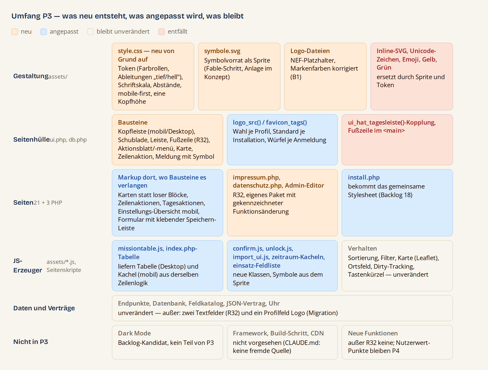

**E-P3-03 Konzept P0 — nachgereicht und abgeglichen.** Zur Konzepterstellung
war das Dokument nicht verfügbar; die vier Themen aus dem Rahmenplan sind
deshalb im Befund eigens erhoben (B-P3-02 bis -05). Der Vorbehalt „taucht das
Dokument auf, wird abgeglichen" ist eingelöst: Zu Beginn der Umsetzung
(26.08.2026) sind `Konzept-P0-Aufraeumen.md` und
`Pruefdokument-P0-Aufraeumen.md` nachgereicht worden. Der Abgleich der
Vormerkliste (P0 10.5) gegen den eigenen Befund:

| P0 10.5 | eigener Befund | Ergebnis |
|---|---|---|
| Oberfläche liegt in JavaScript, **rund 3 300 Zeilen** Inline-JS in sechs Seiten; `einsatz.php` liefert für den Inhalt **gar kein** Markup | B-P3-05 (Zeilen mit HTML-Zeichenketten je Datei ausgezählt) | **bestätigt, mit Zusatz.** P0 nennt die Gesamtzahl und den Satz, auf den es ankommt: „Wer P3 als Markup-Arbeit veranschlagt, findet mitten in der Umsetzung, dass es JS-Arbeit ist." Gilt für O3 bis O7 und O11. |
| Einsatztabelle existiert zweimal in zwei Bauweisen, fachlich gedriftet (F-13, F-14) | B-P3-03 (`renderMissionTable()` in `index.php`, `EdMissionTable` in `missiontable.js`) | **bestätigt.** Die Drift selbst hat P0/N3 geschlossen — beide laufen seither über dieselbe Zellenlogik. Die zwei Bauweisen bleiben; O3 führt sie zusammen. |
| **32 Tabellen, genau eine mit Überlaufbehälter**; Vorlage für weglassbare Spalten liegt mit `nurWenn` in `missiontable.js` bereits vor | B-P3-03 (Tabellen einzeln benannt, ohne Gesamtzahl) | **Zusatz.** Die Zahl 32 ist die Mengenangabe, die dem Befund fehlte; `nurWenn` ist der vorhandene Anknüpfungspunkt für E-P3-32 (Kachel statt Tabelle) und wird in O3 benutzt statt neu erfunden. |
| Suchseite hält ihre Filterleiste selbst; der Schubladenmechanismus muss an der **Klasse** hängen, nicht an `ui_days_sidebar()` | B-P3-04 (Filterspalte erhoben), E-P3-08 (eine Schublade für alle drei Inhalte) | **bestätigt.** P0 nennt die Umsetzungsfalle beim Namen; O2 hängt Schublade und Leiste an `.leiste`/`.schublade`, nicht an der Diensttagsfunktion. |
| Kopfhöhe 50 px **dreimal** verdrahtet | B-P3-02: **fünfmal** (`.layout` min-height, `.daylist` top und height, `.filterspalte` top und height) | **überholt.** Der eigene Befund ist der jüngere und der vollständigere; F-P3-G bleibt wie erhoben. |

**E-A6-02 ist damit wörtlich verfügbar** und lautet: Die Tonart der
Erfolgsmeldung wird als **Parameter** festgeschrieben, „welchen Wert er
bekommt, entscheidet P3". Genau das tut E-P3-16 (Vollzug blau mit Haken); der
Vorbehalt ist eingelöst, nicht umgangen. Aus dem P0-Prüfdokument kommt
zusätzlich der Hinweis, dass `.confirmbox` und `.unlockbox` in **keiner**
Markup-Probe des Stilvergleichs stehen — für P3 ohne Folge, weil der
Stilvergleich hier ohnehin ruht (E-P3-05), aber ein Grund mehr, beide Dialoge
in O11 im Browser zu prüfen statt maschinell.

**E-P3-04 Mockups vorher.** Alle Entwürfe entstehen in der Konzeptphase und
liegen dem Konzept als Anlage bei; jedes Arbeitspaket verweist auf seine
Bilder. Während der Umsetzung entstehen keine neuen Entwürfe, nur Funde.

**E-P3-05 Prüfmittel.** Vollständigkeitsprüfung (jede alte Klasse hat eine
Regel im neuen Stylesheet oder steht mit Begründung auf der Streichliste;
Skript ohne PHP), Screenshots aller Seiten aus der lokalen Instanz mit dem
Demo-Konto bei 360 · 390 · 420 · 768 · 1024 · 1280 · 1440 · 1920 px als
Kontaktbogen je Seite (`tools/screenshots/`, neu), Wortliste (R28) je Paket,
Stilvergleich während P3 aus und am Ende neu geeicht. Claude Code hat PHP,
Datenbank und Browser.

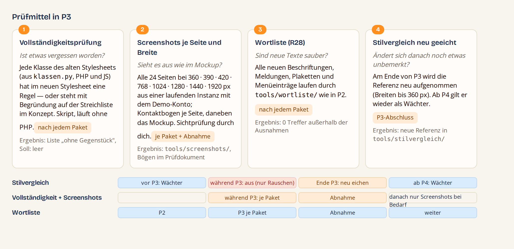

**E-P3-06 Zentralisierung und Freigaberegel.** Drei Ebenen: Token (alle
Werte an einer Stelle), Bausteine (benannte Klassen in `ui.php`, auch von
den JS-Erzeugern verwendet), Regel (neue Seiten nur aus vorhandenen
Bausteinen; ein neuer Baustein wird vorher beschrieben, mit Mockup vorgelegt,
freigegeben und in die Richtlinie aufgenommen). `docs/Branding.md` wird zur
Gestaltungsrichtlinie `docs/Design.md` (Marke, Farbrollen, Token,
Schriftskala, Grundregeln, Schwellen, Symbolvorrat, Bausteine mit Skelett
und Bild, Seitentypen, Freigaberegel). `CLAUDE.md` bekommt einen Abschnitt
„Pflegepflichten": Gestaltung → `docs/Design.md`; Sicherung/Import →
Konzept S1 und Technik.md; Begriffe → Wortliste; neuer Baustein → Freigabe.

---

### 3.B Gerüst

**E-P3-07 Kopfleiste.** Mobil: Menü (drei Striche, 44 px) links, Logo und
Name in der Mitte, Zahnrad rechts. Desktop: Logo, Name und Nutzername
links; rechts „Startseite" und „Suche" mit Symbol (aktiv mit orangem
Strich) und Zahnrad. Der Menüpunkt heißt **Startseite** (nicht
„Übersicht", im Suchmenü sonst missverständlich); der Seitentitel bleibt
„Tagesübersicht" wie im Handbuch. Die Kopfhöhe ist ein Token (56 px).

**E-P3-08 Schublade (mobil).** Von links, 86 % der Breite bis 320 px,
dunkelblauer Schleier, X oben links. Inhalt: Startseite und Suche, darunter
der seitenspezifische Teil (Diensttage, Filter, Einstellungsmenü), Fuß wie
in der Leiste. Schleier oder X schließen.

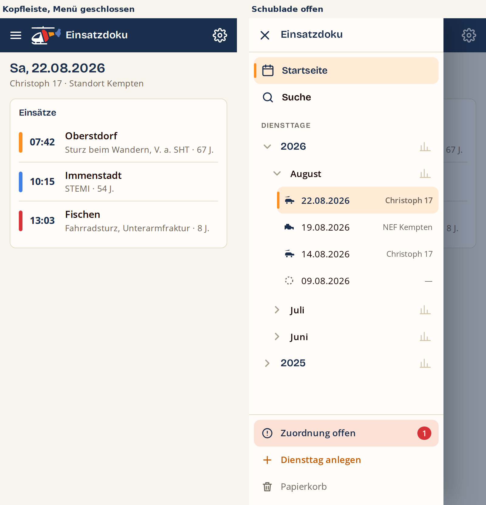

**E-P3-09 Leiste (Desktop).** Derselbe Inhalt wie die Schublade ohne die
beiden Hauptpunkte. Akkordeon: die ganze Zeile klappt, der Winkel steht in
Sand (Mechanik, keine Botschaft) und dreht sich; rechts in der Zeile ein
Balkensymbol als Weg zur Jahres- bzw. Monatsübersicht (heute war der Text
der Link und nur das Dreieck der Schalter, mobil nicht unterscheidbar).
Tage mit Artzeichen, Datum und Rettungsmittel gedämpft rechts; **lange
Rettungsmittelnamen werden mit Ellipse abgeschnitten** („NEF Neubran…"),
der volle Name steht im Tooltip und im Seitentitel, unter 1200 px entfällt
der Name in der Leiste ganz (Artzeichen bleibt). Fuß fest: „Zuordnung
offen" (rosa, roter Zähler) **nur, solange etwas offen ist** — so ist es
heute schon (E24/A12) und bleibt so; die Mockups zeigen den Zustand mit
einer offenen Zuordnung —, „+ Diensttag anlegen" (orange), Papierkorb
(gedämpft).

**E-P3-10 Beide Leisten synchron.** Der aktive Eintrag ist in beiden Leisten
hell orange mit orangem Strich — der aktive Diensttag genauso wie der
aktive Einstellungspunkt.

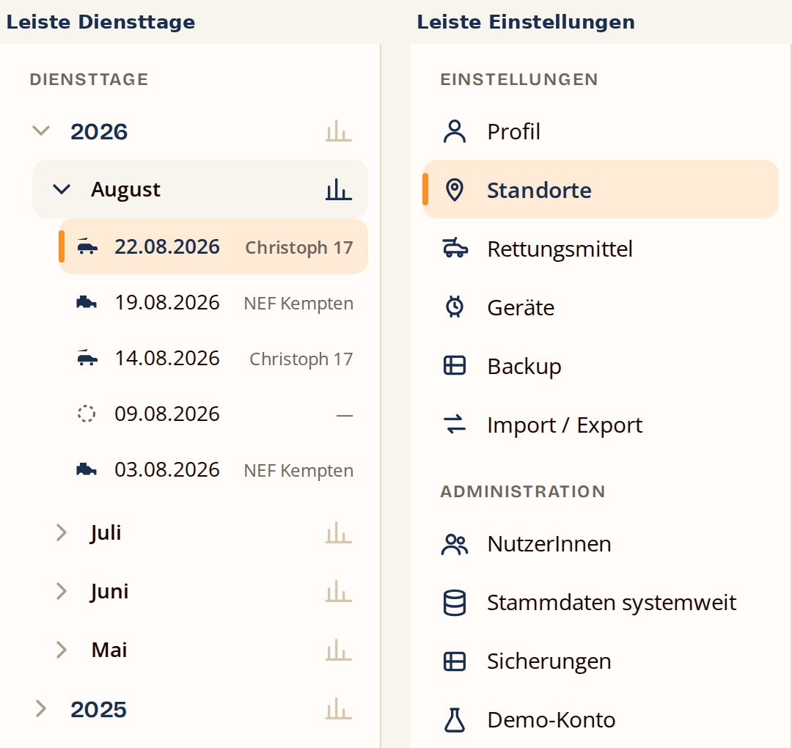

**E-P3-11 Einstellungen mobil.** Das Zahnrad führt auf eine
Übersichtsseite: Einträge als Liste mit Symbol und Winkel, Administration
als zweiter Block, Abmelden getrennt am Ende; darunter nur der Name der
angemeldeten Person. Jede Einstellungsseite trägt „‹ Einstellungen" über
dem Titel; der Menüknopf öffnet die Schublade mit dem Einstellungsmenü.

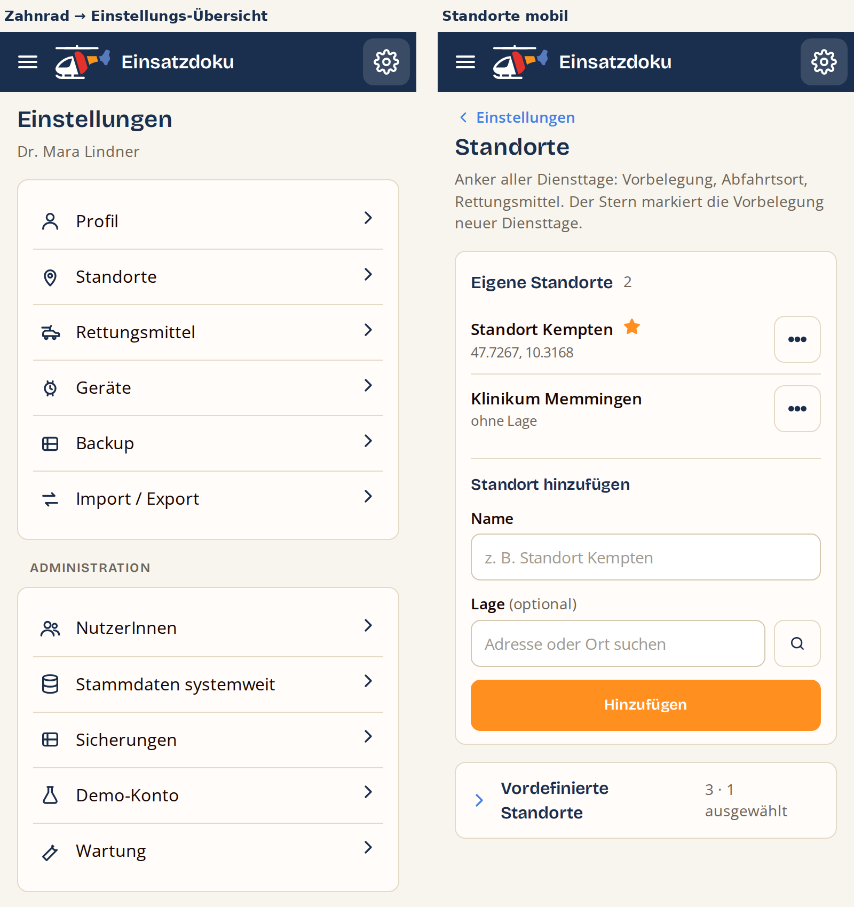

**E-P3-12 Rahmen und Breite.** Leiste und Inhalt werden als Einheit
zentriert, Maximalbreite 1680 px; die Kopfleiste bleibt voll breit, ihr
Inhalt sitzt am selben Raster. Eine Inhaltsbreite für alle Seitentypen
(Listen, Tabellen, Formulare, Einstellungen). Die öffentliche Hülle
(Anmeldung, Zurücksetzen, Abbruch, Einrichter, Impressum, Datenschutz) hat
keine Leiste; Fließtext läuft dort in einer Lesespalte von 760 px
(Baustein „Text", auch für Erklärtexte und die Abbruchseite).

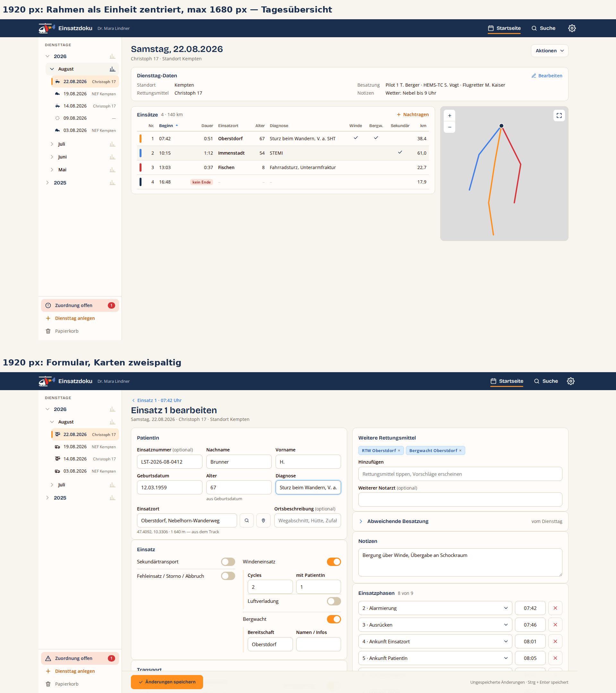

**E-P3-13 Schwellen je Baustein.** Unter 720 px Handy (Schublade, Kacheln
statt Tabellen, Karte 160 px); 720–1023 Tablet hoch (Schublade, Inhalt wie
Desktop, Karte 220 px); ab 1024 Leiste sichtbar mit 220 px (Tagesliste ohne
Rettungsmitteltext); ab 1200 Leiste 260 px, Zweispalter (Einsatzansicht)
und zweispaltige Formularkarten; ab 1600 Karte neben der Tabelle; Rahmen
1680. Tablet wird aus den Regeln abgeleitet (keine eigenen Entwürfe), die
Screenshot-Prüfung deckt 768 und 1024 ab. Die Schwellen stehen als Tabelle
je Baustein im Konzept und in der Richtlinie.

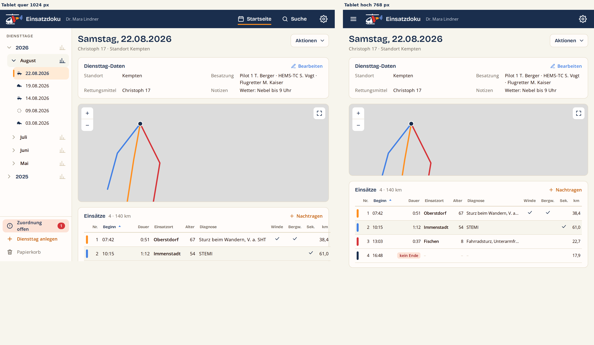
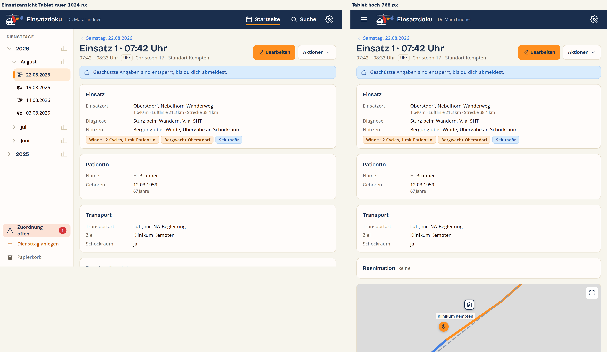

**E-P3-14 Fußzeile (R32).** Zweizeilig, zentriert unter dem Inhalt: erste
Zeile „© Gen-EM · Open Source", Lizenz, Version; zweite Zeile Impressum,
Datenschutz. Dunkel auf der Anmeldung (Hellgrau, weiße Links), hell sonst
(gedämpft, dunkelblaue Links). Auf jeder Seite einschließlich Anmeldung,
Zurücksetzen, Abbruch und Einrichter; nicht mehr im `<main>`.

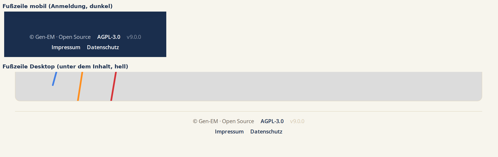

---

### 3.C Farben, Typografie, Symbole

**E-P3-15 Farbrollen.** Orange = Handeln und „hier bin ich" (Primärknopf,
aktiver Menüpunkt, Anlegen-Wege, Vorbelegungsstern, aktive Kachel,
Zeilenhervorhebung). Rot = Aufmerksamkeit (Löschen, Fehler, offene
Zuordnung, unvollständiger Einsatz, Fehleinsatz). Blau = Auswählen und
Erklären (Textlinks, Sortierpfeil, gewählte Filter, Fokusring, Hinweis,
Vollzug). Dunkelblau = Struktur (Kopfleiste, Überschriften, Häkchen,
Symbole, Tabellenkopf). Sand/Grau = Mechanik (Winkel, Trennlinien,
inaktive Symbole). Je Farbe ein „Tief" für Schrift (Orange C25A00, 4,3:1)
und ein „Hell" für Flächen (aus dem Branding); Philipp Orange als Text
(2,2:1) und Weiß auf Orange (2,3:1) sind unzulässig — **der Primärknopf
trägt dunkelblaue Schrift auf Orange (5,4:1)**. Zweite Graufamilie
entfällt, `--muted` bleibt die eine.

**E-P3-16 Grün und Gelb entfallen.** Meldungen in vier Tönen mit Symbol und
fettem Auftakt: Fehler rosa/rot mit Dreieck („Nicht gespeichert."),
Hinweis blau mit Kreis-i, Vollzug blau mit Haken („Sicherung erstellt."),
Warnung hell orange mit Dreieck. Passwortstärke als Vierer-Balken Rot →
Orange → Dunkelblau. „Bearbeiten" wird der neutrale Rahmenknopf,
„Als Vorbelegung" orange mit Stern. Import-Warnzeile mit orangem Randstrich.
Track-Start und -Ende siehe E-P3-32.

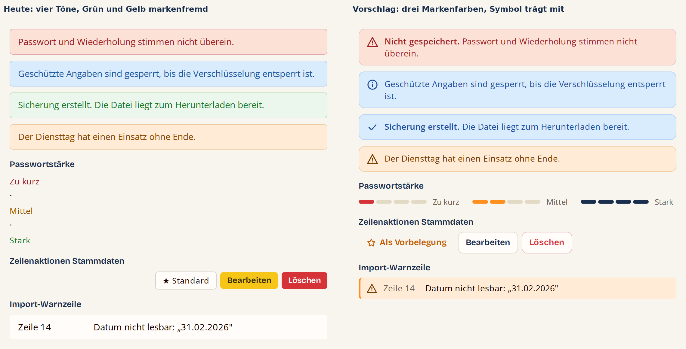

**E-P3-17 Plaketten.** Winde und Bergwacht hell orange mit dunkler Schrift;
Sekundär hell blau; Fehleinsatz und „kein Ende" rosa mit Rot; gewählte
weitere Rettungsmittel hell blau mit ×; Herkunft (Uhr, manuell,
importiert) und „systemweit" neutral. Plaketten tragen kein Häkchen (ihr
Vorhandensein ist das Häkchen) und sind keine Bedienelemente.

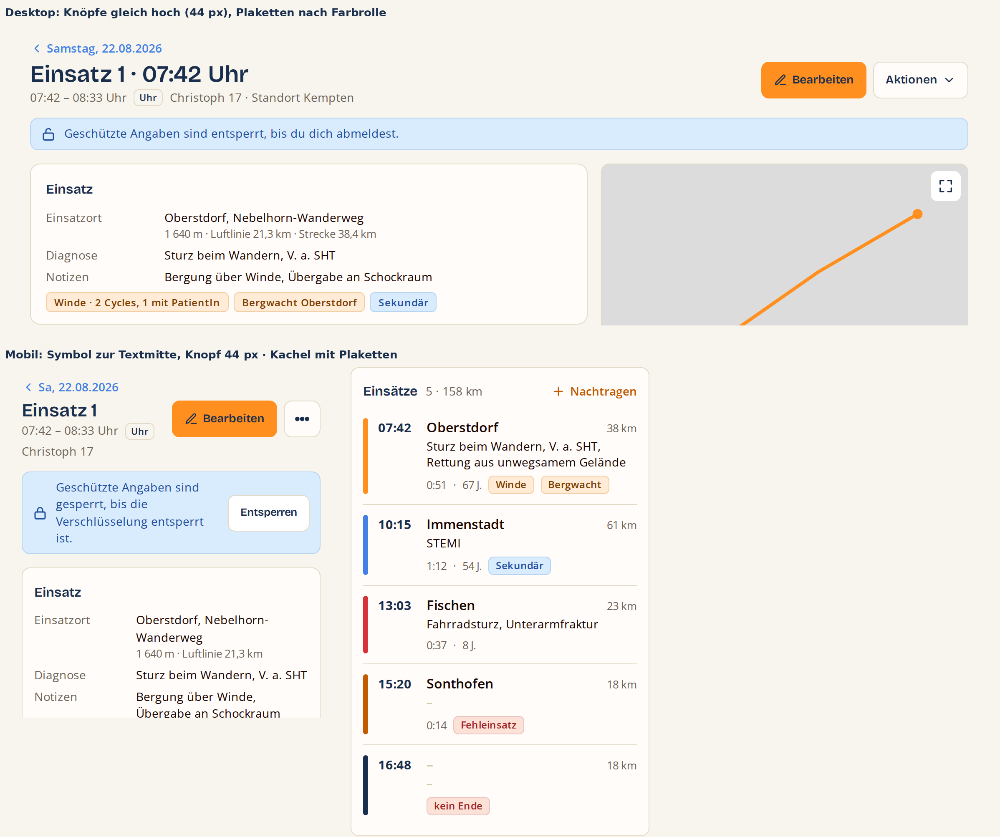

**E-P3-18 Symbolvorrat.** Grundlage ist **Tabler Icons** (MIT-Lizenz;
Outline, 24 × 24, 2 px, runde Enden — exakt der gewählte Stil): 43 Zeichen
werden **unverändert übernommen**, auf unsere Namen umbenannt und liegen
**je Zeichen als eigene Datei** unter `assets/images/symbole/` (am PC
einzeln zu öffnen und zu ändern; kein Sprite, kein Skript), mit
Verwendungsort und Quelle im Dateikommentar und der Lizenzdatei daneben.
Ein Zeichen ist ein eigener Entwurf im selben Stil (Luftlinie). Einbindung
per Verweis auf die Datei (`ui_symbol('haus')` in PHP, derselbe Aufruf in
JS), Farbe über `currentColor`; kein Zeichen liegt als Inline-Pfad im
Code, die Vollständigkeitsprüfung meldet Verweise auf fehlende Dateien und
Inline-Pfade. Ersetzt die fünf Inline-SVGs, die Unicode-Zeichen und die
Emoji; eigene Piktogramme Hubschrauber, Fahrzeug, ohne Zuordnung, Haus,
Klinik, Meine Position, Auf der Karte kommen ebenfalls aus Tabler.
**Neue Zeichen:** zuerst bei Tabler suchen (tabler.io/icons), Datei
unverändert übernehmen und umbenennen; eigener Entwurf nur, wenn nichts
passt; beides nach Freigabe (E-P3-06). Die Regel steht im Kapitel
„Symbole" der Gestaltungsrichtlinie. Damit entfällt der Fable-Zeichenschritt.
Lizenz: MIT erlaubt Nutzung, Änderung und Verkauf, auch kommerziell; die
einzige Pflicht ist, den Lizenztext mitzuliefern (`LICENSE-tabler-icons.txt`
im Repo). Der Winkel liegt einmal vor und wird per CSS gedreht; der Stern
wird per CSS gefüllt, wenn die Vorbelegung gesetzt ist.

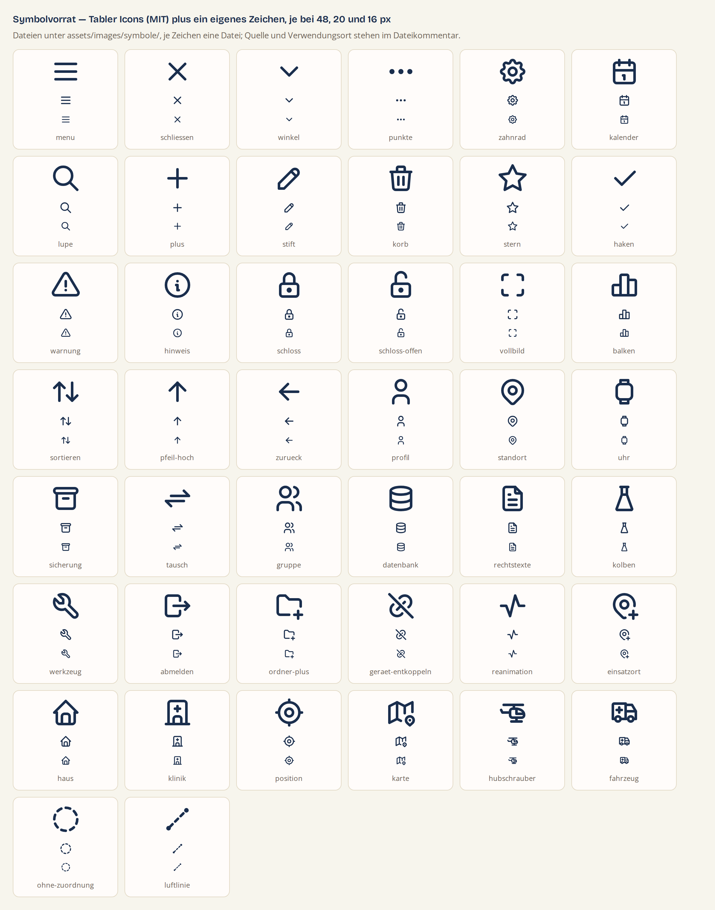

**E-P3-19 Logodateien.** Die drei Logodateien werden auf die Markenfarben
korrigiert (Branding.md B1). Der NEF-Platzhalter entsteht in denselben
Maßen und Fassungen (farbig, weiß, Favicon), sichtbar als Platzhalter, mit
Hinweis in der Wartung, solange er liegt; die echte Datei ersetzt ihn 1:1.

**E-P3-20 Logo-Wahl** *(Funktionsänderung)*. Begriff **Logo** (nicht
„Bildmarke"). Wahl im Profil: Standard der Installation / Hubschrauber
(RTH) / Fahrzeug (NEF) / wechselnd; Standard in der Administration (bis
P5 bei der Wartung). „Wechselnd" würfelt je Anmeldung. Kopfleiste und
Favicon wechseln gemeinsam; die Anmeldeseite zeigt den Standard. Die Uhr
folgt der Wahl (Rahmenplan P6, R29); ihr Launcher-Icon bleibt fest.
Migration: ein Profilfeld.

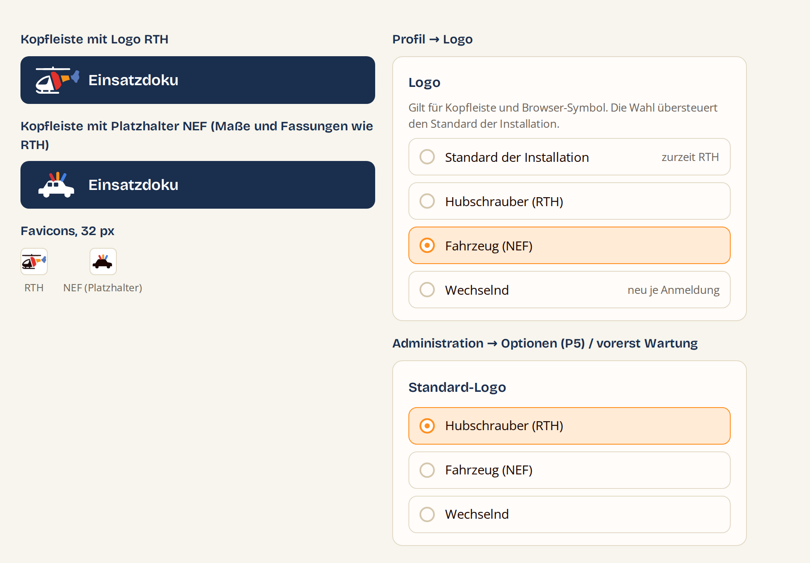

**E-P3-21 Typografie.** Eine Skala (Major Third ab 15/16 px Grundgröße) als
Token; Bricolage Grotesque 600 für Titel, Kartenköpfe, Knöpfe, Menüpunkte
und Kennzahlen; Open Sans für Text und Felder; Zahlen mit tabellarischen
Ziffern. Gesperrte Versalien nur noch für Abschnittsköpfe in Leisten
(„Diensttage", „Filter", „Administration"); Tabellenköpfe, Legenden und
Feldnamen in Normalschrift. Fund F-P3-A (`.metanotes` erbt Versalien) ist
damit erledigt.

---

### 3.D Grundregeln der Bausteine

**E-P3-22 Eine Knopfhöhe.** 44 px für jeden Knopf, mobil wie Desktop, auch
Zeilenaktionen; keine Kompaktvariante. Was kleiner ist, ist kein Knopf:
Kopfaktionen in Karten („Bearbeiten", „+ Nachtragen") sind Links mit
Symbol, Plaketten sind keine Bedienelemente. Token, Prüfpunkt im
Screenshot-Bogen.

**E-P3-23 Vertikale Mitte.** Symbole und Knöpfe stehen auf der vertikalen
Mitte ihres Textblocks — bei einer Zeile auf der Zeilenmitte, bei mehreren
auf der Blockmitte; ist das Symbol höher als eine Zeile, richtet sich der
Text nach dem Symbol. Gilt in den Bausteinen (Meldung, Menüeintrag,
Listenzeile, Plakette, Knopf, Titelzeile), nicht je Stelle.

**E-P3-24 Farbe nie einziger Träger.** Jede Bedeutung hat Symbol oder Text
neben der Farbe (Meldungen, Plaketten, Marker, Extremwerte).

**E-P3-25 Karte mit Kopfzeile.** Jeder Inhaltsblock ist eine Karte mit
Titel in Bricolage, optionaler Zahl (gedämpft) und **einer** Kopfaktion
rechts als Link mit Symbol: „Bearbeiten" (blau) oder ein Anlegen-Weg
(„+ Nachtragen", „+ Hinzufügen", orange tief). Zugeklappte Karten tragen
den Winkel links im Kopf und eine Vorschau rechts („keine", „vom
Diensttag", „3 · 1 ausgewählt").

**E-P3-26 Zeilen und Zeilenaktionen.** Zeilen in Karten: Text links (fett
plus Kleinzeile), Aktionen rechts. Desktop: Knöpfe (44 px), „Löschen" rot
umrandet, Vorbelegung orange leise. Mobil: ein „⋯" je Zeile → Aktionsblatt.
Verwaltungstabellen (Stammdaten, Geräte, Sicherungen, Papierkorb) werden
mobil per CSS zu solchen Zeilen.

**E-P3-27 Aktionsmenü.** Mobil „⋯" neben dem Titel → Blatt von unten
(Griff, Titel, große Zeilen 50 px, Löschen rot und durch Linie abgesetzt,
„Abbrechen"). Desktop „Aktionen ▾" als neutraler Rahmenknopf → Aufklappmenü
mit denselben Einträgen. Der Anlegen-Weg steht auch dort als erste Zeile.
Dasselbe Blatt dient dem Sortieren mobil und dem Ortsfeld (E-P3-33).

**E-P3-28 Schalter.** Ja/Nein-Felder werden Schalter in 44-px-Zeilen,
Beschriftung links, an in Orange. Abhängige Felder klappen darunter auf,
eingerückt mit orangem Randstrich.

**E-P3-29 Speichern-Leiste.** Klebend am unteren Rand, erscheint, sobald das
Formular schmutzig ist (Dirty-Tracking vorhanden): mobil ein breiter
Primärknopf, Desktop Knopf links plus Hinweis „Ungespeicherte Änderungen ·
Strg + Enter speichert". Kein „Verwerfen"; der Rückweg oben genügt.

**E-P3-30 Segmentwahl.** Für Gemischt/Luft/Boden, egal/ja/nein und
Wochentage: Tastenreihe mit orangem Aktivzustand, mobil vollbreit.

---

### 3.E Seiten

**E-P3-31 Tagesübersicht.** Rückweg entfällt (Startseite); Titel „Sa,
22.08.2026" (mobil) bzw. „Samstag, 22.08.2026" mit Unterzeile
Rettungsmittel · Standort; rechts „⋯"/„Aktionen" (E-P3-27) mit Einsatz
nachtragen, Diensttag-Daten bearbeiten, Datum ändern, anderen Diensttag
aufnehmen, Tag löschen. Diensttag-Daten als Karte mit Lesezustand
(Standort, Rettungsmittel, Besatzung, Notizen; Desktop zweispaltig) und
„Bearbeiten", das dasselbe Formular in der Karte aufklappt. Einsätze als
Karte mit Zahl und km-Summe und „+ Nachtragen" (**am Kartenkopf und im
Menü**, E-P3-27). Karte: mobil 160 px über der Liste, Desktop unter 1600 px
oben mit 300 px; **ab 1600 px neben Diensttag-Daten und Tabelle: die
linke Spalte trägt beide Karten in derselben Breite, die Karte beginnt
oben auf Höhe der Diensttag-Daten und läuft bis unter die Tabelle**
(400 px breit). Sperrhinweis als Meldung mit Schloss und „Entsperren".

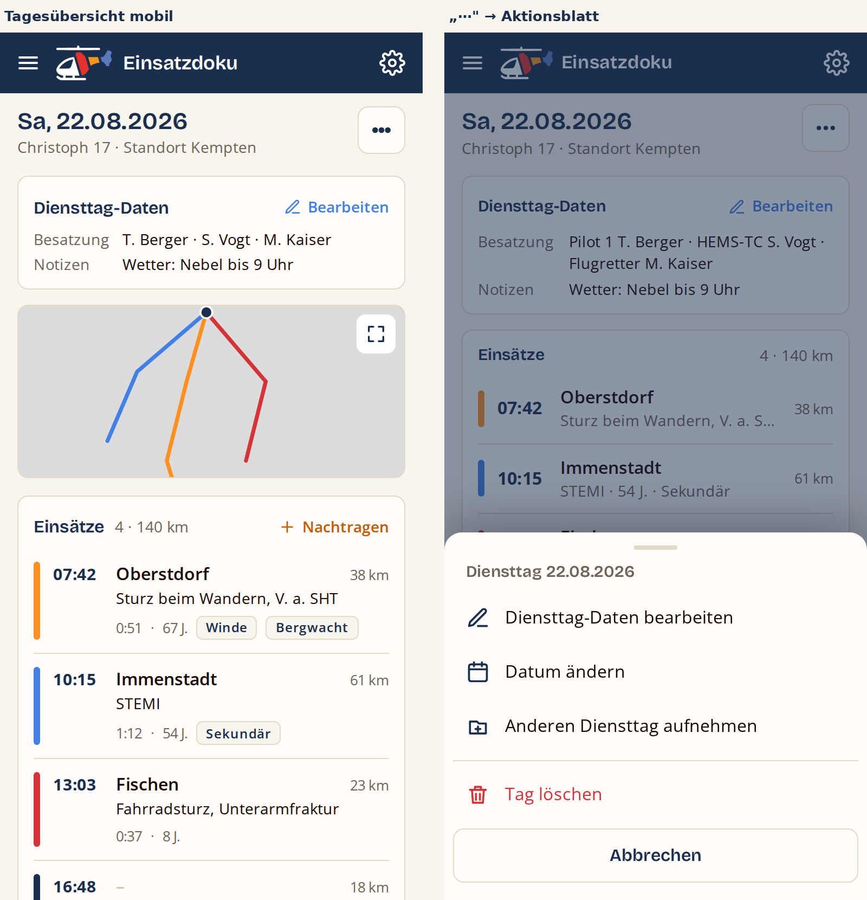
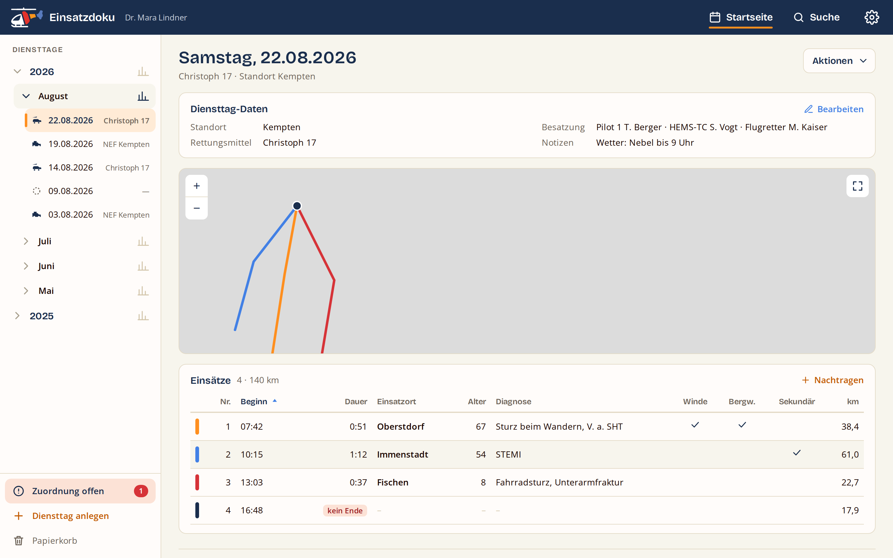
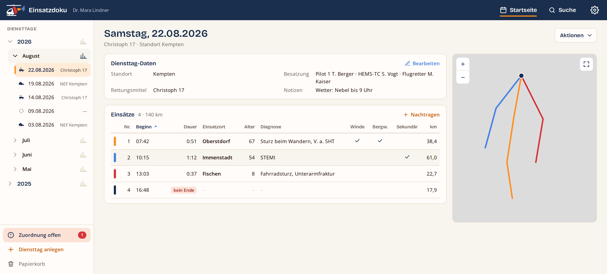

**E-P3-32 Tabelle und Kachel.** Desktop: Tabelle mit Farbstreifen, Sortierung
über Spaltenköpfe (Pfeil blau), Häkchen dunkelblau, Diagnose mit Ellipse.
Mobil (unter 720 px): dreizeilige Kachel — Zeile 1 Ort fett und km, Zeile 2
Diagnose (am Tag bis zwei Zeilen, in Suche und Zeitraum eine Zeile mit
Abschneiden), Zeile 3 Dauer, Alter und Plaketten. In Suche und Zeitraum
zusätzlich Artzeichen, Datum und Beginn als erstes Element. Sortieren mobil
über einen Link im Kartenkopf → Blatt mit den Spalten. „kein Ende" als
rote Plakette in beiden Formen. Beide Formen kommen aus demselben
Zeilenerzeuger (`missiontable.js`, Tabelle in `index.php`).

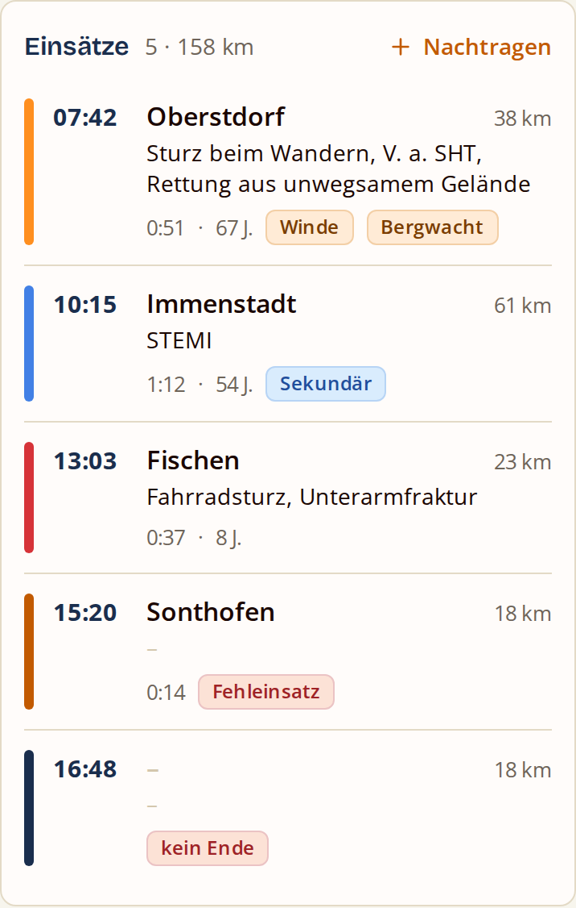

**E-P3-33 Einsatzansicht.** Rückweg „‹ Samstag, 22.08.2026"; Titel „Einsatz
1" (mobil) bzw. „Einsatz 1 · 07:42 Uhr"; Unterzeile Zeitspanne,
Herkunfts-Plakette, Rettungsmittel. „Bearbeiten" als Primärknopf am
Titel, „⋯"/„Aktionen" mit Verschieben und Löschen. Vier Karten in der
Rangfolge aus `einsatz.php`: Einsatz (Ort mit Höhe, Luftlinie, Strecke als
Kleinzeile; Diagnose; Notizen; Plaketten Winde mit Cycles, Bergwacht mit
Bereitschaft, Sekundär, Fehleinsatz), PatientIn (Name, Geburtsdatum mit
Alter), Transport (Art mit NA-Begleitung, Ziel, Schockraum), Reanimation
(zugeklappt „keine", sonst Ereignisliste). Leere Felder werden nicht
gezeigt. Karte: mobil 160 px zwischen Angaben und Phasen, Desktop ab
1200 px rechts oben und klebend. Marker (E-P3-40): Standort als Haus, Ziel
als Klinik, Einsatzort oranger Kreis mit Pin, Luftlinie grau gestrichelt;
**Track-Start als blauer Ring, Ende als roter Ring am Symbol, beides am
selben Ort als Doppelring, dazu Richtungspfeile auf dem Track ab einer
Zoomstufe, bei der sie nicht gedrängt stehen.** Einsatzphasen als Zeilen
mit Nummer, Name, Uhrzeit und Minutenabstand zur vorigen Phase; die
angetippte Phase leuchtet orange und hebt ihr Teilstück hervor; die
Gesamtdauer im Kartenkopf.

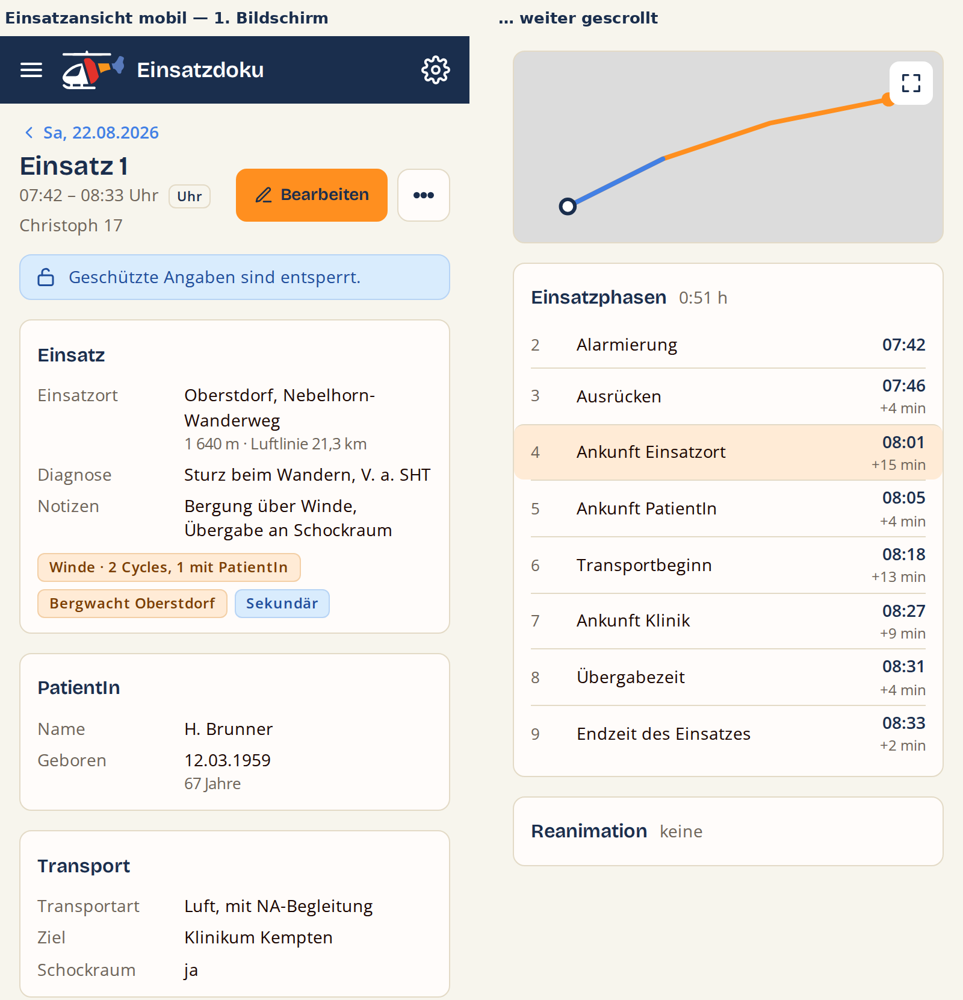
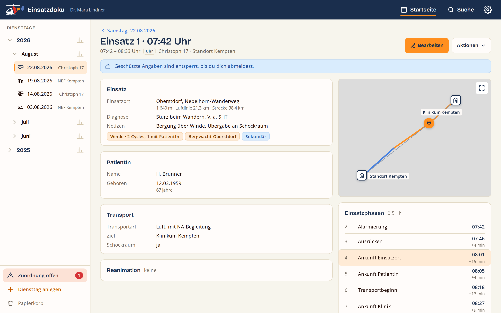
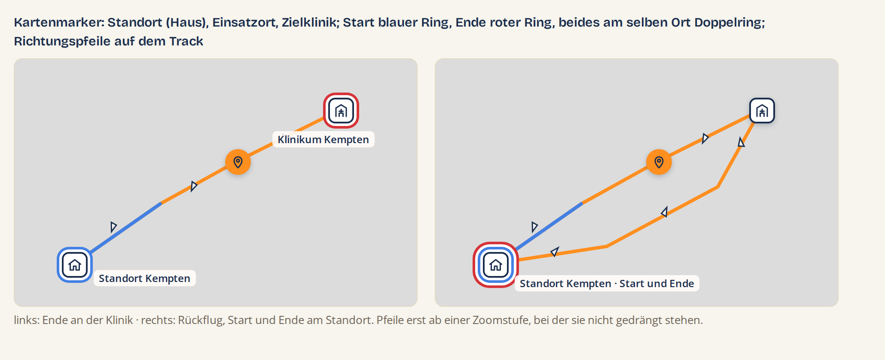

**E-P3-34 Einsatzformular** *(mit Funktionsänderungen)*. Karten in dieser
Reihenfolge: PatientIn (Einsatznummer, Nach-/Vorname, Geburtsdatum mit
Alter, Diagnose, Einsatzort, Ortsbeschreibung), Einsatz (Schalter
Sekundär, Fehleinsatz, Winde mit Cycles/mit PatientIn/Luftverladung,
Bergwacht mit Bereitschaft/Namen-Infos), Transport (Art, NA-Begleitung,
Ziel, Schockraum), **Weitere Rettungsmittel** (offen; gewählte als blaue
Plaketten mit ×, Feld mit Vorschlägen, Weiterer Notarzt), **Abweichende
Besatzung** (zugeklappt, Vorschau „vom Diensttag"), **Notizen**,
Einsatzphasen, Reanimation (zugeklappt). Desktop ab 1200 px zwei
Kartenspalten: links PatientIn, Einsatz, Transport; rechts der Rest.
Einsatzort: ein Feld, daneben Lupe (ersetzt das zweite Feld
„Lokalisation") und **Pin → Blatt mit „Meine Position übernehmen"
(Geolocation) und „Auf der Karte wählen" (Leaflet-Dialog mit Fadenkreuz);
Adresse per Photon-Umkehrsuche** — neu. Koordinaten, Höhe und Herkunft
als Kleinzeile. Einsatzphasen: Zeile je Phase (Auswahl, Zeitfeld 44 px
zentriert, rotes X), am Desktop einspaltig in der rechten Karte, „+ Phase
hinzufügen" orange; **die Liste sortiert sich sofort beim Verlassen eines
Zeitfelds um, kein Hinweistext** — neu. Speichern-Leiste E-P3-29.

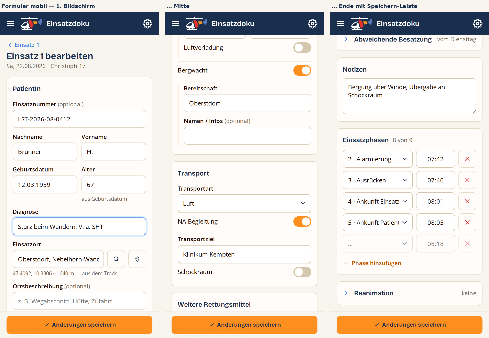
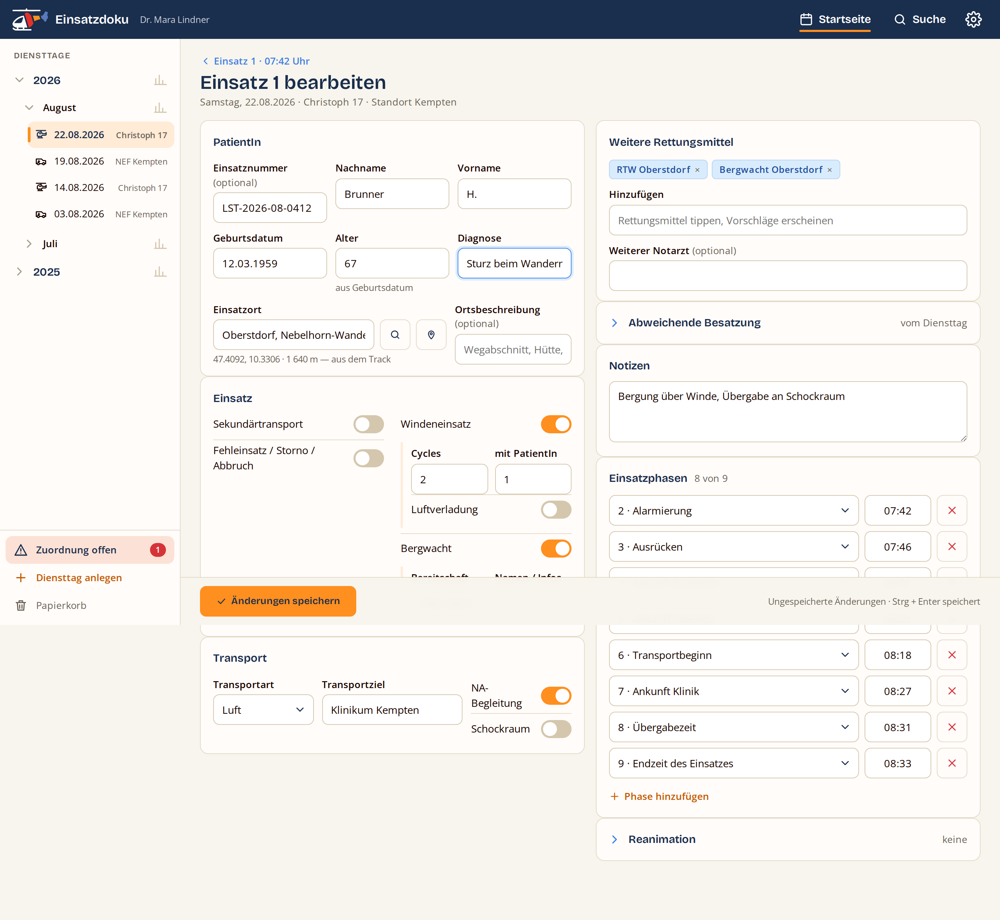
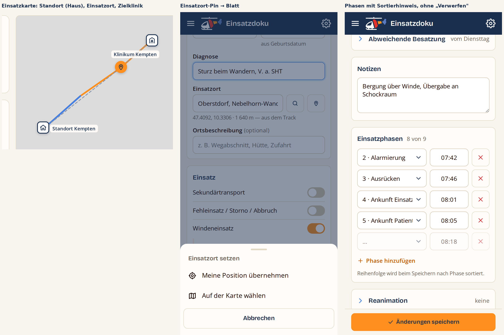

**E-P3-35 Verwaltungslisten (Standorte als Muster).** Titel, Erklärtext auf
drei Zeilen gekürzt (kein Aufklapper). Karte „Eigene …" mit Zeilen (Name
fett, Vorbelegungsstern orange, Koordinaten oder „ohne Lage" klein) und
Zeilenaktionen nach E-P3-26; das Formular „… hinzufügen" bleibt in der
Karte unter der Liste (Desktop zwei Felder nebeneinander), „Bearbeiten"
füllt es und macht daraus „… bearbeiten" mit Abbrechen. Vordefinierte als
zweite, zugeklappte Karte mit Zahl und „n ausgewählt", Zeilen mit
„systemweit"-Plakette und Auswählen/Abwählen. Rettungsmittel, Geräte,
NutzerInnen, Stammdaten, Sicherungen, Papierkorb und Zuordnung nachtragen
folgen demselben Aufbau.

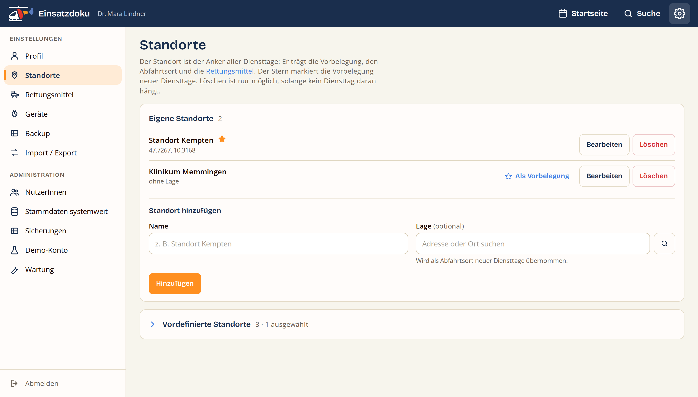

**E-P3-36 Suche.** Filterspalte = Leiste (280 px, Tablet 240) mit den fünf
Bestandsgruppen als Akkordeon; jede Gruppe zeigt die Zahl gesetzter Filter
in Blau; von/bis nebeneinander, Wochentage und Dreierwahl als Segmentwahl;
„Filter zurücksetzen" im Fuß. Inhalt: großes Suchfeld (48 px) mit Lupe und
×, darunter der Bestandshinweis mit Link auf die Und/Oder/Nicht-Syntax,
dann die **gesetzten Filter als blaue Plaketten mit ×**, dann die
Treffer-Karte mit Zahl und km-Summe, Sortierung rechts, Trefferwort hell
orange hinterlegt. Mobil: Suchfeld plus Knopf „Filter (n)" → Schublade
(Startseite, Suche, Filtergruppen) mit „Zurücksetzen" und **„n Treffer
zeigen"** (lebende Zahl, die Suche filtert schon beim Tippen) im Fuß.
Tablet hoch: Leiste in der Schublade, Filter-Knopf sichtbar.

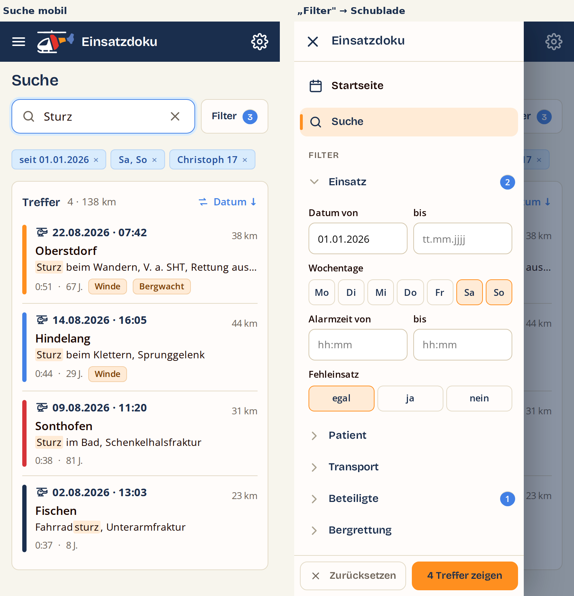
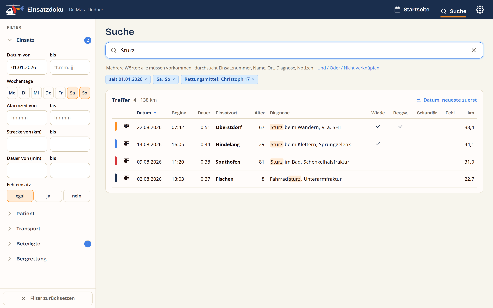

**E-P3-37 Zeitraum** *(Funktionsänderung an den Kachelsätzen)*. Rückweg zum
Jahr, Titel, Unterzeile mit Diensttagen und Spanne, Segmentwahl
Gemischt/Luft/Boden rechts (mobil vollbreit). Kachelsätze: **Gemischt 4**
(Einsätze, Diensttage, Ø Einsätze je Diensttag, Sekundärtransporte) — heute
teilt Gemischt den Boden-Satz mit acht; **Luft 10** unverändert; **Boden
8** (der heutige Neutral-Satz). Spaltenzahl folgt dem Satz (4 oder 5 je
Reihe). Extremwerte tragen einen Punkt oben rechts und den Tag in der
Beschriftung; die aktive Kachel wird hell orange mit orangem Rahmen, die
Zeile in der Liste hell orange (statt rot). Mobil: **komprimierte Kacheln,
zweispaltig, vier sichtbar** — Luft: Einsätze, Flugtage, Winden-Cycles,
Flugkilometer gesamt; Boden: Einsätze, Diensttage, Einsatzkilometer
gesamt, längste Einsatzdauer; Gemischt alle vier — **Rest hinter
„Weitere Statistik (n)"**. Karte 260/160 px mit Standort-Haus; darunter
die Einsätze mit Artzeichen und Datum, ohne Nachtragen. In der Leiste ist
der Monat bzw. das Jahr aktiv.

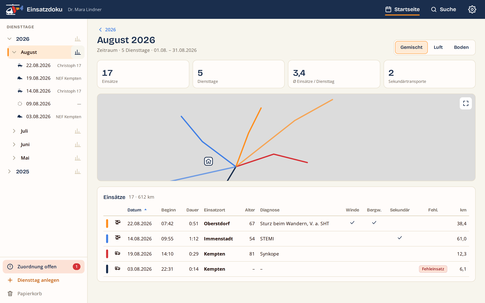
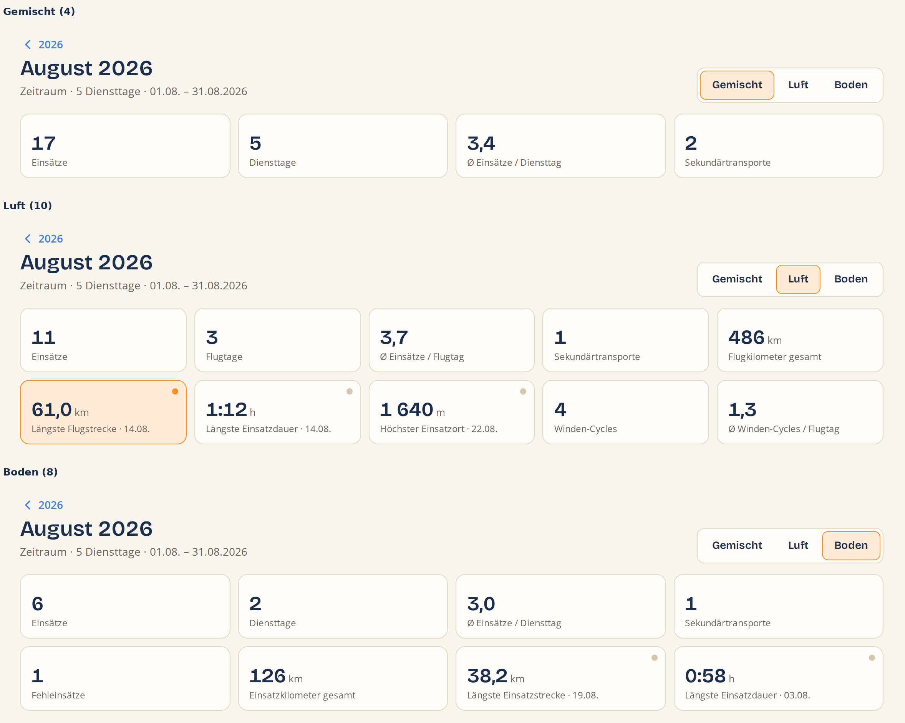
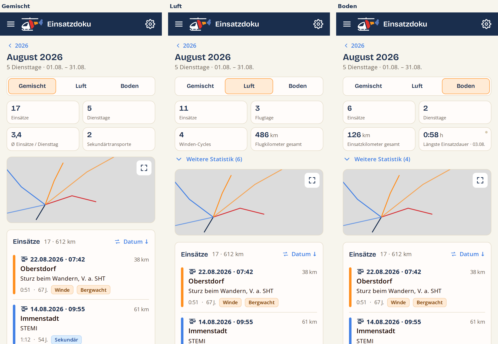

**E-P3-38 Anmeldung und R32-Seiten.** Anmeldung: dunkelblaue Fläche, Karte
mit farbigem Logo, Name, Untertitel, E-Mail und Passwort, Primärknopf,
„Passwort vergessen?", Demo-Hinweis als Baustein (hell orange mit
Kolben, nur im Demo-Betrieb), Fußzeile dunkel. Zurücksetzen und Abbruch in
derselben Hülle. Impressum und Datenschutz: öffentliche Hülle (Kopfleiste
ohne Menü und Zahnrad, rechts „Zurück zur Anmeldung" bzw. „Zurück"),
Titel, Text in einer Karte in der Lesespalte; Markdown-Elemente:
Überschriften (Bricolage, Dunkelblau), Absätze (16 px, 1,6), Listen, Links;
„Stand"-Datum am Ende, vom Editor beim Speichern gesetzt. Leerzustand:
„Der Betreiber dieser Installation hat noch kein Impressum hinterlegt",
für angemeldete Admins mit Link zum Editor. Editor: Eintrag
**„Rechtstexte"** in der Administration, zwei Karten (mobil untereinander)
mit Monospace-Textfeld, Syntaxzeile, Vorschau und Stand-Plakette
(„öffentlich" mit Datum bzw. „leer" in Rot), Speichern-Leiste.

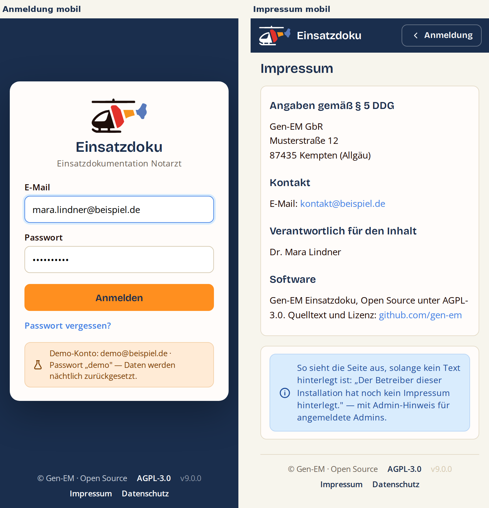
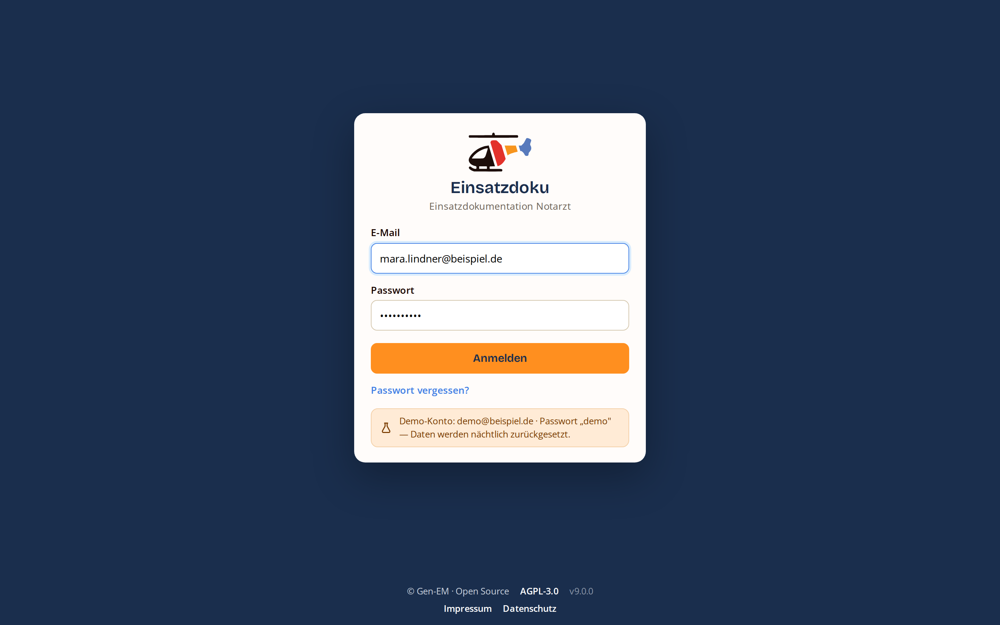
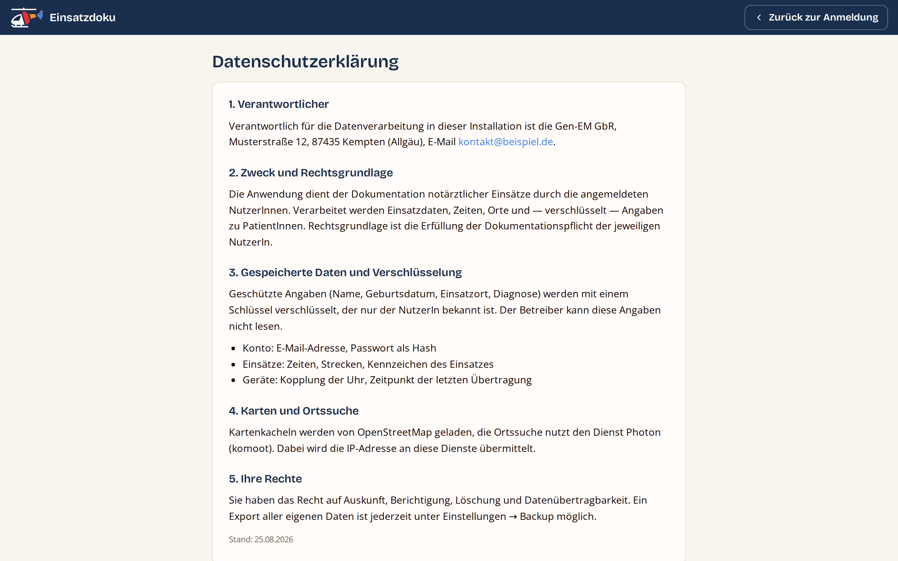
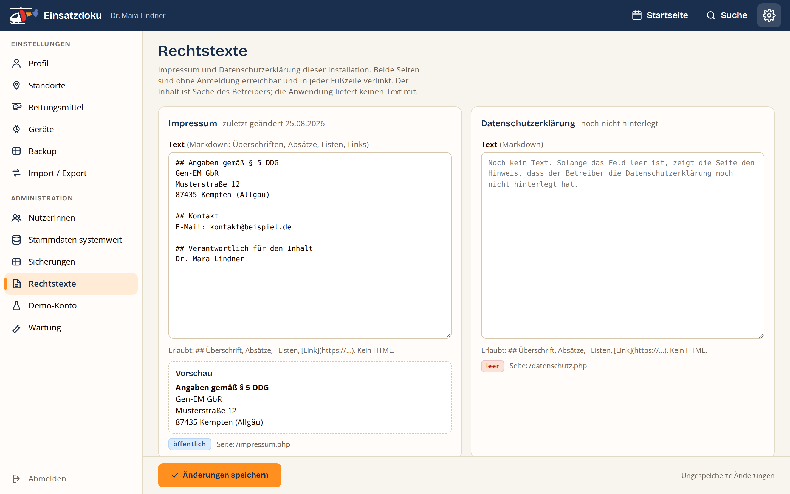

**E-P3-39 Übrige Seiten aus Bausteinen.** Papierkorb und Zuordnung
nachtragen (Karte mit Zeilen und Zeilenaktionen), Diensttag anlegen /
Datum ändern / löschen / zusammenführen und Einsatz verschieben / löschen
(Formularkarte plus Speichern-Leiste bzw. Aktionsblatt), Import
(Schrittfolge; Zuordnung mobil als Liste „Spalte → Feld"), NutzerInnen,
Stammdaten systemweit, Sicherungen, Demo, Wartung (Listen nach E-P3-35),
Einrichter (öffentliche Hülle), Bestätigungsdialog und Entsperrdialog
(Aktionsblatt mobil, Karte im Schleier am Desktop). Sie bekommen im
Konzept je einen Absatz mit Bausteinliste; braucht eine davon eine eigene
Entscheidung, wird sie beim Schreiben als Fund vorgelegt.

**E-P3-40 Standort- und Zielpin** *(Funktionsänderung)*. Auf Tages-,
Einsatz- und Zeitraumkarte immer sichtbar, sobald Koordinaten vorliegen:
Standort als Haus (aus dem eingefrorenen Standort des Diensttags), Ziel als
Klinik (aus der Lokalisation des Transportziels), beide mit Namensschild,
in dunkelblauem Rahmen auf Weiß. Der Kartenbaustein definiert den
Marker-Satz Standort, Einsatzort, Ziel, Start, Ende, Pfeil einmal für alle
drei Seiten.

**E-P3-41 Administration: Kontoseite als Drehscheibe** *(Funktionsänderung)*.
Verwaltungsaufgaben zu einem Konto liegen auf dessen **Kontoseite**
(heute `admin_user.php`): Titel ist der Name, Unterzeile E-Mail, Rolle,
seit, zuletzt angemeldet; oben „Jetzt sichern" und „Aktionen ▾"
(Freigabe, Passwort zurücksetzen, Konto löschen). Karten: **Konto** (Name,
Rolle, E-Mail in einem Formular mit einem Speichern), **Geräte**,
**Sicherungen** (Stand-Plakette, Pakete des Kontos mit Zeit, Umfang, Größe,
Zustand, Einspielen, Löschen; „Jetzt sichern", „Für Zielkonto freigeben";
Rückspielformular als Dialog), **Abonnement** (reservierter Platz für
Tarif, Laufzeit, Zahlungsstand, Rechnungen — Inhalt kommt mit R33),
**Konto löschen** als rote Gefahrenzone mit Adressbestätigung. Desktop
zweispaltig ab 1200 px, mobil untereinander mit „⋯". **NutzerInnen** wird
die Liste dazu: Statuskacheln (Konten, Admins, Sicherung überfällig, nie
gesichert), Suche nach Name oder E-Mail, Filterplaketten (Admins,
überfällig, nie gesichert, ohne Gerät), Spalten Rolle, Seit, zuletzt
angemeldet, Geräte, Sicherungsstand; **50 je Seite mit Seitenwechsel**,
Suche und Filter serverseitig; jede Zeile öffnet die Kontoseite; „+ Anlegen"
im Kartenkopf; Kästchen und Sammelleiste „n ausgewählt · Auswahl sichern",
die Auswahl gilt über alle Seiten. **Sicherungen** (Admin) hält nur noch
die Regeln: Erinnerung nach n Tagen (Bestand), **Aufbewahrung je Konto**
(n Pakete, ältere werden beim nächsten Sichern gelöscht — neu),
**Erinnerung an Admins per E-Mail** mit wöchentlicher Liste der
überfälligen Konten (neu, Schalter), Ablage mit Pfad, Zustand und letzter
Sicherung, Zähler mit Sprung in die gefilterte NutzerInnen-Liste, „Alle
sichern" oben rechts, „Sicherungen ohne Konto" als zugeklappte Karte. Die
heutige Paket-Gesamttabelle entfällt. Ausgelegt auf mehrere hundert
Konten: keine Paketlisten in der Kontenliste, nichts ungefiltert, alles
seitenweise.

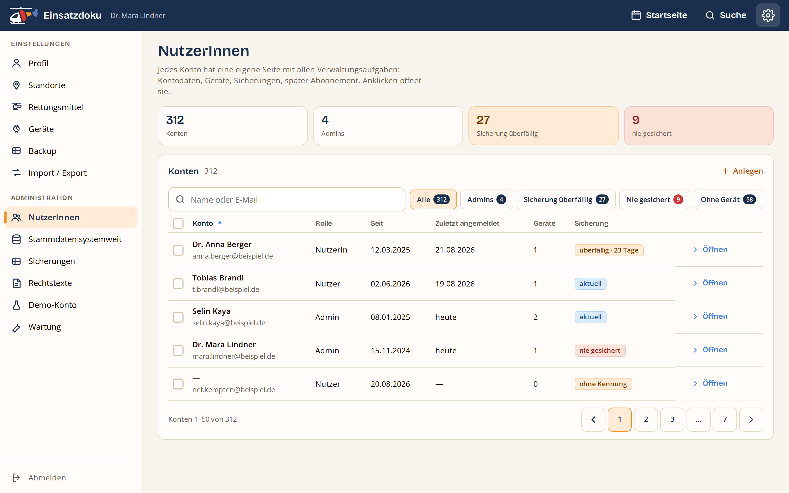
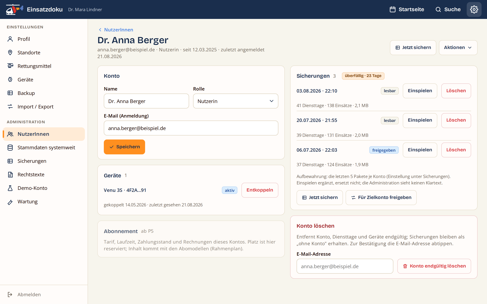
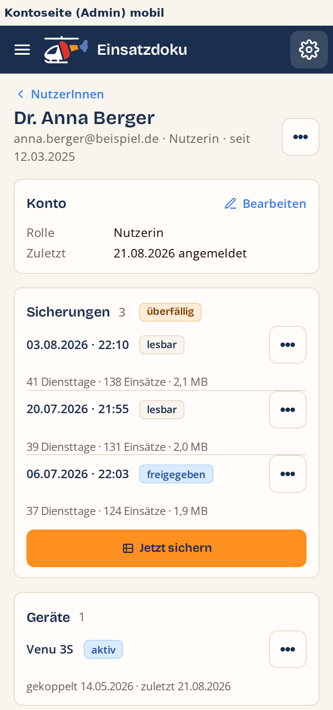
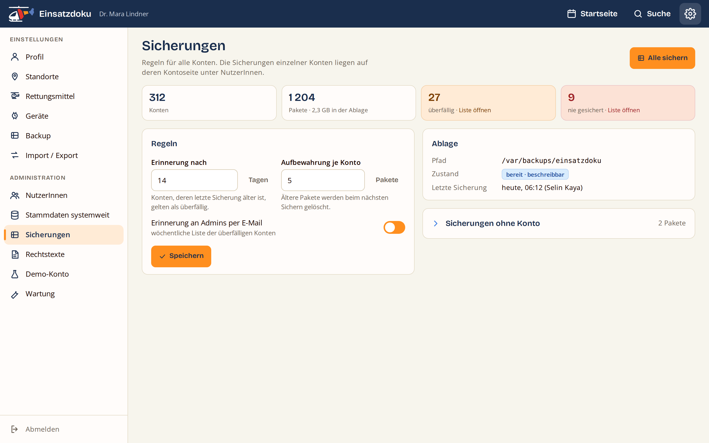

---

### 3.F Zulieferungen und Folgen

- **Rahmenplan:** R32 (Impressum/Datenschutz) und die Logo-Wahl auf der Uhr
  sind in Fassung 4 eingetragen; Fassung 5 ergänzt R33 (Servicemodell:
  Abonnements, Zahlungen, Kontooptionen — P5, Konzept vor v1.0; die
  Kontoseite reserviert den Platz), die Kontoseite in P3, „Alle sichern"
  in Schüben und die Admin-Optionen in P5, `docs/Lizenzen.md` in P6.
- **Backlog (P4):** Kurzname je Rettungsmittel als Stammdatenfeld (max. acht
  Zeichen, für Leiste, Kacheln und Plaketten; der lange Name bleibt für
  Titel, Ansicht und Export), „Auf der Karte setzen" für Standorte in den
  Einstellungen.
- **Dokumentation:** Handbuch 3 und 4.1 (Kopfleiste, Tagesleiste, Emoji)
  werden mit dem Gerüst nachgezogen; Gesamtabgleich bleibt P6 (R16).
  `docs/Design.md` (mit Kapitel „Symbole"), `docs/Lizenzen.md` (Leaflet,
  Tabler Icons, Schriften, Photon/OSM als Dienste) und der
  CLAUDE.md-Abschnitt „Pflegepflichten" entstehen in P3.
- **Fable-Schritte:** keine. Der Symbolvorrat kommt aus Tabler (E-P3-18)
  und liegt dem Konzept als Anlage bei; in der Umsetzung sind keine
  Fable-Schritte vorgesehen. Ein neuer Baustein löst eine Freigabe aus
  (E-P3-06), keinen Modellwechsel.
- **Zuarbeiten Philipp:** NEF-Logo (vor der Abnahme), Impressums- und
  Datenschutztext der eigenen Installation (vor der Abnahme).

---

## 4. Offene Fragen

Alle acht Fragen der Konzeptphase sind beantwortet und in Entscheidungen
überführt (K6). Zur Nachvollziehbarkeit:

| Nr. | Frage | Antwort → Entscheidung |
|---|---|---|
| F-P3-01 | Welche Aufgaben mobil zuerst? | alle Seiten voll → E-P3-01 |
| F-P3-02 | Tabellen unter 720 px | Kachel, dreizeilig → E-P3-32 |
| F-P3-03 | Grün als Vollzugsfarbe? | nein, Blau mit Symbol → E-P3-16 |
| F-P3-04 | Symbolvorrat als Sprite, Linienstil? | Einzeldateien aus Tabler → E-P3-18 |
| F-P3-05 | Logo-Wechsel je Anmeldung, Favicon gemeinsam? | ja → E-P3-20 |
| F-P3-06 | Umfang Komplettumbau? | ja, Grenzen nach E-P3-02 |
| F-P3-07 | Konzept P0 verfügbar? | nein, eigener Befund → E-P3-03 |
| F-P3-08 | Prüfmittel im Redesign? | Vollständigkeit, Screenshots, Wortliste → E-P3-05 |

Während der Umsetzung neu entstehende Fragen werden hier als F-P3-09 ff.
eingetragen und vor dem betroffenen Paket entschieden (K6).

---

## 5. Grundregeln, Token und Bausteine

Dieser Abschnitt ist die Kurzfassung dessen, was `docs/Design.md` (O12)
ausführlich beschreibt. Die Umsetzung liest ihn **vor dem ersten Knopf**.

### 5.1 Grundregeln (gelten überall, Prüfpunkte in 7)

1. **Eine Knopfhöhe:** 44 px (Token `--knopf`) für jeden Knopf, mobil wie
   Desktop, auch Zeilenaktionen. Kopfaktionen in Karten und Sortierlinks
   sind Links mit Symbol, keine Knöpfe; Plaketten sind keine
   Bedienelemente.
2. **Vertikale Mitte:** Symbole und Knöpfe stehen auf der Mitte ihres
   Textblocks (eine Zeile: Zeilenmitte; mehrere: Blockmitte; Symbol höher
   als eine Zeile: Text richtet sich nach dem Symbol). Gilt in den
   Bausteinen, nicht je Stelle.
3. **Farbe nie einziger Träger:** Jede Bedeutung hat Symbol oder Text.
4. **Kein Wert außerhalb der Token:** keine Hexwerte, Pixelbreiten,
   Schriftgrößen oder Schwellen außerhalb von `:root` und der
   Schwellentabelle. Ausnahme: reine Geometrie in SVG-Dateien.
5. **Nur Bausteine:** Seiten setzen Bausteine zusammen und definieren
   nichts Eigenes. Ein neuer Baustein wird vorher beschrieben, mit Mockup
   vorgelegt, freigegeben und in `Design.md` aufgenommen (E-P3-06).
6. **Rahmen zentriert:** Leiste und Inhalt als Einheit, max. 1680 px;
   Kopfleisteninhalt am selben Raster; eine Inhaltsbreite für alle
   Seitentypen; Fließtext in der Lesespalte (760 px).
7. **Symbole aus dem Vorrat:** kein Inline-SVG, kein Unicode-Zeichen als
   Symbol, kein Emoji (E-P3-18).

### 5.2 Token (Namen sind Vorgabe, Werte aus dem Branding und den Entscheidungen)

| Gruppe | Token | Wert / Regel |
|---|---|---|
| Fläche | `--schnee`, `--rauch`, `--sand` | FFFCFA, F7F5ED, D4C7AD |
| Schrift | `--asphalt` (Text), `--dunkelblau` (Struktur), `--gedaempft` | 1A0500, 1A2E4D, 6E6459 — die einzige Graustufe |
| Linie | `--linie` | E3DAC6 |
| Orange | `--orange`, `--orange-tief`, `--orange-hell` | FF8F1F (Fläche/Strich), C25A00 (Schrift, 4,3:1), FFEBD6 |
| Blau | `--blau`, `--blau-tief`, `--blau-hell` | 4280E5 (Strich/Fokus), 1F4E9C (Schrift), D9ECFD |
| Rot | `--rot`, `--rot-tief`, `--rosa` | D63338, 9E2226 (Schrift), FCE2D6 |
| Primärknopf | `--knopf-primaer-flaeche`, `--knopf-primaer-schrift` | Orange, **Dunkelblau** (5,4:1) |
| Schrift | `--schrift-kopf`, `--schrift-text` | Bricolage Grotesque 600, Open Sans 400/600/700 |
| Skala | `--groesse-1` … `--groesse-6` | Major Third ab 15 px: 12, 13, 15, 16, 19, 24, 28 (mobil) / 30 (Desktop) |
| Abstände | `--abstand-1` … `--abstand-5` | 4, 8, 12, 16, 24 px |
| Radien | `--radius-klein`, `--radius`, `--radius-gross` | 6, 10, 12 px |
| Maße | `--kopf`, `--knopf`, `--leiste`, `--leiste-schmal`, `--rahmen`, `--lesespalte` | 56, 44, 260, 220, 1680, 760 px |
| Karte | `--karte-mobil`, `--karte-tablet`, `--karte-desktop` | 160, 220, 300 px |
| Schwellen | `--s-handy`, `--s-leiste`, `--s-zwei`, `--s-karte-neben` | 720, 1024, 1200, 1600 px (nur in der Schwellentabelle, Anlage G) |

Kontraste sind mit den Werten oben nachgerechnet (Anlage G führt die
Tabelle); die Umsetzung prüft sie maschinell (P-P3-05).

### 5.3 Bausteine (Klasse ist Vorgabe für das Präfix, die Umsetzung wählt die Untergliederung)

| Baustein | Klasse | Inhalt und Zustände | Mobil / Desktop |
|---|---|---|---|
| Kopfleiste | `.kopf` | Menüknopf (mobil), Logo + Name (+ Nutzername Desktop), Hauptpunkte Startseite/Suche (Desktop), Zahnrad; aktiver Punkt mit orangem Strich; Zahnrad hell hinterlegt auf Einstellungsseiten | Menüknopf < 1024; Hauptpunkte ≥ 1024 |
| Schublade | `.schublade` | Startseite, Suche, seitenspezifischer Teil (Diensttage / Filter / Einstellungen), Fuß; Schleier; X | nur < 1024 |
| Leiste | `.leiste` | wie Schublade ohne Hauptpunkte; sticky; Fuß fest | ≥ 1024 (220 px), ≥ 1200 (260 px) |
| Akkordeon | `.akkordeon` | Jahr/Monat bzw. Filtergruppe: ganze Zeile klappt, Winkel Sand (gedreht per CSS), Übersichtssymbol rechts (Diensttage), Filterzahl rechts (Suche) | beide |
| Leisteneintrag | `.eintrag` | Tag mit Artzeichen, Datum, Rettungsmittel (Ellipse, kein Text < 1200); Menüpunkt mit Symbol; aktiv: hell orange + oranger Strich | beide |
| Karte (Inhaltsblock) | `.karte` | Kopf (Titel Bricolage, Zahl gedämpft, **eine** Kopfaktion rechts als Link mit Symbol), Inhalt; zugeklappt mit Winkel und Vorschau | beide |
| Zeile | `.zeile` | Text (fett + Kleinzeile), Plaketten, Aktionen rechts (Desktop: Knöpfe; mobil: „⋯") | beide |
| Kachel (Einsatz) | `.kachel` | Farbstreifen, Beginn, Zeile 1 Ort + km, Zeile 2 Diagnose (2 Zeilen Tag / 1 Zeile sonst), Zeile 3 Dauer, Alter, Plaketten; Suche/Zeitraum mit Artzeichen + Datum | < 720 statt Tabelle |
| Tabelle | `.tabelle` | Farbstreifen, Sortierpfeil blau, Häkchen dunkelblau, Diagnose Ellipse; Verwaltungstabellen stapeln < 720 per CSS | ≥ 720 |
| Kennzahl | `.kennzahl` | Wert Bricolage + Einheit, Beschriftung; Extremwert mit Punkt und Tag; aktiv hell orange; komprimiert mobil; Aufklapper „Weitere Statistik (n)" | beide |
| Plakette | `.plakette` | neutral, orange (Winde, Bergwacht), blau (Sekundär, Rettungsmittel, aktuell, freigegeben), rot (Fehleinsatz, kein Ende, nie gesichert, leer); ohne Häkchen | beide |
| Meldung | `.meldung` | Fehler / Hinweis / Vollzug / Warnung mit Symbol und fettem Auftakt; optionaler Knopf rechts (mittig) | beide |
| Knopf | `.knopf` | neutral (Rahmen), primär (Orange, dunkelblaue Schrift), gefahr (rot umrandet), leise (nur Schrift), Symbolknopf 44 × 44 | beide |
| Aktionsmenü | `.aktionen` | mobil „⋯" → Blatt von unten (Griff, Titel, Zeilen 50 px, Löschen rot abgesetzt, Abbrechen); Desktop „Aktionen ▾" → Aufklappmenü | beide |
| Blatt | `.blatt` | das Bottom Sheet des Aktionsmenüs; auch Sortieren, Ortsfeld, Zeilenaktionen | < 1024 |
| Dialog | `.dialog` | Bestätigen, Entsperren, Rückspielen, Karte wählen: Karte im Schleier (Desktop), Blatt (mobil) | beide |
| Feld | `.feld` | Beschriftung oben, Eingabe 44 px, Fokusring blau, Kleinzeile; Reihen zu zweit/dritt | beide |
| Schalter | `.schalter` | 44-px-Zeile, Beschriftung links, an in Orange; abhängige Felder eingerückt mit orangem Randstrich | beide |
| Segmentwahl | `.segment` | Tastenreihe, aktiv orange (Gemischt/Luft/Boden, egal/ja/nein, Wochentage) | beide |
| Speichern-Leiste | `.speichern` | klebend unten, erscheint bei Änderungen; mobil Primärknopf breit; Desktop Knopf + Hinweis Strg + Enter | beide |
| Suchfeld | `.suche` | 48 px, Lupe, ×; Filterknopf mit Zahl (mobil); Plakettenzeile aktiver Filter | beide |
| Kartenansicht (Leaflet) | `.geo` | Marker-Satz Standort (Haus), Einsatzort (orange), Ziel (Klinik), Start (blauer Ring), Ende (roter Ring), Doppelring, Pfeile ab Zoom; Vollbild; Luftlinie grau gestrichelt | Höhe nach Token; Position nach Schwellen |
| Fußzeile | `.fuss-seite` | zweizeilig zentriert; dunkel auf Anmeldung | beide, jede Seite |
| Öffentliche Hülle | `.oeffentlich` | Kopfleiste ohne Menü/Zahnrad, Zurück-Knopf, Lesespalte | beide |
| Demo-Hinweis | `.demo-hinweis` | hell orange mit Kolben; nur im Demo-Betrieb | beide |
| Text | `.text` | Fließtext in der Lesespalte: Überschriften Bricolage, Absätze 16/1,6, Listen, Links, Stand | beide |

### 5.4 Seitentypen

| Typ | Hülle | Seiten |
|---|---|---|
| Startseite/Inhalt | Kopfleiste, Leiste Diensttage, Inhalt, Fußzeile | Tagesübersicht, Einsatzansicht, Einsatzformular, Zeitraum, Papierkorb, Zuordnung nachtragen, Diensttag-/Einsatz-Formulare |
| Einstellungen | Kopfleiste, Leiste Einstellungen, Inhalt, Fußzeile; mobil Übersichtsseite | Profil, Standorte, Rettungsmittel, Geräte, Backup, Import/Export, NutzerInnen, Kontoseite, Stammdaten, Sicherungen, Rechtstexte, Demo, Wartung |
| Suche | Kopfleiste, Leiste Filter, Inhalt, Fußzeile | Suche |
| Anmeldung | dunkle Fläche, Karte, Fußzeile dunkel | Anmeldung, Zurücksetzen |
| Öffentlich | Kopfleiste ohne Menü, Lesespalte, Fußzeile | Impressum, Datenschutz, Abbruchseite, Einrichter |

Schwellen je Baustein: Anlage G.

---

## 6. Arbeitspakete

Reihenfolge verbindlich für **O1 → O2** (Token, Prüfmittel und Bausteine
vor jeder Seite) und **O12** (Abschluss). O3–O11 sind fachlich
unabhängig; empfohlene Reihenfolge O3 → O4 → O5 → O6 → O7 → O8 → O9 → O10
→ O11, weil O3 den Tabellen-/Kachelerzeuger liefert, den O6 und O7
wiederverwenden, und O8 die Verwaltungsliste, die O9 wiederverwendet.
Je Paket ein Commit (K7); nach jedem Paket: Vollständigkeitsprüfung,
Screenshots der berührten Seiten, Wortliste, Konzeptabschnitt 11 und
Prüfdokument fortschreiben. **Funktionsänderungen** sind je Paket
aufgeführt und im CHANGELOG als solche zu nennen.

### O1 — Grundlage: Token, Stylesheet-Gerüst, Symbole, Logos, Prüfmittel

**Umfang:** `server/assets/style.css` (neu, ersetzt die alte Datei
vollständig), `server/assets/images/symbole/` (Anlage B, aus dem
Konzept), `server/assets/images/` (Logodateien), `tools/vollstaendigkeit/`
(neu), `tools/screenshots/` (neu), `tools/stilvergleich/` (deaktivieren),
`CLAUDE.md` (Abschnitt „Pflegepflichten", Anlage D).

**Vorgehen:**
1. **Vorher-Stand messen:** Klassenliste des alten Stylesheets mit
   `tools/stilvergleich/klassen.py` sichern (PHP und JS) — das ist die
   Sollmenge der Vollständigkeitsprüfung. Zahl protokollieren (P-P3-01).
2. `style.css` neu anlegen: `:root` mit allen Token aus 5.2; Grundlagen
   (Reset, Schriften mit den vorhandenen woff2, Skala, Abstände, Fokus);
   noch keine Bausteine. Kopfhöhe nur als `--kopf`, nirgends als Zahl.
3. Symbolvorrat aus Anlage B nach `server/assets/images/symbole/` samt
   `LICENSE-tabler-icons.txt` und `LIESMICH.md`; `ui_symbol($name)` in
   `ui.php` und `edSymbol(name)` in einem kleinen `assets/symbol.js`, beide
   erzeugen dieselbe Zeichenkette (`<svg class="symbol"><use
   href="…/symbole/<name>.svg#i"/></svg>`); Winkel-Drehklassen, Stern-Füllklasse.
4. Logodateien in Markenfarben korrigieren (B1: D63338, 4280E5, FF8F1F,
   Asphalt 1A0500) — farbig, weiß, Favicon; **NEF-Platzhalter** in denselben
   Maßen und Fassungen (`gen-em_logo_fahrzeug*.svg`, `favicon-fahrzeug.png`),
   Wartungshinweis „Platzhalter liegt" (O9).
5. `tools/vollstaendigkeit/` nach Anlage E: Klassen ohne Regel, Hexwerte
   außerhalb `:root`, Schriftgrößen außerhalb der Skala, Pixelmaße außerhalb
   der Token, Inline-SVG/Unicode-Symbole/Emoji im Markup, Verweise auf
   fehlende Symboldateien, `50px`-Reste. Erstlauf gegen den Vorher-Stand
   protokollieren (P-P3-01).
6. `tools/screenshots/` nach Anlage F: Playwright gegen die lokale Instanz
   mit dem Demo-Konto, alle Seiten, acht Breiten, Kontaktbogen je Seite,
   Prüfung auf waagerechten Überlauf (`scrollWidth > innerWidth`) und
   Konsolenfehler. Erstlauf gegen den Vorher-Stand (Ist-Bilder für das
   Prüfdokument).
7. Stilvergleich: `LIESMICH.md` um den Vermerk „während P3 nicht
   aussagekräftig, Neueichung in O12" ergänzen; Werkzeug nicht löschen.
8. `CLAUDE.md`: Abschnitt „Pflegepflichten" nach Anlage D; Hinweis in
   Abschnitt 6 (Prüfen) auf die beiden neuen Werkzeuge.

**Abnahme:** `style.css` enthält außerhalb `:root` keinen Hexwert (P-P3-02);
alle 44 Symboldateien vorhanden, jede mit Kommentar und `id="i"`, Lizenz
daneben; Vollständigkeitsprüfung läuft und meldet gegen den Vorher-Stand
alle alten Klassen als „ohne Gegenstück" (erwartet: die Gesamtzahl aus
Schritt 1 — das Werkzeug kann scheitern); Screenshots erzeugen 24 × 8
Bilder; `CLAUDE.md` ergänzt.

### O2 — Seitenhülle und Bausteine

**Umfang:** `ui.php` (alle Bausteine aus 5.3 als Funktionen), `db.php`
(`logo_src()`, `favicon_tags()` mit Wahl), `style.css` (Bausteine), neue
`assets/schublade.js` (Öffnen/Schließen, Schleier, Escape), `assets/blatt.js`
(Aktionsblatt/-menü, Sortierblatt), Anpassung von `confirm.js` und
`unlock.js` auf `.dialog`; alle 24 Seiten auf die neue Hülle (Kopfleiste,
Leiste/Schublade, Fußzeile außerhalb `<main>`), noch ohne Umbau der
Seiteninhalte. Einstellungs-Übersicht mobil (neue Seite `einstellungen.php`
ohne Reiter = Liste).

**Vorgehen:**
1. Bausteine nach 5.3 anlegen, jeder als Funktion mit klarem Namen
   (`ui_karte_start()`, `ui_zeile()`, `ui_plakette()`, `ui_meldung()` mit
   vier Tönen und Symbol, `ui_knopf()`, `ui_aktionen()`, `ui_schalter()`,
   `ui_feld()`, `ui_segment()`, `ui_speichern_leiste()`, `ui_fuss_seite()`).
   `ui_meldung()` behält die bisherige Signatur und erweitert sie um
   `warn`/`fehler` (heute: `info`, `ok`).
2. Kopfleiste, Schublade, Leiste (Diensttage, Einstellungen, Filter) mit
   Akkordeon nach E-P3-08/09/10; Menüpunkt **Startseite**; „Zuordnung
   offen" bleibt bedingt (E24/A12); Rettungsmittel mit Ellipse.
3. Fußzeile nach E-P3-14 auf jeder Seite, auch Anmeldung, Zurücksetzen,
   Abbruch, Einrichter (Einrichter lädt `style.css`, Backlog 18).
4. Öffentliche Hülle `ui_seite_start(['oeffentlich' => true])`.
5. Schwellen nach Anlage G als Media-Abfragen **nur** in den Bausteinen.
6. Alle Seiten umstellen; Inhalte dürfen vorübergehend roh aussehen, aber
   nichts darf verschwinden (Vollständigkeitsprüfung, Screenshots).
7. Handbuch 3 (Web-Überblick) und 4.1 (Tagesleiste) nachziehen (Klasse B
   nach P2-Regeln; Wortliste läuft).

**Abnahme:** Screenshots aller 24 Seiten bei 360 und 1280 zeigen Kopfleiste,
Leiste/Schublade und Fußzeile nach Mockup 01/03/07/36; kein waagerechter
Überlauf bei 360; Schublade öffnet/schließt per Knopf, Schleier und Escape;
Einstellungs-Übersicht mobil vorhanden; Konsole 0 Fehler; Wortliste 0.

### O3 — Startseite (Tagesübersicht) und Kartenbaustein

**Umfang:** `index.php` (Markup, Seitenskript, `renderMissionTable()`),
`assets/missiontable.js` (Zeilenerzeuger liefert Tabelle **und** Kachel;
Sortierblatt mobil), `assets/luftlinie.js`, `assets/map_layers.js`,
`assets/map_fullscreen.js` (Marker-Satz nach E-P3-33/40), `daylist.js`.
Mockups 02, 03, 04, 05, 10.

**Vorgehen:**
1. Titel und Aktionsmenü nach E-P3-31; Diensttag-Daten als Karte mit
   Lesezustand und aufklappendem Formular (dasselbe Formular wie heute).
2. Einsätze-Karte mit Zahl, km-Summe, „+ Nachtragen" (Kopf und Menü); die
   Kachelform für < 720 aus demselben Zeilenerzeuger; „kein Ende" als
   Plakette; Sortieren mobil über Blatt.
3. Kartenbaustein: Positionen nach Schwellen (mobil 160 über der Liste;
   Desktop < 1600 oben 300; ≥ 1600 neben Diensttag-Daten und Tabelle);
   **Marker-Satz** (Funktionsänderung E-P3-40): Standort-Haus aus
   `base_lat/lon` des Tages, Ziel-Klinik aus `dest_lat/lon` je Einsatz,
   Einsatzort orange, Start/Ende als Ringe, Doppelring, Pfeile ab Zoom
   (eigene kleine Marker, kein Zusatzmodul), Luftlinie gestrichelt grau;
   Farben aus den Token (die `COLORS`-Liste in `index.php` wird auf die drei
   Markenfarben plus Dunkelblau und vier abgeleitete Töne umgestellt, alle
   als Token).
4. Fund F-P3-A (`.metanotes`) erledigt sich mit der Karte; prüfen.

**Abnahme:** Screenshots bei 360/390/420/768/1024/1280/1440/1920 nach den
Mockups; bei 360 sind Ort und Diagnose jedes Einsatzes sichtbar (P-P3-06);
Marker auf Tageskarte vorhanden, sobald Koordinaten vorliegen; Sortierung
mobil und Desktop liefert dieselbe Reihenfolge; Konsole 0.

### O4 — Einsatzansicht

**Umfang:** `einsatz.php` (Markup, `dlZeile`-Erzeuger → vier Karten,
Phasenliste mit Minutenabstand, Reanimation), Kartenbaustein aus O3.
Mockups 19, 20, 21, 26.

**Vorgehen:** nach E-P3-33: Rückweg, Titel (mobil „Einsatz N"), Plakette
Herkunft, Primärknopf Bearbeiten, Aktionen (Verschieben, Löschen); Karten
Einsatz / PatientIn / Transport / Reanimation in der Rangfolge aus
`RANG`; leere Felder nicht rendern; Sperr-/Entsperrhinweis als Meldung;
Karte mobil 160 zwischen Angaben und Phasen, Desktop ≥ 1200 rechts oben
klebend, < 1200 gestapelt; Phasenliste mit Minutenabstand (Anzeige aus
vorhandenen Zeiten), angetippte Phase hebt Teilstück hervor (Bestand).

**Abnahme:** Screenshots nach Mockups; alle Felder des Feldkatalogs, die
Werte haben, erscheinen in einer der vier Karten (Prüfung über den
Referenzdatensatz: jedes Feld mindestens einmal sichtbar); Tablet 1024/768
nach Mockup 21.

### O5 — Einsatzformular

**Umfang:** `einsatz_form.php` (Karten, Schalter, Phasenzeilen,
Speichern-Leiste), `assets/forms.js`, `assets/zeitfeld.js`,
`assets/ortsfeld.js` (Suchknopf, Pin-Blatt), neue `assets/ortswahl.js`
(Geolocation, Kartendialog mit Fadenkreuz, Photon-Umkehrsuche), `ui.php`
(`ui_ortsfeld` mit Knöpfen). Mockups 22, 23, 24, 25.

**Funktionsänderungen:** (a) Ortsfeld: „Meine Position übernehmen"
(Geolocation, HTTPS) und „Auf der Karte wählen" (Leaflet-Dialog,
Fadenkreuz, Übernehmen), Adresse per Photon-Umkehrsuche; das zweite Feld
„Lokalisation" entfällt zugunsten des Suchknopfs — Speicherlogik und
Felder unverändert. (b) Phasenzeilen sortieren sich sofort beim Verlassen
eines Zeitfelds (Client), Serverlogik unverändert; kein Hinweistext.

**Vorgehen:** Karten in der Reihenfolge PatientIn, Einsatz, Transport,
Weitere Rettungsmittel (offen), Abweichende Besatzung (zu, „vom
Diensttag"), Notizen, Einsatzphasen, Reanimation (zu); Desktop ≥ 1200 zwei
Kartenspalten; Ja/Nein-Felder als Schalter mit eingerückten Detailfeldern;
Zeitfeld 44 px zentriert; Speichern-Leiste erscheint bei Änderung
(Dirty-Tracking vorhanden), kein Verwerfen; Rückweg oben. Ortsdatenbank
(Vorschläge) unverändert.

**Abnahme:** Screenshots nach Mockups; Kreisläufe edbak und CSV unverändert
(P-P3-11/12); Rückimport eines vollständigen Einsatzes über das Formular
ergibt dieselben Werte wie vorher (Probe mit dem Referenzdatensatz: 5
Einsätze bearbeiten, speichern, vergleichen); Geolocation liefert
Koordinaten ins Ortsfeld; Kartendialog übernimmt Koordinaten und Adresse;
Phasenliste sortiert beim Verlassen; Konsole 0.

### O6 — Suche

**Umfang:** `suche.php` (Leiste = Filter, Suchfeld, Plakettenzeile,
Trefferkarte), `assets/suchtext.js`, `missiontable.js` (Suche-Spalten und
Kachel mit Artzeichen/Datum). Mockups 27, 28.

**Vorgehen:** nach E-P3-36; Filterzahl je Gruppe und Plakettenzeile sind
Anzeige vorhandener Zustände (Client); mobil Filterknopf → Schublade mit
„Zurücksetzen" und „n Treffer zeigen" (Zahl aus der laufenden Suche);
Trefferwort hervorheben (Bestand?; sonst Client, ohne Änderung der
Suchlogik); Diagnose in Kacheln einzeilig.

**Abnahme:** dieselbe Suche liefert vor und nach O6 dieselben Treffer (Probe
mit fünf Suchbegriffen und drei Filterkombinationen auf dem
Referenzdatensatz, Zahlen ins Prüfdokument); Screenshots; Tablet 768 zeigt
Filterknopf, 1024 die Leiste.

### O7 — Zeitraum

**Umfang:** `zeitraum.php` (Segmentwahl, Kachelsätze, Kennzahlen mobil,
Karte, Liste über den Erzeuger aus O3), `api/range.php` nur, falls Zahlen
für Gemischt fehlen (nicht erwartet). Mockups 29, 30, 31.

**Funktionsänderung:** Kachelsätze nach E-P3-37 (Gemischt 4, Luft 10, Boden
8); mobil vier sichtbar, Rest „Weitere Statistik (n)".

**Vorgehen:** nach E-P3-37; Extremwert-Hervorhebung orange statt rot;
Standort-Haus auf der Zeitraumkarte; Leiste markiert Monat/Jahr.

**Abnahme:** Kachelwerte identisch zu vorher für Luft und Boden (Probe:
Monat August des Referenzdatensatzes, Zahlen ins Prüfdokument); Gemischt
zeigt genau die vier; Screenshots; Extremwert-Klick hebt Zeile hervor.

### O8 — Einstellungen und Verwaltungslisten

**Umfang:** `einstellungen.php` (Profil mit Logo-Wahl, Standorte,
Rettungsmittel, Geräte, Backup), `import.php` und `assets/import_ui.js`
(Schrittfolge, Zuordnung mobil als Liste), `db.php`/Migration
(Profilfeld `logo_wahl`), `session_lib.php` (Würfel je Anmeldung),
`pw_handling.php` (Passwortstärke als Balken). Mockups 07, 08, 13, 11.

**Funktionsänderung:** Logo-Wahl je Profil (Standard / RTH / NEF /
wechselnd je Anmeldung), Kopfleiste und Favicon gemeinsam, Anmeldeseite
Standard; Standard der Installation vorerst in der Wartung (O9).

**Vorgehen:** Verwaltungslisten nach E-P3-35 (Karte, Zeilen, Zeilenaktionen,
Formular in der Karte, vordefinierte zugeklappt, Erklärtext drei Zeilen);
Geräte-Reiter (Uhr koppeln) mit Kopplungscode als `.text`-Baustein groß;
Backup mit Meldungen nach E-P3-16; Import: Zuordnungstabelle < 720 als
Liste „Spalte → Feld"; Passwortstärke-Balken.

**Abnahme:** Screenshots je Reiter in acht Breiten; Standort anlegen,
bearbeiten, Vorbelegung setzen, löschen funktioniert mobil über „⋯" und am
Desktop über Knöpfe; Logo-Wahl wirkt auf Kopfleiste und Favicon, „wechselnd"
bleibt innerhalb einer Sitzung stabil; Backup-Export und -Import
unverändert (Kreislauf); Import-Probe (Excel-Rückimport wie P-P2-07) mit
identischer Bilanz.

### O9 — Administration: NutzerInnen, Kontoseite, Sicherungsregeln, Stammdaten, Demo, Wartung

**Umfang:** `admin_users.php` (Liste mit Suche, Filtern, Seiten,
Sammelleiste), `admin_user.php` (Kontoseite), `admin_sicherungen.php`
(nur Regeln), `admin_stammdaten.php`, `admin_demo.php`, `update.php`
(Wartung: Logo-Standard, Platzhalterhinweis), `adminbackup_*`-Bibliotheken
(Abfragen mit Bedingung, Grenze und Zählern; Aufbewahrung), Migration
(Einstellungen `sicherung_aufbewahrung`, `sicherung_admin_erinnerung`,
`logo_standard`), Mailvorlage Admin-Erinnerung. Mockups 38–41.

**Funktionsänderungen:** Kontoseite als Drehscheibe (Sicherungen je Konto
dorthin, Rückspielen als Dialog), NutzerInnen-Liste serverseitig gesucht,
gefiltert und seitenweise (50), Aufbewahrung je Konto (n Pakete, Löschung
beim nächsten Sichern), Admin-Erinnerung per E-Mail (wöchentlich, Schalter),
Zähler überfällig / nie gesichert, „Sicherungen ohne Konto". „Alle
sichern" bleibt eine Anfrage mit Hinweis auf lange Dauer (Schübe: P5).

**Vorgehen:** nach E-P3-41; Reihenfolge Kontoseite → Liste → Regeln;
Rückspielformular (Zielkonto, Adressbestätigung) unverändert, nur als
Dialog; Aufbewahrung: beim Sichern eines Kontos werden Pakete über n gelöscht,
freigegebene und die jüngste nie; Erinnerungsmail nutzt die bestehende
Mailvorlagenstruktur (Support-Adresse bleibt R31-Fund).

**Abnahme:** mit einem Testbestand von **300 Konten** (Skript im
Prüfdokument, Demo-Umgebung): Liste lädt seitenweise, Suche und Filter
antworten serverseitig, Kontoseite zeigt nur die Pakete des Kontos,
Sammelauswahl über Seiten hinweg funktioniert; Sichern, Einspielen,
Freigeben, Löschen je Konto wie vorher (Kreislauf-Prüfmittel `wiederherstellungs-probe`);
Aufbewahrung löscht korrekt; Screenshots.

### O10 — Anmeldung, öffentliche Seiten und Rechtstexte (R32)

**Umfang:** `login.php`, `reset_request.php`, `pw_handling.php`,
`ui_abbruch()`, `install.php` (öffentliche Hülle), neu `impressum.php`,
`datenschutz.php`, `admin_rechtstexte.php`, `rechtstexte_lib.php`
(eingeschränktes Markdown → HTML: Überschriften, Absätze, Listen, Links;
kein HTML durchlassen), Migration (zwei Textfelder, Änderungsdatum).
Mockups 32–36.

**Funktionsänderung:** R32 vollständig — zwei öffentliche Seiten,
Editor, Leerzustand mit Admin-Link, Fußzeilenlinks überall.

**Vorgehen:** Anmeldung nach E-P3-38 (Demo-Hinweis als Baustein, nur im
Demo-Betrieb; Fußzeile dunkel); öffentliche Hülle mit Zurück-Knopf
(Anmeldung oder vorige Seite); Lesespalte; Editor mit Vorschau (Client,
dieselbe Markdown-Bibliothek serverseitig ist Referenz — Vorschau darf
Server-Rendering per Anfrage nutzen), Stand-Plakette; Einrichter auf das
gemeinsame Stylesheet (Backlog 18 erledigt).

**Abnahme:** Impressum und Datenschutz ohne Anmeldung erreichbar, Leerzustand
korrekt, Markdown-Probe (Überschrift, Absatz, Liste, Link, HTML-Versuch
`<script>` wird als Text gezeigt); Fußzeile auf jeder Seite inkl. Anmeldung,
Zurücksetzen, Abbruch, Einrichter; Screenshots.

### O11 — Übrige Seiten und Dialoge

**Umfang:** `papierkorb.php`, `nachbearbeitung.php`, `diensttag_neu.php`,
`diensttag_datum.php`, `diensttag_loeschen.php`,
`diensttag_zusammenfuehren.php`, `einsatz_loeschen.php`,
`einsatz_verschieben.php`, `confirm.js`, `unlock.js`, `map_fullscreen.js`
(Vollbildknopf aus dem Vorrat). Kein Mockup; Bausteinliste in E-P3-39.

**Vorgehen:** Listen nach `.karte`/`.zeile` mit Zeilenaktionen; Formulare
nach `.feld`/`.schalter` mit Speichern-Leiste; Bestätigungen als
Aktionsblatt (mobil) bzw. Dialog (Desktop) mit rotem Gefahrenknopf;
Entsperrdialog nach demselben Muster.

**Abnahme:** Screenshots; jede Löschbestätigung verlangt wie heute die
Bestätigung; Papierkorb wiederherstellen/löschen (Prüfmittel
`papierkorb_misch.mjs` läuft); Konsole 0.

### O12 — Dokumentation, Lizenzen, Neueichung, Abschluss

**Umfang:** `docs/Design.md` (neu, ersetzt `docs/Branding.md`; Gliederung
Anlage C; Kapitel „Symbole" aus Anlage C wörtlich), `docs/Lizenzen.md`
(neu), `docs/Handbuch.md` (Kapitel 3, 4.1 und alle Stellen mit Emoji,
„Übersicht", Kopfleiste, Aktionen; Screenshots aus `tools/screenshots/`),
`docs/Technik.md` (Verzeichnisbaum, Assets, Symbole, Token,
Prüfmittel), `README.md` (Bildschirmfotos), `CHANGELOG.md`,
`docs/Backlog.md` (Nr. 18 und 20 erledigt; Zulieferungen an P4),
`tools/stilvergleich/` (Neueichung), Prüfdokument.

**Vorgehen:**
1. `Design.md` nach Anlage C mit den Mockups als Bildern (aus
   `docs/konzept-p3/mockups/`), Token-Tabelle aus dem endgültigen
   Stylesheet erzeugt (nicht abgeschrieben), Schwellentabelle, Bausteine
   mit Markup-Skelett aus `ui.php`, Seitentypen, Freigaberegel, Kapitel
   Symbole.
2. `Lizenzen.md`: Leaflet (BSD-2), Tabler Icons (MIT), Bricolage Grotesque
   und Open Sans (OFL), Photon (komoot) und OpenStreetMap-Kacheln als
   Dienste mit ODbL-Hinweis; Verweis aus Handbuch und Impressum-Kapitel.
3. Handbuch, Technik, README nachziehen; Wortliste 0.
4. Stilvergleich neu eichen: Referenz aus dem Endstand aufnehmen, Breiten
   `[1920, 1680, 1440, 1280, 1100, 1024, 900, 768, 720, 560, 420, 390, 360]`;
   `LIESMICH.md` bereinigen.
5. Vollständigkeitsprüfung: 0 ohne Gegenstück, Streichliste vollständig;
   Screenshots aller Seiten in acht Breiten als Abnahmebögen;
   Regressionspflicht (8); Prüfdokument fertig; Statuseintrag Rahmenplan
   Abschnitt 6.

**Abnahme:** alle Punkte in 7 auf Soll; `git diff --stat` zeigt keine
Datei außerhalb des Konzeptumfangs; Push erst nach Bestätigung (K7).

---

## 7. Prüfprotokoll (Soll und Ist)

Bedienwege und Fehlschlagbedeutung stehen im Prüfdokument
(`docs/Pruefdokument-P3-Oberflaeche.md`, K9). Ist-Spalte während der
Umsetzung füllen.

| Nr. | Prüfung | Soll | **Ist** |
|---|---|---|---|
| P-P3-01 | Vollständigkeitsprüfung gegen den **Vorher-Stand** (O1) | Klassenliste gesichert; alle alten Klassen „ohne Gegenstück" — das Werkzeug kann scheitern | **erledigt.** `klassen.py` ist gescheitert (14 784 statt 220, F-P3-P); Sollmenge jetzt **220 Klassen** aus den Selektoren. Erstlauf protokolliert: 78 Hexwerte, 71 Schriftgrößen, 154 Pixelmaße, 5 × `50px`, 14 `style=`, 5 Inline-SVG, 147 Unicode-Symbole, 80 Emoji. |
| P-P3-02 | Vollständigkeitsprüfung gegen den **Endstand** | 0 ohne Gegenstück, 0 Hexwerte außerhalb `:root`, 0 Schriftgrößen außerhalb der Skala, 0 Pixelmaße außerhalb der Token, 0 `50px`, Streichliste vollständig | |
| P-P3-03 | Symbole | 0 Inline-`<svg>` mit Pfaden in PHP/JS außer `ui_symbol`/`edSymbol`, 0 Unicode-Symbolzeichen (▸ ▾ ▲ ▼ ✓ ⚠ ★ ◌) im Markup, 0 Emoji; jede referenzierte Datei existiert | **nach O2:** Inline-SVG **3** (vorher 5) · Unicode **159** · Emoji **9** (vorher 80) · fehlende Dateien **0** · Dateien ohne Anker **0**. Rest verteilt auf O3 bis O11. |
| P-P3-04 | Knopfhöhe | Screenshot-Werkzeug misst jedes `.knopf`: computed height = 44 px in allen Breiten | **nach O2 erfüllt: 0 Abweichungen** über 232 Bilder. Gemessen werden nur sichtbare Knöpfe — ein ausgeblendeter ist weder zu hoch noch zu niedrig. |
| P-P3-05 | Kontrast | alle Schrift/Fläche-Paare der Token ≥ 4,5:1 (Schrift) bzw. ≥ 3:1 (Flächen/Ränder); Primärknopf 5,4:1 | **erfüllt (O1, bestätigt nach O2).** 21 Paare gerechnet, **0 verfehlt**; Primärknopf **5,97:1**. Drei benannte Ausnahmen mit Grund (F-P3-J, F-P3-K). |
| P-P3-06 | Kein Verlust bei 360 px | auf jeder Seite `scrollWidth ≤ innerWidth`; Tagesübersicht zeigt Ort und Diagnose jedes Einsatzes | **nach O2: 0 Überlauf** auf allen 29 Seiten in allen acht Breiten (vorher 26). Ort und Diagnose bei 360 px sind noch **offen** — das ist die Kachel aus E-P3-32 und gehört zu O3. |
| P-P3-07 | Screenshots | 24 Seiten × 8 Breiten = 192 Bilder, Sichtprüfung gegen die Mockups, Konsole 0 Fehler | **läuft. 29 Seiten × 8 = 232 Bilder** (die Zahl 192 wird in O12 berichtigt), Konsole **0**. Sichtprüfung gegen die Mockups je Paket. |
| P-P3-08 | Wortliste (R28) | 0 außerhalb der Ausnahmen, 0 ungenutzte Ausnahmen | **O1: 0 / 0 / 0.** Ein Treffer im neuen Code (`var BASIS` in `symbol.js`) vor dem Commit behoben. **O2: 0 / 0 / 0**, mit fünf neuen Ausnahmen der Klasse *Homonym* — sie benennen ein Bild, nicht die Einsatzart. |
| P-P3-09 | Dauer-Regression R20 (`browser/angriffswerte.mjs`) | 42 Einzelprüfungen, 0 Befunde | |
| P-P3-10 | Demo (`browser/demo_pruefen.mjs`) | 24 Einzelprüfungen, 0 Befunde | |
| P-P3-11 | Kreislauf edbak (`kreislauf.py --art edbak --frisch`) | 0 unerklärt, Sollstand nach S1 (286 739 Einzelvergleiche, 16 erwartet) | |
| P-P3-12 | Kreislauf CSV | 0 unerklärt (8 797 / 859 erwartet) | |
| P-P3-13 | Formular-Rundlauf (O5) | 5 Einsätze bearbeitet und gespeichert: alle Feldwerte identisch | |
| P-P3-14 | Suche (O6) | 5 Begriffe × 3 Filterkombinationen: Trefferzahlen identisch | |
| P-P3-15 | Zeitraum (O7) | Kachelwerte Luft/Boden identisch; Gemischt genau 4 | |
| P-P3-16 | Administration (O9) | 300-Konten-Bestand: Seitenwechsel, Suche, Filter, Sammelauswahl; Aufbewahrung löscht korrekt | |
| P-P3-17 | R32 (O10) | Seiten öffentlich, Leerzustand, Markdown-Probe inkl. `<script>`, Fußzeile auf allen Seiten | |
| P-P3-18 | Logo-Wahl (O8) | Kopfleiste und Favicon wechseln gemeinsam; „wechselnd" stabil je Sitzung | |
| P-P3-19 | Stilvergleich neu geeicht (O12) | Referenz aufgenommen, Lauf gegen sich selbst 0 Abweichungen | |
| P-P3-20 | Syntax | `php -l` über alle geänderten PHP-Dateien, JS über `new Function()`; fehlerfrei | **O1 und O2: fehlerfrei** (`php -l` über alle 57 PHP-Dateien, `node --check` über die geänderten Skripte). |

---

## 8. Regressionspflicht (R24)

Vor Abschluss beide Kreisläufe fahren (P-P3-11/12) und die Zahlen ins
Prüfdokument tragen. Sollstand nach S1: **edbak 0, CSV 0.** P3 berührt
Schreibwege nur in O5 (Formular; Feldbestand unverändert), O8/O9
(Einstellungen, Sicherungen: Aufbewahrung, Logo-Wahl) und O10 (zwei neue
Textfelder). Jede unerklärte Abweichung ist ein Befund von P3. R27-Prüfmittel
(`wiederherstellungs-probe`, `papierkorb_misch.mjs`) sind Pflicht für O9
und O11.

---

## 9. Fehlerfunde (gesammelt, K4)

### 9.1 Funde aus der Konzepterstellung

| Nr. | Fund | Behandlung |
|---|---|---|
| F-P3-A | `.metanotes` erbt Versalien und Sperrung vom `summary` — Diensttag-Notizen erscheinen als gesperrte Versalzeile (B-P3-07) | erledigt sich mit O3 (Karte Diensttag-Daten) |
| F-P3-B | Logodateien tragen nicht die Markenfarben (Branding.md B1) | O1 |
| F-P3-C | „Alle sichern" läuft in einer Anfrage über alle Konten; bei hunderten Konten über PHP-Laufzeit | Hinweis in O9; Schübe mit Fortschritt → P5 (Rahmenplan 5) |
| F-P3-D | Keine Lizenzliste der Fremdbestandteile im Repo | `docs/Lizenzen.md` in O12; P6 prüft Vollständigkeit |
| F-P3-E | `CLAUDE.md` „keine fremde Quelle zur Laufzeit" vs. Photon (Ortssuche) und OSM-Kacheln (Karte) — im Betrieb notwendig, aber undokumentiert | in `Technik.md` und `Lizenzen.md` als bewusste Ausnahme benennen; Datenschutzhinweis ist Betreibersache (R32) |
| F-P3-F | Admin-Sicherungsseite skaliert nicht (alle Pakete aller Konten mit Formularen auf einer Seite, B-P3-14) | O9 |
| F-P3-G | Kopfhöhe 50 px fünffach verdrahtet; Demo-Banner verschiebt sticky-Leiste (B-P3-02) | O1/O2 (Token, Banner innerhalb der Kopfleiste) |
| F-P3-H | Sekundär-Filter in der Tagesansicht der Uhr-Daten: `COLORS` in `index.php` enthält fünf markenfremde Farben (B-P3-06) | O3 (Token) |

### 9.2 Funde während der Umsetzung

| Nr. | Fund | Behandlung |
|---|---|---|
| F-P3-I | **Die Schriftskala hat sechs Namen und sieben Werte.** Abschnitt 5.2 führt `--groesse-1 … --groesse-6`, nennt aber „12, 13, 15, 16, 19, 24, 28 (mobil) / 30 (Desktop)". | O1. Aufgelöst mit `--groesse-1 … --groesse-6` und einem eigenen `--groesse-titel`: Der Seitentitel ist als einziger von der Fensterbreite abhängig und hat deshalb einen eigenen Namen verdient, keine siebte Stufe. |
| F-P3-J | **Anlage G und P-P3-05 widersprechen sich beim Orange.** Anlage G führt „Orange FF8F1F als Fläche/Strich 2,2:1"; P-P3-05 verlangt „≥ 3:1 (Flächen/Ränder)". | O1. Beides stimmt und meint Verschiedenes: Anlage G misst die **Farbe**, P-P3-05 die **Rolle**. Die 3:1-Schwelle (WCAG 1.4.11) gilt für Ränder und Zustandsanzeigen, die ein Bedienelement **allein** kenntlich machen. Orange trägt nirgends allein — der Primärknopf hat dunkelblaue Schrift darauf (5,97:1), der aktive Menüpunkt zusätzlich Fläche und Fettung, die Zeilenhervorhebung zusätzlich Text. Wo ein oranger Strich doch allein stünde, tritt `--orange-tief` (4,32:1) an seine Stelle. Als benannte Ausnahme in `tools/screenshots/kontrast.py` geführt, damit der Lauf sie nicht jedes Mal meldet. |
| F-P3-K | **Kein Linienton erreicht die Randschwelle.** P-P3-05 verlangt 3:1 für Ränder; `--linie` erreicht 1,36:1, `--sand` 1,64:1. Ein Eingabefeld hätte damit einen Rand, den gute Augen sehen und andere nicht. | O1. Zwei Linien statt einer: `--linie` bleibt für Trenner und Kartenränder (Zierrat, WCAG 1.4.11 nimmt ihn aus), **`--linie-stark`** begrenzt Bedienelemente — Eingabefeld, neutraler Knopf, Segmentwahl, Kästchen. Wert ist `--gedaempft` (5,66:1); ein neuer Farbwert war dafür nicht nötig, und CLAUDE.md 5 verlangt für einen neuen Farbwert eine Herkunft. |
| F-P3-L | **Die Mockups zeigen weiße Schrift auf dem Primärknopf** (Bilder 11, 18, 22, 23). E-P3-15 legt ausdrücklich dunkelblaue Schrift fest und nennt Weiß auf Orange (2,3:1) unzulässig. | O1. Der Entscheidungstext gilt (Konzept 3, Vorbemerkung: „verbindlich sind Bausteine, Token, Schwellen und Regeln"). Der Token `--knopf-primaer-schrift` steht auf Dunkelblau, 5,97:1. Beim Abgleich der Screenshots gegen die Mockups ist das die eine erwartete Abweichung. |
| F-P3-M | **Vier Kontrastwerte in Anlage G liegen zu niedrig.** Asphalt 19,29 statt 17,5 · Blau tief 7,82 statt 7,2 · Rot tief 7,58 statt 7,1 · Primärknopf 5,97 statt 5,4. | O1. Alle Abweichungen gehen zugunsten der Sicherheit; kein Wert ist überschätzt. Die Tabelle in `docs/Design.md` wird in O12 aus dem Stylesheet **erzeugt** (`kontrast.py --json`), nicht abgeschrieben — dann kann sie nicht wieder veralten. |
| F-P3-N | **22 Klassen stehen im Markup, für die es keine Regel gibt** (Bestandsfund, Stand Web 8.0.1): `card`, `crewrole`, `dreiwert`, `fld`, `focus-target`, `mainnav`, `nb-veh`, `parentcheck`, `rollehaken`, `rollen-zeile`, `setup-card`, `small`, `vehcaps`, `vehcaps-zeile` und die `imp-*`-Familie. | Sie tun nichts — aber sie sehen aus, als täten sie etwas, und beim nächsten Umbau richtet sich jemand danach. Werden in den Paketen mitgenommen, die die jeweilige Seite anfassen; die Vollständigkeitsprüfung meldet sie bis dahin. |
| F-P3-O | **B-P3-13 nennt „13 `style=`-Attribute in PHP/JS", die eigene Aufzählung derselben Zeile summiert auf 14** (`einstellungen` 4, `pw_handling` 4, `import` 2, je 1 in `admin_users`, `index`, `login`, `import_ui.js`). Gemessen: 14. | Nur eine Zahl im Befund. Sollwert bleibt 0; die 14 verteilen sich auf O2, O8 und O10. |
| F-P3-P | **`klassen.py` taugt nicht als Sollmenge.** O1 Schritt 1 sieht vor, die Klassenliste damit zu sichern („das ist die Sollmenge der Vollständigkeitsprüfung"). Das Werkzeug zählt jedoch **jedes Wort** im Quelltext als möglichen Klassennamen und meldet 14 784 — richtig für die Kaskadenfrage, unbrauchbar hier. Der Konzeptvorbehalt „das Werkzeug kann scheitern" ist eingetreten. | O1. Sollmenge ist stattdessen die rauschfreie Menge aus den **Selektoren** des alten Stylesheets: **220 Klassen** (`tools/vollstaendigkeit/vorher-klassen.txt`). Die Markupseite läuft als Gegenprobe mit und trennt dabei belegte Literale von geratenen Namen. |
| F-P3-Q | **Winkelrichtung im Akkordeon falsch herum** (Fable-Kontrolle nach O2). Die Mockups 01/03/06 zeigen: zugeklappt „›", offen „⌄". Gebaut war offen = oben. | O2-Nacharbeit (Web 9.1.1). Zugeklappt wird der Winkel nach rechts gedreht, offen steht er in Ruhelage; gilt auch für zugeklappte Karten. |
| F-P3-R | **Der Balken-Link zur Zeitraumübersicht war an zugeklappten Zeilen unsichtbar.** Er lag als Kind des `
` außerhalb des `
` — der Inhalt eines geschlossenen `
` wird nicht gerendert. Mockup 06 zeigt ihn an jeder Zeile. | O2-Nacharbeit. Link in die Zeile (`
`); `daylist.js` fängt den Klick ab und navigiert, sonst klappte er zusätzlich auf und zu. Mit Strg/Cmd bleibt der Browser zuständig (neuer Tab). |
| F-P3-S | **O2-Umfang nicht erfüllt: `confirm.js` und `unlock.js` waren nicht auf `.dialog`.** Der Umfang nennt es ausdrücklich; jede Rückfrage (auch Abmelden) und der Entsperrdialog erschienen unformatiert. | O2-Nacharbeit. Beide auf den Dialog-Baustein (`.dialog`, `.knopf`, `.feld`, `.meldung`), ebenso die Archiv-Passwortabfrage in `import_ui.js` (ihr `style="width:100%"` entfiel dabei). Elf Klassen auf die Streichliste. Im Browser bei 390 px belegt. |
| F-P3-T | **Alt-Meldungen erschienen als Fließtext.** Die `.alert`-Familie, `.muted` und `.swatch` hatten keine Regel mehr; die Gerätemeldung der Startseite und der Sperrhinweis der Suche standen nackt da, der Farbchip der Einsatztabelle war 0 × 0. | O2-Nacharbeit. **Eine** eng begründete Klassen-Ausnahme in der Übergangsschicht: Eine Fehlermeldung, die aussieht wie Text, warnt niemanden; `.muted` trägt den Unterschied zwischen Auskunft und Nebenbemerkung; ohne `.swatch` ist die Zuordnung Einsatz → Spurfarbe weg. Jede der Klassen stirbt in ihrem Paket. |
| F-P3-U | **„‹ Einstellungen" über den Unterseiten fehlte** (E-P3-11, Mockup 07). | O2-Nacharbeit. `ui_geruest_start()` gibt ihn bei Einstellungs-Leiste mit gewähltem Menüpunkt aus; sichtbar nur unter 1024 px. |
| F-P3-V | **Fokusring auf dem X beim Öffnen der Schublade.** `schublade.js` fokussierte das erste Bedienelement. | O2-Nacharbeit. Fokus auf die Leiste selbst (`tabindex="-1"`); per Tab ist das X trotzdem das Erste. |
| F-P3-W | **„Administration" stand als Kartentitel statt als Blocküberschrift** (Mockup 07: gesperrte Versalzeile über der Karte). | O2-Nacharbeit. Blocküberschrift `.uebersicht-block` über der Karte. |
| F-P3-X | **Der Rückweg der öffentlichen Hülle war unter 1024 px unsichtbar** — `.kopf-punkt` ist mobil ausgeblendet; die Abbruchseite hatte mobil keinen Kopf-Rückweg. | O2-Nacharbeit. Eigene Klasse `.kopf-zurueck`, in jeder Breite sichtbar. |
| F-P3-Y | **Leaflet zeichnete über die Schublade.** Die Karte vergibt intern z-Indizes bis 1000; Zoomknöpfe und Pin standen mitten im offenen Menü. | O2-Nacharbeit. `.geo` bildet einen eigenen Stapelkontext (`position:relative; z-index:0`) — die inneren Werte bleiben in der Karte eingesperrt, kein Wettrüsten der z-Indizes. |
| F-P3-Z | **`fitBounds` bekam sein Padding seit jeher mit vertauschten Achsen** (Bestandsfehler, älter als P3). Leaflet erwartet `padding` als Punkt **(x, y)**; übergeben wurde `[Höhe·⅛, Breite·⅛]`. Bei einer Karte, die deutlich breiter als hoch ist (Tagesübersicht: 1128 × 300), forderte das Padding fast die ganze Höhe — Leaflet fand keine gültige Zoomstufe und blieb auf dem Rückfall (Zoom 7, halb Bayern) hängen. Diagnose über fünf Sonden: `setView` griff, `fitBounds` nicht; die Grenzen waren korrekt; die Padding-Rechnung entlarvte es. | O3. `L.point(px.x·⅛, px.y·⅛)`; die Tageskarte zoomt jetzt auf die Spuren. Im Browser bei 390/1440/1920 belegt. |
| F-P3-AA | **`hidden` verlor gegen jedes `display` eines Bausteins.** `.tag-lese{display:grid}` überstimmte das Attribut (Autorenregel schlägt UA-Stylesheet) — nach „Bearbeiten" standen Lese- **und** Formularzustand gleichzeitig auf der Seite. Vier Einzelwächter (`.meldung[hidden]` usw.) hatten dasselbe Problem je Baustein geflickt. | O3. Ein globaler Wächter in den Grundlagen: `[hidden]{display:none !important}`; die vier Einzelregeln sind gestrichen. Mit Bediensonde belegt (Lese sichtbar → Klick → Formular sichtbar, Lese weg). |
| F-P3-AB | **Der Kartenkopf übermalte bei 360 px seine eigene Zahl.** `.karte-titel` darf schrumpfen (`flex:0 1 auto; min-width:0`); ein Ein-Wort-Titel kann aber nicht umbrechen, also lief der Text über die Kachelbreite hinaus über „6 · 59 km". | O3. `.karte-kopf{flex-wrap:wrap}` — wird die Zeile zu eng, rückt „+ Nachtragen" in eine zweite Zeile, statt dass Text übermalt wird. Bei 360 px fotografiert. |
| F-P3-AC | **Der Prüf-Browser kommt nicht an die Kartenkacheln.** In der Arbeitsumgebung setzt die Egress-Sperre Chromiums TLS-Handschlag zurück — direkt **und** über den Umgebungsproxy, unabhängig von TLS-Version und Post-Quantum-Merkmalen (per NetLog belegt); `curl` und Node-`fetch` kommen durch. Jede Karte auf den Prüfbildern war grau. | O3, im Prüfmittel. `aufnehmen.mjs` fängt Kachelabrufe mit einer Playwright-Route ab und beantwortet sie aus einem Node-Abruf (Lager je URL; Neustart-Weiche für `NODE_USE_ENV_PROXY`, das nur beim Prozessstart gelesen wird). Nebeneffekt: deterministische Bilder; ohne Proxy läuft derselbe Weg direkt. |
| F-P3-AD | **Die Utility `nur-ab-720` stellte mit `display:block` wieder her.** Ihr Versprechen ist „blendet nur aus"; ein `` (Titelzusatz „· 07:13 Uhr") wurde beim Wiedereinblenden aber zum Block und brach in die eigene Zeile. | O4. `display:revert` stellt die Grundform des Elements wieder her (span → inline, div → block). |
| F-P3-AE | **Die Unterzeile der Titelzeile saß im Flex-Block und bestimmte dessen Breite.** Bei kurzem Titel („Einsatz 1") und zwei Knöpfen brachen die Knöpfe unter den Titel, obwohl neben ihm Platz war. | O4. Unterzeile NACH der Hauptzeile (volle Breite), Baustein `ui_titelzeile()` und beide Handaufbauten (Start-, Einsatzseite) angepasst — entspricht den Mockups 02/19. |
| F-P3-AF | **Ein POST an `einstellungen.php` ohne `?t` versandet stillschweigend.** Die Übersichts-Weiche aus O2 (E-P3-11: ohne `t` die Übersicht, dann `exit`) steht VOR der POST-Verarbeitung; die Antwort ist die Übersichtsseite mit HTTP 200 — kein Fehler, kein Speichern. Die Browser-Formulare tragen alle `?t=…` und sind nicht betroffen; das Einspielwerkzeug postete ohne Parameter, und sein Fehlerfänger suchte noch die vor-P3-Klasse `alert-danger`. Aufgefallen am CSV-Kreislauf (O5-Abnahme). | O5, im Werkzeug: `einspielen.py` postet mit `?t=standorte` und liest `meldung-fehler`. Die Weiche selbst bleibt — sie ist Anzeige-, nicht Speicherlogik; ein POST ohne `t` kommt aus keinem Formular der Anwendung. |

---

## 10. Statuspflege und Übergaben

### 10.1 Rahmenplan (Fassung 5, liegt bei)

R33 (Servicemodell) eingetragen; P3-Absatz um Umsetzung ohne Fable-Schritt,
Funktionsänderungen, neue Dokumente und Prüfmittel ergänzt; P4 um die
Zulieferungen (Kurzname je Rettungsmittel, „Auf der Karte setzen" für
Standorte); P5 um Servicemodell, „Alle sichern" in Schüben und die
Einordnung der P3-Admin-Optionen; P6 um `Lizenzen.md`; Statuszeile P3
„Konzept fertig".

### 10.2 Übergabeliste an P4 (Backlog)

- Kurzname je Rettungsmittel (max. acht Zeichen) als Stammdatenfeld für
  Leiste, Kacheln, Plaketten.
- „Auf der Karte setzen" auch für Standorte in den Einstellungen (Ortsfeld
  mit Kartendialog aus O5 wiederverwenden).
- Backlog Nr. 18 (Einrichter-Stil) und Nr. 20 (Hexwerte) werden mit P3
  erledigt und im Backlog abgehakt.

### 10.3 Übergabeliste an P5

- „Alle sichern" in Schüben mit Fortschrittsanzeige (F-P3-C).
- Admin-Optionen: Logo-Standard der Installation, Sicherungsregeln,
  Rechtstexte aus ihren P3-Plätzen (Wartung, eigene Seiten) in die
  Admin-Optionen einordnen; Support-Adresse (R31).
- Servicemodell (R33) an der Kontoseite einhängen (Karte „Abonnement").

### 10.4 Übergabeliste an P6

- `docs/Lizenzen.md` auf Vollständigkeit prüfen; Logo-Wahl auf der Uhr
  (R29-Auslieferung); Handbuch-Gesamtabgleich (R16).

### 10.5 Zuarbeiten (Philipp)

- NEF-Logo und -Favicon (vor der Abnahme; Platzhalter aus O1 bis dahin).
- Impressums- und Datenschutztext der eigenen Installation (vor der
  Abnahme, Eingabe über den Editor aus O10).

### 10.6 Statuszeile P3 (nach Abschluss)

*(bei Abschluss ausfüllen: Web-Version, Pakete, Prüfzahlen, offene Punkte)*

---

## 11. Umsetzungsstand

| Paket | Stand | Version |
|---|---|---|
| O1 Grundlage | **erledigt** | Web 9.0.0 |
| O2 Seitenhülle und Bausteine | **erledigt**, Nacharbeit nach Fable-Kontrolle | Web 9.1.1 |
| O3 Startseite und Karte | **erledigt** | Web 9.2.0 |
| O4 Einsatzansicht | **erledigt** | Web 9.3.0 |
| O5 Einsatzformular | **erledigt** | Web 9.4.0 |
| O6 Suche | offen | |
| O7 Zeitraum | offen | |
| O8 Einstellungen und Verwaltungslisten | offen | |
| O9 Administration | offen | |
| O10 Anmeldung, öffentliche Seiten, R32 | offen | |
| O11 Übrige Seiten und Dialoge | offen | |
| O12 Dokumentation und Abschluss | offen | |

---

### O1 — Grundlage: Token, Stylesheet-Gerüst, Symbole, Logos, Prüfmittel

**Erledigt.** Web 9.0.0. Keine Migration.

#### Was entstanden ist

| | |
|---|---|
| `server/assets/style.css` | neu geschrieben, 517 Zeilen (vorher 1 468): Schriften unverändert übernommen, Token-Block, Grundlagen. **Keine Bausteine** — die folgen in O2. |
| `server/assets/images/symbole/` | 44 Zeichen, Lizenztext, Zuordnungstabelle, Kontaktbogen — unverändert aus der Konzeptanlage übernommen |
| `server/ui.php` | `ui_symbol()`; `data-webversion` am `<html>` |
| `server/assets/symbol.js` | `edSymbol()` — erzeugt dieselbe Zeichenkette wie `ui_symbol()` |
| `server/assets/images/*.svg` | 7 Farbwerte auf die Markenwerte berichtigt (F-P3-B erledigt) |
| `gen-em_logo_fahrzeug*.svg`, `favicon-fahrzeug.png` | NEF-Platzhalter in denselben Maßen und Fassungen |
| `tools/vollstaendigkeit/` | Prüfskript, Sollmenge, Streichliste, Ausnahmen, Anleitung |
| `tools/screenshots/` | Aufnahme in acht Breiten, Kontaktbögen, Bericht, Kontrastrechnung, Anleitung |
| `tools/logos/` | Favicons aus den Logodateien erzeugen — damit Logo und Favicon nicht wieder auseinanderlaufen |
| `tools/stilvergleich/LIESMICH.md` | Ruhevermerk für die Dauer der Phase |
| `CLAUDE.md` | Abschnitt 9 „Pflegepflichten“ (Anlage D), Hinweis auf die neuen Prüfmittel in Abschnitt 6 |

#### Abweichungen vom Konzept, mit Grund

1. **Die Sollmenge kommt nicht aus `klassen.py`** (F-P3-P). 14 784 „Klassen“
   gegen 220 echte — das Werkzeug zählt jedes Wort im Quelltext. Der
   Konzeptvorbehalt „das Werkzeug kann scheitern“ ist eingetreten; die
   Sollmenge stammt jetzt aus den Selektoren des alten Stylesheets.
2. **Die Schriftskala hat sechs Stufen plus `--groesse-titel`** statt sieben
   Stufen (F-P3-I).
3. **`--linie-stark` ist ein Token mehr, als 5.2 führt** (F-P3-K). Ohne ihn
   hätte kein Eingabefeld einen sichtbaren Rand.
4. **Die Seitenliste der Bildaufnahme führt 29 Seiten, nicht 24.** Der
   Unterschied sind ein Bedienzustand (Schublade) und die
   Administrationsseiten, die B-P3-01 als eine Gruppe zählt. 29 × 8 = **232
   Bilder** statt der in P-P3-07 genannten 192; die Zahl dort wird in O12
   berichtigt.
5. **Zwei Werkzeuge mehr als vorgesehen:** `tools/logos/` (Favicons aus den
   Logodateien) und `kontrast.py` neben der Bildaufnahme. Beides sind
   Ableitungen, die sonst jemand von Hand nachbaut — und genau das war der
   Grund, warum das Favicon die falschen Markenfarben trug.

#### Probleme und wie sie gelöst wurden

**Der Symbolverweis holte schwarze Klumpen.** `<use href="…#i">` klont das
`<g id="i">`, nicht das `<svg>` darum — und die Attribute `fill="none"`,
`stroke="currentColor"`, `stroke-width="2"` stehen in der Datei am `<svg>`,
damit sie sich einzeln öffnen lässt. Beim Verweis fehlten sie, und der
Browser malte gefüllte Flächen. Gelöst in der Regel `.symbol`: Alle fünf
Eigenschaften sind vererbbar und fließen vom Wirts-`<svg>` über das `<use>`
in den geklonten Baum. Im Browser bestätigt (44 Zeichen, vier Zustände je
Zeichen).

**Der Erkennungswert musste `WEB_VERSION` sein, nicht die Änderungszeit.**
`asset()` hängt an jede Adresse die `filemtime` der Datei. Im Browser gibt es
die nicht — `edSymbol()` könnte sie nicht kennen, und die beiden Erzeuger
lieferten verschiedene Zeichenketten. Beide benutzen deshalb `WEB_VERSION`,
das die Seite als `data-webversion` am `<html>` mitgibt.

**Die ersten 232 Bilder zeigten den Entsperrdialog.** Die Bildaufnahme
öffnete je Aufnahme eine neue Registerkarte; der Inhaltsschlüssel liegt aber
im `sessionStorage` und ist an die Registerkarte gebunden. Genau die Angaben,
um die es geht — Einsatzort, Diagnose, Alter —, waren auf keinem Bild zu
sehen. Jetzt gibt es **eine** Seite je Rolle, und für jede Breite ändert sich
nur die Fenstergröße. Im Browser gegengeprüft: Diagnose und Einsatzort
erscheinen im Klartext.

**Nicht jede rote Konsolenzeile ist ein Fehler.** Der erste Lauf meldete 41 —
davon war jede einzelne entweder eine gescheiterte Kartenkachel oder der
Statuscode der Seite selbst (die Abbruchseite antwortet mit 404, das ist ihre
Aufgabe). Der Filter greift jetzt an der **Fundstelle** der Meldung, nicht an
ihrem Wortlaut. Danach: 0.

**Die Wortliste fand einen Treffer im neuen Code.** `var BASIS` in
`symbol.js` — „Basis“ ist in diesem Projekt der Luftfahrtbegriff für einen
Standort. Umbenannt in `ORDNER`; der Kommentar daneben sagt, warum.

#### Prüfstand nach O1

**Was maschinell geprüft wurde:**

| Was | Mittel | Ergebnis |
|---|---|---|
| Sollmenge gesichert | `vollstaendigkeit/pruefen.py --vorher` | **220 Klassen** |
| Werte außerhalb der Token | `vollstaendigkeit/pruefen.py` | 0 Hexfarben, 0 `rgb()`, 0 Schriftgrößen, 0 Pixelmaße, 0 `50px` — vorher 78 / 8 / 71 / 154 / 5 |
| Kontraste | `screenshots/kontrast.py` | **21 Paare gerechnet, 0 verfehlt**, 3 benannte Ausnahmen |
| Bildaufnahme | `screenshots/aufnehmen.mjs` | **232 Einzelbilder, 29 Kontaktbögen**; 26 Fälle waagerechten Überlaufs (alle 360–420 px, Rohstand), **0 Konsolenfehler**, 0 Knöpfe ≠ 44 px (es gibt noch keine) |
| Wortliste | `wortliste/wortliste.py` | **0** außerhalb der Ausnahmen, 0 ungenutzte Ausnahmen, 0 durchgerutschte Fallen |
| Syntax | `php -l`, `node --check` | fehlerfrei |

**Was im Browser geprüft wurde:** Symbolprobe mit allen 44 Zeichen in vier
Zuständen (24 px dunkelblau, 20 px orange tief, gedreht und gefüllt, im
Primärknopf) — der Verweis trägt, `currentColor` wirkt, die Drehung wirkt, 0
Konsolenfehler. Logos und Favicons auf hellem und dunklem Grund, Favicons bei
16, 32 und 128 px. Entschlüsselung der geschützten Angaben nach der Anmeldung.

**Was nicht geprüft werden konnte:**

- **Kein WebKit, kein Gecko.** Die Umgebung hat ausschließlich Chromium. Der
  Symbolverweis (`<use href="externe.svg#i">`) ist damit **nur in Chromium
  belegt**. Das ist der wichtigste offene Punkt aus O1: Trägt er in Safari
  auf dem iPhone nicht, fehlt auf dem Hauptgerät jedes Symbol. Er steht als
  erster Punkt im Prüfdokument.
- **Kein echtes Endgerät.** Gemessen sind Fensterbreiten, nicht Geräte;
  Trefferflächen sind gerechnet, nicht getastet.

### Prüfumgebung

Aufgesetzt am 26.08.2026, vor dem ersten Arbeitspaket. Sie ist die
Voraussetzung dafür, dass in dieser Phase überhaupt etwas anderes als Lesen
möglich ist — P0 musste ohne Datenbank auskommen und konnte deshalb keinen
einzigen Punkt seiner Prüfliste selbst abhaken (P0-Prüfdokument 4.1).

| | |
|---|---|
| PHP | 8.4.19 (CLI-Server, `php -S 127.0.0.1:8080`) |
| Datenbank | MariaDB 10.11.14, Schema aus `install.php` |
| TLS davor | `socat` auf 8443, selbstsigniert — die Anwendung setzt ihr Sitzungs-Cookie mit `secure` |
| Browser | Chromium (Playwright 1194), `device_scale_factor 2` |
| Aufruf | `sh tools/referenzdatensatz/einspielen/lokal_starten.sh` |
| Admin | `admin@gen-em.org` / `adminlokal2026` |
| Demo-Konto | `demo@gen-em.org` / `nadokudemo0815` |
| Bestand | Referenzdatensatz P1 vollständig über die regulären Wege eingespielt: 16 Diensttage, 87 Einsätze, 56 587 Spurpunkte, 526 Ingest-Anfragen ohne Fehler, dazu die vier CSV-Einsätze über den Browser-Import |
| Kartenkacheln | `tile.openstreetmap.org` erreichbar (HTTP 200) |
| Ortssuche | `photon.komoot.io`, Suche und Umkehrsuche erreichbar (HTTP 200) |

**Damit ist die Grenze aus dem P1-Prüfmittel (`einspielen/LIESMICH.md`,
„Kartenkacheln laden hier nicht") in dieser Umgebung aufgehoben:** Karte und
Ortssuche sind mit echtem Hintergrund und echten Adressen prüfbar, also auch
die Funktionsänderung aus E-P3-34 (Position übernehmen, auf der Karte wählen,
Adresse per Umkehrsuche).

**Nur mit anderem Browser prüfbar:** Die Umgebung hat ausschließlich Chromium.
WebKit (Safari, iOS) und Gecko (Firefox) stehen nicht zur Verfügung. Was
davon berührt ist, steht im Prüfdokument an erster Stelle.

*(300-Konten-Bestand für O9: entsteht in O9)*

---

### O2 — Seitenhülle und Bausteine

**Erledigt.** Web 9.1.0. Keine Migration.

#### Was entstanden ist

| | |
|---|---|
| `server/ui.php` | Gerüst (`ui_kopf`, `ui_geruest_start/_ende`, `ui_leiste_ende`), drei Leisteninhalte, Fußzeile, Demo-Hinweis, Abbruchseite, Einstellungs-Übersicht und die Bausteine `ui_meldung`, `ui_knopf`, `ui_plakette`, `ui_karte_start/_ende`, `ui_zeile`, `ui_titelzeile`, `ui_aktionen`, `ui_feld`, `ui_schalter`, `ui_segment`, `ui_speichern_leiste`, `ui_kennzahl`, `ui_artzeichen` |
| `server/assets/style.css` | Abschnitte 4–19: Gerüst, Leiste, Karte/Zeile/Titelzeile, Knopf, Plakette, Meldung, Aktionsmenü, Formular, Kennzahl, Text, Tabelle/Kachel, Dialog, Kartenansicht, Übergangsschicht, Schwellen, Übersichtszeile |
| `server/assets/schublade.js` | Öffnen und Schließen, Schleier, Escape, Fokus bleibt in der Schublade |
| `server/assets/blatt.js` | Aktionsblatt (mobil) und Aufklappmenü (Desktop) aus **einem** Markup |
| `server/assets/daylist.js` | neu geschrieben: nur noch die Verkopplung der Akkordeon-Ebenen |
| `server/assets/missiontable.js` | Artzeichen aus dem Symbolvorrat statt als Emoji |
| `server/diensttag_lib.php` | `dt_art_symbole()` liefert einen Dateinamen statt eines Emoji |
| 21 Seiten | auf `ui_geruest_start()` / `ui_geruest_ende()` umgestellt |
| `server/login.php`, `reset_request.php`, `pw_handling.php`, `session_lib.php` | Anmeldehülle `.anmeldung`, Fußzeile dunkel |
| `server/install.php` | gemeinsames Stylesheet, öffentliche Hülle, Bausteine (Backlog Nr. 18 erledigt) |
| `docs/Handbuch.md` 3 und 4.4, `docs/Technik.md` | nachgezogen |

#### Abweichungen vom Konzept, mit Grund

1. **Eine Übergangsschicht im Stylesheet** (Abschnitt 17), die das Konzept
   nicht vorsieht. O2 stellt die Hülle um und lässt die Seiteninhalte stehen;
   ohne Grundformen für `table`, `input`, `label` und `fieldset` wäre jede
   Zwischenprüfung von O3 bis O11 gegen eine Ruine gelaufen. Sie greift **nur
   an Elementnamen, nie an Bestandsklassen** — eine Klasse dort einzutragen
   hieße, das Redesign zurückzunehmen. Ihr Umfang: 12 Regeln.
2. **Tabellen scrollen waagerecht** (`display:block; overflow-x:auto`), statt
   die Seite zu sprengen. Das ist nicht die Lösung — die Einsatztabellen werden
   unter 720 px zur Kachel (O3), die Verwaltungstabellen stapeln zu Zeilen
   (O8/O9) —, sondern die Notbremse, bis es so weit ist. Ohne sie hätte O2
   seine eigene Abnahme („kein waagerechter Überlauf bei 360") nicht erfüllt,
   obwohl kein einziger Fall vom Gerüst kam.
3. **Acht Token mehr, als 5.2 führt**: `--radius-rund`, `--schalter-breit`,
   `--schalter-hoch`, `--schalter-punkt`, `--anmeldekarte`,
   `--karte-neben-breit`, `--auf-dunkel-leise/-flaeche/-strich`. Alle entstanden
   aus derselben Frage: Die Vollständigkeitsprüfung meldet jedes Pixelmaß
   außerhalb der Token, und ein Schalter braucht Maße. Die Alternative wäre
   gewesen, die Prüfung aufzuweichen.
4. **Der Einrichter ist schon in O2 umgestellt**, nicht erst in O10. Er stand
   ohnehin in der Liste der Seiten, die auf die neue Hülle gehen, und Backlog
   Nr. 18 hing daran.

#### Probleme und wie sie gelöst wurden

**Das Datum in der Leiste wurde abgeschnitten, nicht der Name.** Datum und
Rettungsmittelname hatten beide `flex:1 1 auto`; bei 260 px Leistenbreite wurde
aus „27.12.2026" ein „27.12.20…". Abgeschnitten wurde also genau die Auskunft,
die den Eintrag identifiziert. E-P3-09 will die Ellipse am **Namen**. Behoben
mit `flex:1 0 auto` am Datum.

**Die Bildaufnahme meldete Dutzende Knöpfe mit Höhe 0.** Es waren die Knöpfe,
die es gerade nicht gibt: der X-Knopf der Schublade, ab 1024 px ausgeblendet,
und die Einträge in einem geschlossenen Aktionsblatt. Ein Knopf, den es nicht
gibt, ist weder zu hoch noch zu niedrig. Gemessen werden jetzt nur sichtbare.

**Der Schubladenschritt lief am Desktop in einen Timeout.** Die Bildaufnahme
klickte den Menüknopf auch bei 1024 px und höher, wo er ausgeblendet ist — und
meldete einen Fehler, den es nicht gab. Sie fragt jetzt erst, ob es das
Bedienelement in dieser Breite gibt.

**`<label>Text <input></label>` lief nebeneinander.** Das Muster steht im
Bestand an über hundert Stellen; ohne Regel brach die Eingabe neben der
Beschriftung an unvorhersehbaren Stellen um. Zwei Zeilen in der
Übergangsschicht stellen es untereinander, bis der Baustein `.feld` an die
jeweilige Stelle kommt.

**Die Wortliste fand „hubschrauber" fünfmal.** Alle fünf benennen ein **Bild**
— die Symboldatei, die Logodatei, die Beschreibung des Artzeichens im
Handbuch —, nicht die Einsatzart; die steht jeweils daneben und heißt
„luftgebunden". Fünf Ausnahmen mit Begründung, Klasse *Homonym*.

**Die Karte verschwand.** `#map` hatte seine Höhe aus einer Bestandsklasse; die
gibt es nicht mehr, und die Karte war 0 px hoch. Die drei Kartenbehälter tragen
jetzt den Baustein `.geo`. Positionen und Höhen je Schwelle kommen mit O3/O4.

#### Prüfstand nach O2

| Was | Mittel | Ergebnis |
|---|---|---|
| Waagerechter Überlauf | `screenshots/aufnehmen.mjs`, 29 Seiten × 8 Breiten | **0 von 232** — vorher 26. Die Messung nennt seither auch das überlaufende Element |
| Konsolenfehler | dieselbe Aufnahme | **0** |
| Knopfhöhen | dieselbe Aufnahme, nur sichtbare Knöpfe | **0 außerhalb der 44 px** |
| Werte außerhalb der Token | `vollstaendigkeit/pruefen.py` | 0 Hexfarben, 0 `rgb()`, 0 Schriftgrößen, 0 Pixelmaße, 0 `50px` |
| Emoji im Markup | dasselbe Werkzeug | **9** — vorher 80; alle neun in `einsatz.php` (O4) |
| Inline-SVG mit Pfaden | dasselbe | **3** — vorher 5; Karten-Pin zweimal und der Vollbildknopf (O3) |
| Klassen des alten Stylesheets | dasselbe | 220 Sollmenge, **25 auf der Streichliste** mit Grund, 194 offen (O3–O11) |
| Kontraste | `screenshots/kontrast.py` | 21 Paare, **0 verfehlt** |
| Wortliste | `wortliste/wortliste.py` | **0 / 0 / 0**; 5 neue Ausnahmen mit Begründung |
| Syntax | `php -l` über alle 57 PHP-Dateien, `node --check` über die geänderten | fehlerfrei |

**Was im Browser geprüft wurde:** Anmeldeseite bei 390 px gegen Mockup 33 —
Karte zentriert, Logo, Primärknopf mit dunkelblauer Schrift auf Orange, dunkle
Fußzeile. Tagesübersicht bei 1440 px gegen Mockup 03 — Kopfleiste mit aktivem
Strich, Leiste mit Akkordeon und Fuß. Schublade bei 390 px gegen Mockup 01 —
öffnet, Schleier, X, Startseite aktiv, Diensttage darunter, Fuß. Einstellungs-
Übersicht bei 390 px gegen Mockup 07.

**Was nicht geprüft werden konnte:** Weiterhin kein WebKit und kein Gecko —
der Symbolverweis bleibt nur in Chromium belegt (Prüfdokument P-1). Dazu neu:
Der Fokusfang der Schublade und das Verhalten der Speichern-Leiste bei
eingeblendeter Bildschirmtastatur sind nur am Gerät zu prüfen.

#### Nacharbeit nach der Fable-Kontrolle (Web 9.1.1)

Nach dem Halt am Ende von O2 wurde der Stand auf ausdrücklichen Wunsch von
Fable kontrolliert: Mockup für Mockup gegen die Screenshots, Konzeptumfang
gegen den Code. **Neun Funde (F-P3-Q bis F-P3-Y, Abschnitt 9.2), alle
behoben.** Die gewichtigsten: Der O2-Umfang „`confirm.js` und `unlock.js`
auf `.dialog`" war schlicht vergessen — jede Rückfrage erschien
unformatiert; der Balken-Link zur Zeitraumübersicht war an zugeklappten
Zeilen unsichtbar und unerreichbar; die Winkel zeigten in die falsche
Richtung; Leaflet zeichnete über die Schublade; und Alt-Meldungen sahen aus
wie Fließtext, wofür die Übergangsschicht jetzt **eine** eng begründete
Klassen-Ausnahme führt (`.alert`-Familie, `.muted`, `.swatch`).

Die Kontrolle hat zugleich die Einordnung geschärft, die zum Eindruck
„sieht nicht aus wie die Mockups" gehört: Titelzeile, Karten, Kachel und
Kartenbild der Mockups 02/03 sind **Inhalt der Pakete O3 bis O11** und zu
diesem Zeitpunkt absichtlich nicht gebaut. Der Halt nach O2 zeigt die neue
Hülle um alte Inhalte.

Prüfstand nach der Nacharbeit: 232 Bilder — 0 Überlauf, 0 Konsolenfehler,
0 Knöpfe ≠ 44 px; Kontraste 21 Paare, 0 verfehlt; Wortliste 0/0/0; Syntax
fehlerfrei. Beide Dialoge im Browser bei 390 px fotografiert und gegen
Mockup 11 gehalten; Schublade mit Karte darunter erneut fotografiert.

### O3 — Startseite (Tagesübersicht) und Kartenbaustein

**Erledigt.** Web 9.2.0. Keine Migration.

*Arbeitsmodus:* Auf Anweisung nach der Fable-Kontrolle führt **Fable** die
designtragenden Pakete O3, O4 und O5 selbst aus (mit Selbstkontrolle gegen
die Mockups und Umfangs-Checkliste je Paket); vor O6 wird gehalten und das
Modell gewechselt.

#### Was entstanden ist

| | |
|---|---|
| `server/index.php` | komplett auf O3: Titelzeile mit Aktionsblatt (`ui_aktionen`, 5 Einträge), Diensttag-Daten als Karte mit Leseansicht (`zeigeTagLese`) und Umschalter (`tagdatenBearbeiten`), Einsätze-Karte mit Zahl/km-Summe/„+ Nachtragen", Tabelle **und** Kachelliste aus demselben Zeilenbestand, Sortierblatt (`#sortblatt`), `EdGeo`-Marker statt `COLORS`/`locPin` |
| `server/assets/geo.js` | **neu**: EdGeo — Spurfarben aus den Token, Schild-/Kreis-/Punkt-Marker, Start/Ende-Ringe, Richtungspfeile (Verteilung je Zoom) |
| `server/assets/missiontable.js` | `kachel()` (dreizeilig, Plaketten), `kachelGeschuetzt()`, `zelleDauer()` mit „kein Ende"-Plakette, `fmtKmZahl()`; Spaltenausrichtung nach Mockup 03 (Zahlen rechts, Haken zentriert), Symbole statt Text-Pfeilen |
| `server/assets/style.css` | Abschnitte 20/21: `--spur-1…8`, `--spur-ruhe`, Kachel-, Tag-Lese-, Raster- (`.tag-raster`, ≥ 1600 zweispaltig) und Marker-Regeln (`.geo-*`); globaler `[hidden]`-Wächter (F-P3-AA); `.karte-kopf` umbruchfähig (F-P3-AB); `.streifen-spalte`/`.zahl-spalte`/`.haken-spalte`, `tabular-nums` in Tabellen |
| `server/ui.php` | `ui_aktionen()` mit `id`-Option; `ui_artzeichen()` |
| `server/api/day.php`, `api/mission.php` | `art_symbol`/`day_art_symbol` statt des toten Schlüssels `zeichen` (O2-Rest) |
| `tools/screenshots/aufnehmen.mjs` | Kachel-Lieferung per Playwright-Route aus Node-fetch (F-P3-AC); Verursacher-Messung beim Überlauf; eine Seite je Rolle (sessionStorage ist registerkartengebunden) |

#### Entscheidungen und bewusste Abweichungen

- **Luftlinie in der Spurfarbe ihres Einsatzes** statt einheitlich grau
  (Konzepttext zu O3): Bei mehreren Einsätzen am Tag wäre sonst nicht
  erkennbar, welche Linie zu welchem gehört. Gestrichelt bleibt sie überall —
  das Strichmuster trägt die Unterscheidung zum Track, nicht die Farbe.
  Begründung steht im Code (`index.php`, Luftlinien-Block).
- **Dauer als „57min" / „1h 15min"** statt „0:51" (Mockup 02/03): die
  bestehende `fmtDur`-Schreibweise ist eindeutiger als ein nacktes
  Stunden-Doppelpunkt-Paar und bleibt.
- **km-Zelle nennt nur die Zahl**, die Einheit steht im Spaltenkopf
  (Mockup 04); die Kachel rundet auf ganze km („38 km").
- **F-P3-A** (`.metanotes` doppelt definiert) hat sich mit der Karte
  erledigt; die Klasse steht auf der Streichliste.
- Sechzehn Klassen der alten Startseite auf die **Streichliste** (u. a.
  `daymeta`, `meta-form`, `dayactions`, `geraetehinweis`, `swatch`,
  `checkcol` und die Spaltenfamilie `c-no`/`c-km`/`c-winde` …);
  `c-dc-<spalte>` bleibt als Anker des Feldkatalogs, `mono` lebt auf den
  Verwaltungsseiten bis zu deren Paketen weiter.

#### Prüfprotokoll O3

- **Vollständigkeit:** Sollmenge 220 Klassen — 11 mit Regel, 51 auf der
  Streichliste, 158 offen (alle auf noch nicht umgebauten Seiten). 0 Werte
  außerhalb der Token (Hex, Schriftgrößen, Pixelmaße). 0 Knopfhöhen abseits
  `--knopf`.
- **Screenshots:** 29 Seiten × 8 Breiten — Zahlen siehe Prüfdokument;
  Startseite bei 360/390/1440/1920 gegen Mockups 02/03/04 gehalten
  (Kachel dreizeilig, Titelzeile, Lesezustand, Marker-Satz, Zweispalter
  ab 1600).
- **Bediensonden (Playwright, 390 px):** Sortierblatt öffnet, „Einsatzort"
  sortiert Kacheln **und** Tabelle identisch (Auwiesen ×2, Felsgrat,
  Steinach ×3 — belegt gegen die Dauer-Spalte derselben Zeilen);
  Bearbeiten-Umschalter: Lese sichtbar → Klick → Formular sichtbar, Lese
  weg; Tagesblatt zeigt die fünf Einträge. 0 Konsolenfehler (die
  abgefangenen Kachelabrufe der Sonde ausgenommen).
- **Karte im Browser:** Zoom auf die Spuren statt Rückfallstufe (F-P3-Z
  behoben), Kacheln laden (F-P3-AC), Haus-/Klinik-Schild, orange
  Einsatzort-Kreise, Richtungspfeile, gestrichelte Luftlinie — bei 390,
  1440 und 1920 fotografiert.
- **Wortliste:** 0 Treffer außerhalb der Ausnahmen, 0 ungenutzte Ausnahmen,
  0 durchgerutschte Fallen (49 Regeln, 49 gegriffen).
- **Syntax:** `php -l` und `node --check` über alle geänderten Dateien
  fehlerfrei.

**Was nicht geprüft werden konnte:** Weiterhin kein WebKit/Gecko
(Prüfdokument P-1). Das Verhalten des Aktionsblatts mit
Bildschirmtastatur und die Geolocation-Abfrage sind nur am Gerät zu
prüfen. Der Vollbildmodus der Karte wurde nicht erneut fotografiert
(unverändert aus O2, nur der Knopf-Inhalt kommt jetzt aus `edSymbol`).

### O4 — Einsatzansicht

**Erledigt.** Web 9.3.0. Keine Migration; `api/mission.php` nur erweitert.

#### Was entstanden ist

| | |
|---|---|
| `server/einsatz.php` | komplett auf O4: Titelzeile (Rückweg, Primärknopf „Bearbeiten", Aktionsblatt), Zustands-Meldungen der geschützten Angaben (gesperrt/entsperrt/unlesbar), vier Karten + Besatzung aus der RANG-Ordnung **je Karte**, Plaketten-Bündel, Kleinzeile (Höhe · Luftlinie · Strecke), Phasenliste mit Minutenabstand und Teilstück-Hervorhebung, Reanimations-Karte; `EdGeo`-Marker statt des doppelten SVG-Pfads; die neun Schloss-Emojis sind fort |
| `server/api/mission.php` | erweitert um `base_lat/lon` (Haus-Schild, Klartext wie der Name) und `track_idx` je Phase — nächstliegender Trackpunkt nach **Zeitstempel** (UTC gegen die Uhr-Epoche), weil GPS nicht jede Phase trägt |
| `server/assets/geo.js` | `markerRing()` — Start/Ende-Ring abseits von Standort/Ziel als eigener Ringpunkt |
| `server/assets/style.css` | Abschnitt 22: `.einsatz-raster` (≥ 1200 zweispaltig, rechte Spalte klebend), `.phasen`-Zeilenliste, `.lese-klein`, `.pm-chip`, `.geo-ringpunkt`; dazu F-P3-AD (`nur-ab-720` → `revert`) und F-P3-AE (Unterzeile aus dem Flex-Block) |
| `server/ui.php` | `ui_titelzeile()`: Unterzeile nach der Hauptzeile (F-P3-AE) |
| entfernt | `assets/aktionsmenu.js` mitsamt letzter Nutzung; dreizehn Klassen auf der Streichliste (`pagehead`-Familie, `aktionsmenu`/`aktionsliste`, `btn-edit`, `fieldlist`, `badge-*`-Herkunftsfamilie, `abw`, `locpin`) |

#### Entscheidungen und bewusste Abweichungen

- **Besatzung bleibt als fünfte Karte.** E-P3-33 nennt vier Karten; die
  Besatzung stand aber immer auf dieser Seite, und sie zu streichen wäre
  ein Funktionsverlust, den kein Konzepttext verlangt. Sie steht zwischen
  Transport und Reanimation.
- **Teilstück nach Zeit, nicht nach Phasen-GPS.** Die Uhr schreibt
  Koordinaten nur bei Fix an die Phase; der Referenzbestand hat keine
  einzige. Der Server bildet deshalb je Phase den nächsten Trackpunkt nach
  Zeitstempel — ein Index je Phase statt 700 Zeitstempel in der Antwort.
  Der GPS-Weg bleibt als Rückfall für ältere Antworten im Client.
- **Gesamtdauer als „52min"**, nicht „0:51 h" (Mockup 19): dieselbe
  dokumentierte Schreibweisen-Abweichung wie auf der Tagesübersicht.
- **Herkunfts- und editiert-Plakette neutral** (`plakette-neutral`), wie im
  Mockup als stille Kennzeichen — keine Farbe, die eine Bedeutung
  behauptet.

#### Prüfprotokoll O4

- **Screenshots:** Seite 12 in acht Breiten — 0 Überlauf, 0 Konsolenfehler,
  0 Knöpfe ≠ 44 px; 390/768/1440 gegen Mockups 19/21/20 gehalten
  (Kartenfolge, Plaketten, Kleinzeile, Phasenliste, klebende Spalte,
  Ringe nach Mockup 26).
- **Bediensonden (Playwright, 1440):** Entsperr-Fluss in frischer
  Registerkarte (Abbruch → Sperrmeldung, keine PatientIn-Karte; Passwort →
  Frei-Meldung, PatientIn-Karte, Einsatzort-Zeile, oranger Kreis);
  „kein Ende" in der Unterzeile (D09, Einsatz 7); Reanimation mit zwei
  Sitzungen (14 Ereigniszeilen, Zwischentitel); Teilstück-Hervorhebung
  (Zeile orange, Überlagerungspfad erscheint: 4 → 5 Pfade, 261 Punkte);
  Luft-Einsatz D02: Haus-Schild mit Start-Ring, Klinik-Schild mit
  Ende-Ring, Plaketten Winde/Bergwacht, Kleinzeile „731 m · Strecke
  5,5 km"; Einsatz ohne Track: gestrichelte Luftlinie, Abfahrt-Punkt,
  Kleinzeile „Luftlinie 3,0 km".
- **Vollständigkeit/Wortliste/Kontraste:** Zahlen im Prüfdokument (2.5).
- **Syntax:** `php -l` und `node --check` über alle geänderten Dateien
  fehlerfrei.

**Was nicht geprüft werden konnte:** Weiterhin kein WebKit/Gecko. Die
Phasenmarker auf der Karte (GPS je Phase) sind mit dem Referenzbestand
nicht darstellbar — keine Phase trägt dort Koordinaten; der Weg ist
unverändert aus dem Bestand übernommen und nur neu eingekleidet
(`.pm-chip`). Der Fall „unlesbar" (falscher Schlüssel) wurde nicht
durchgespielt — er bräuchte einen absichtlich beschädigten Blob.

### O5 — Einsatzformular

**Erledigt.** Web 9.4.0. Keine Migration; Speicherlogik und Felder
unverändert (belegt, siehe Prüfprotokoll).

#### Was entstanden ist

| | |
|---|---|
| `server/einsatz_form.php` | Titelzeile mit Rückweg; Karten statt `fieldset`-Gruppen in der Reihenfolge aus E-P3-34 (PatientIn mit Einsatzort/Beschreibung/Abfahrtort, Einsatz mit den Schaltern und der Bergrettung, Transport, Weitere Rettungsmittel, Abweichende Besatzung [zu, „vom Diensttag"], Notizen, Einsatzphasen, Reanimation [zu, „keine"]); Checkbox-Renderer auf den Schalter-Baustein; Phasen-/Rea-Zeilen als `.phasen-eingabe` (44-px-Zeitfeld zentriert, roter Entfernen-Symbolknopf); Sofort-Sortierung + Zähler; Speichern-Leiste statt Knopf und Abbrechen-Link |
| `server/assets/ortswahl.js` | **neu**: Pin-Blatt — Geolocation, Leaflet-Kartendialog mit Fadenkreuz, Photon-Umkehrsuche (Anfrage trägt nur die Koordinate); Adresse füllt nur ein leeres Feld |
| `server/assets/ortsfeld.js` | Suche bei getrennter Suche nur noch per Lupen-Knopf (das zweite Suchfeld entfällt); `uebernehmen()`/`melde()` für die Ortswahl |
| `server/ui.php` | `ui_ortsfeld()`: Feldzeile mit Lupe und (per `ortswahl`) Pin + Blatt; das `such`-Feld ist ausgebaut |
| `server/assets/forms.js` | Speichern-Leiste hängt am Dirty-Kennzeichen (zeigen bei Änderung, verbergen beim Absenden); `EdForms.markieren()` für Änderungen ohne Feld-Ereignis (entfernte Zeile) |
| `server/assets/style.css` | Abschnitt 23: `.form-raster` (zwei Kartenspalten ≥ 1200), `.fld-reihe`/`.patname`, `.childfields` (orange Linie), Ortsfeldzeile, Vorschlags-/Chip-Regeln (`rm*`, `loc-*` — vorher regellos), `.phasen-eingabe`, `.anlegen-link`, Kartendialog mit `.ortswahl-kreuz` |
| `tools/referenzdatensatz/einspielen/einspielen.py` | F-P3-AF: POST mit `?t=`, Fehlerfänger liest `meldung-fehler` |

#### Entscheidungen und bewusste Abweichungen

- **Sichtbare Speichern-Leiste erst bei Änderung** (E-P3-29/34) — die
  Mockups zeigen sie durchgehend, aber sie zeigen den Zustand „mit
  Änderung"; ohne Änderung gibt es nichts zu speichern.
- **Kein Sortierhinweis** unter den Phasen — Mockup 25 trägt noch
  „Reihenfolge wird beim Speichern sortiert"; der Konzepttext (E-P3-34,
  „kein Hinweistext") ist jünger und gilt.
- **Feldlabels, die den Kartentitel wiederholen** („Notizen", „Weitere
  Rettungsmittel"), bleiben nur für das Vorlesen stehen
  (`.nur-vorlesen`) — sichtbar sagt es der Kartenkopf.
- **'nebeneinander' gilt nicht für Schalter**: Zwei Griffe in halber
  Breite wären zum Tippen zu eng; Sekundär und Fehleinsatz stehen
  untereinander (Mockup 22).
- **Pin-Knopf nur an Einsatzort und manuellem Abfahrtort**; das
  Transportziel behält die Lupe (nur-Koordinaten-Übernahme), aber keinen
  Kartendialog — so weit reicht E-P3-34, und die Verwaltungsseiten
  entscheiden in O8 selbst.

#### Prüfprotokoll O5

- **Screenshots:** Seite 13 in acht Breiten — 0 Überlauf, 0 Konsolenfehler,
  0 Knöpfe ≠ 44 px; 390/1440 gegen Mockups 22/23 gehalten (Kartenfolge,
  Schalter mit Einrückung, Chips im Feld, Phasenzeilen, zugeklappte
  Karten, Zweispalter).
- **Bediensonden (Playwright):** Leiste erscheint mit der ersten Änderung;
  Zeitfeld 07:13 → 09:59 sortiert die Zeile ans Ende (Reihenfolge
  07:17 … 08:10, 09:59), Zähler „8 von 9"; Pin-Blatt öffnet; Geolocation
  (überstellte Position 47.5555/10.2222) setzt exakt diesen Chip;
  Kartendialog mit Fadenkreuz übernimmt nach Verschieben die
  Kartenmitte; die Adresse aus der Umkehrsuche überschreibt ein
  gefülltes Feld nicht. Externe Abrufe (Kacheln, Photon) liefert die
  Sonde aus Node zu (F-P3-AC).
- **Rundlauf (Abnahme):** fünf Einsätze geöffnet, unverändert gespeichert,
  API-Antwort samt **entschlüsseltem** Patientenblock verglichen
  (schlüsselstabil serialisiert): **0 Abweichungen** — nur die
  Schlüsselreihenfolge im neu gebauten Blob wechselt, kein Wert.
- **Kreisläufe (P-P3-11/12):** Sicherung 286 739 Einzelvergleiche,
  **0 unerklärte** Abweichungen (16 erwartete); CSV 8 797
  Einzelvergleiche, **0 unerklärte** (859 erwartete) — nach dem
  Werkzeug-Fix F-P3-AF.
- **Vollständigkeit/Wortliste/Kontraste:** Zahlen im Prüfdokument (2.6).
- **Syntax:** `php -l` und `node --check` über alle geänderten Dateien
  fehlerfrei.

**Was nicht geprüft werden konnte:** Weiterhin kein WebKit/Gecko. Die
echte Geolocation (GPS-Empfang, Freigabedialog des Browsers) ist nur am
Gerät zu prüfen — die Sonde überstellt die Position; ebenso das Verhalten
der klebenden Speichern-Leiste über der Bildschirmtastatur. Die
Photon-Umkehrsuche lief gegen den echten Dienst, aber aus Node — der
Browser dieser Umgebung kommt nicht hinaus (F-P3-AC).

---

## Anlage A — Mockups

Alle Bilder unter `docs/konzept-p3/mockups/`, nur die gewählte Fassung. Die
Zuordnung zu Entscheidungen und Paketen:

| Datei | Zeigt | E / O |
|---|---|---|
| 00-ist-tagesuebersicht-360 / -1280 | Ist-Zustand | Befund |
| 01-geruest-mobil-schublade | Kopfleiste, Schublade | E-07/08 · O2 |
| 02-tagesuebersicht-mobil | Startseite mobil, Aktionsblatt | E-31 · O3 |
| 03-tagesuebersicht-desktop-1440 | Startseite Desktop, Karte oben | E-31 · O3 |
| 04-tagesuebersicht-desktop-1680 | Karte neben Daten und Tabelle | E-31 · O3 |
| 05-tagesuebersicht-tablet | 1024 / 768 | E-13 · O3 |
| 06-leisten-synchron | aktiver Eintrag in beiden Leisten | E-10 · O2 |
| 07-einstellungen-mobil | Übersichtsseite, Standorte mobil | E-11/35 · O8 |
| 08-standorte-desktop-1440 | Verwaltungsliste | E-35 · O8 |
| 10-kachel-dreizeilig | Einsatzkachel | E-32 · O3 |
| 11-meldungstoene | Meldungen, Passwortstärke, Knöpfe | E-16 · O2 |
| 12-symbole | Symbolvorrat | E-18 · O1 |
| 13-logo-wahl | Logo-Wahl, Platzhalter | E-19/20 · O1/O8 |
| 14-umfang | Schichtdiagramm Umfang | E-02 |
| 15-pruefmittel | Prüfmittel | E-05 · O1/O12 |
| 18-regeln-knoepfe-plaketten | Knopfhöhe, Zentrierung, Plaketten | E-17/22/23 |
| 19/20/21-einsatzansicht-* | Einsatzansicht mobil, Desktop, Tablet | E-33 · O4 |
| 22/23/24-einsatzformular-*, 24-breite-bildschirme | Formular, 1920 | E-34/12 · O5 |
| 25-pins-ortsblatt-phasen | Pins, Ortsblatt, Phasen | E-34/40 · O5 |
| 26-marker | Kartenmarker | E-33/40 · O3 |
| 27/28-suche-* | Suche | E-36 · O6 |
| 29/30/31-zeitraum-* | Zeitraum, Kachelsätze, mobil | E-37 · O7 |
| 32–36 Anmeldung, Rechtstext, Editor, Fußzeile | R32 | E-14/38 · O10 |
| 38–41 Sicherungen, Kontoseite, NutzerInnen | Administration | E-41 · O9 |

## Anlage B — Symbolvorrat

Liegt unter `server/assets/images/symbole/` (44 Dateien,
`LICENSE-tabler-icons.txt`, `LIESMICH.md` mit Zuordnungstabelle und
`kontaktbogen.png`). Die Umsetzung übernimmt den Ordner unverändert (O1).

## Anlage C — Gestaltungsrichtlinie `docs/Design.md`: Gliederung und Kapitel „Symbole"

**Gliederung:** 1 Zweck und Freigaberegel · 2 Marke (Farben, Schriften,
Logo, Logo-Wahl, Platzhalter) · 3 Farbrollen und abgeleitete Töne mit
Kontrasttabelle · 4 Token (aus dem Stylesheet erzeugt) · 5 Schriftskala ·
6 Grundregeln (5.1) · 7 Schwellen je Baustein (Anlage G) · 8 Symbole ·
9 Bausteine (je: Zweck, Klasse, Markup-Skelett aus `ui.php`, Zustände,
Bild) · 10 Seitentypen und Rezept „neue Seite" · 11 Prüfmittel · 12
Änderungsverlauf.

**Kapitel 8 — Symbole (wörtlich zu übernehmen):**

> Alle Zeichen der Oberfläche liegen als einzelne SVG-Dateien unter
> `server/assets/images/symbole/`, je Zeichen eine Datei, 24 × 24, Strich
> 2 px, runde Enden und Ecken, Farbe über `currentColor`. Grundlage ist
> **Tabler Icons** (tabler.io/icons, MIT-Lizenz, Lizenztext in
> `LICENSE-tabler-icons.txt` daneben). Jede Datei trägt im Kommentar den
> Verwendungsort und die Quelle (Tabler-Name oder „eigener Entwurf") und ein
> `<g id="i">` als Anker. Die Zuordnung Datei → Tabler-Name → Verwendung
> steht in `LIESMICH.md` im selben Ordner.
>
> **Einbindung:** in PHP `ui_symbol('haus')`, in JS `edSymbol('haus')`;
> beide erzeugen dieselbe Zeichenkette. Kein Zeichen liegt als Inline-Pfad im
> Code, kein Unicode-Zeichen (▸ ✓ ★ …) und kein Emoji dient als Symbol; die
> Vollständigkeitsprüfung meldet Verstöße und Verweise auf fehlende Dateien.
> Der Winkel liegt einmal vor (`winkel.svg`, zeigt nach unten) und wird per
> Klasse gedreht; der Stern wird per Klasse gefüllt, wenn die Vorbelegung
> gesetzt ist.
>
> **Ein neues Zeichen:** (1) bei Tabler suchen, Outline-Variante; (2) Datei
> unverändert übernehmen, auf einen deutschen Namen umbenennen, Kommentar
> mit Verwendung und Tabler-Name ergänzen, `<g id="i">` setzen; (3) Zeile in
> `LIESMICH.md`; (4) Freigabe wie für jeden neuen Baustein (Kapitel 1).
> Nur wenn Tabler nichts Passendes hat, entsteht ein eigener Entwurf im
> selben Stil (24er-Raster, 2 px, runde Enden), als „eigener Entwurf"
> gekennzeichnet. Zeichen aus anderen Bibliotheken werden nicht gemischt.
>
> **Lizenz:** MIT erlaubt Nutzung, Änderung und Verbreitung, auch in
> kommerziellen Produkten und Diensten; einzige Pflicht ist die Mitlieferung
> des Lizenztexts. Die Symbole bleiben unter MIT, der Anwendungscode unter
> AGPL-3.0; siehe `docs/Lizenzen.md`.

## Anlage D — `CLAUDE.md`, Abschnitt „Pflegepflichten" (wörtlich)

> ## Pflegepflichten
>
> Wer etwas ändert, pflegt das zugehörige Dokument im selben Paket nach —
> nicht später, nicht „in P6":
>
> - **Gestaltung** (Stylesheet, Bausteine in `ui.php`, Symbole, Token,
>   Schwellen): `docs/Design.md`. Ein neuer Baustein oder eine neue
>   Darstellung entsteht nur nach ausdrücklicher Freigabe mit Mockup; bis
>   dahin werden vorhandene Bausteine verwendet.
> - **Sicherung und Import** (`backup_*`, `adminbackup_*`, `import*`,
>   Formate): `docs/Konzept-S1-Sicherung-Import.md` (Fortschreibung),
>   `docs/Backup-Format.md`, `docs/Technik.md`.
> - **Begriffe und Texte:** `tools/wortliste/` laufen lassen; Handbuch an
>   der betroffenen Stelle nachziehen.
> - **Fremdbestandteile** (Bibliotheken, Schriften, Symbole, Dienste):
>   `docs/Lizenzen.md`.
> - **Prüfmittel:** nach jedem Paket `tools/vollstaendigkeit/`,
>   `tools/screenshots/` (berührte Seiten) und `tools/wortliste/`; der
>   Stilvergleich wacht ab P4 wieder.

## Anlage E — Vollständigkeitsprüfung (`tools/vollstaendigkeit/`)

Skript ohne PHP-Laufzeit (Python), Rückgabewert ≠ 0 bei Befund. Prüfungen:

1. **Klassen ohne Gegenstück:** Klassen aus dem gesicherten Vorher-Stand
   (`klassen.py`-Ausgabe, PHP und JS) und aus dem aktuellen Markup; jede
   braucht eine Regel im Stylesheet **oder** einen Eintrag in
   `streichliste.md` (Klasse, Grund, Paket).
2. **Werte außerhalb der Token:** Hexwerte, `rgb(`, Pixelbreiten und
   Schriftgrößen außerhalb `:root` und der Schwellen-Media-Abfragen;
   `50px`-Reste; `style="…"`-Attribute in PHP/JS (Sollwert 0, Ausnahmen mit
   Grund in `ausnahmen.md`).
3. **Symbole:** Inline-`<svg>` mit `<path>` in PHP/JS außerhalb
   `ui_symbol`/`edSymbol`; Unicode-Symbolzeichen im Markup; Emoji; Verweise
   `symbole/<name>.svg` ohne Datei; Dateien ohne Verweis (Hinweis, kein
   Fehler).
4. **Knopfregel:** jede `.knopf`-Regel bezieht ihre Höhe aus `--knopf`.
5. **Ausgabe:** je Prüfung Zahl und Liste (Datei:Zeile), Gesamtergebnis.
   `LIESMICH.md` mit Aufruf und Bedeutung. Eintrag in `Technik.md` und
   `CLAUDE.md`.

## Anlage F — Screenshots (`tools/screenshots/`)

Playwright (Chromium) gegen die lokale Instanz mit dem Demo-Konto
(Anmeldung per Skript, Referenzdatensatz geladen). Seitenliste mit
Aufrufpfad und Vorbedingung (z. B. Tag gewählt, Einsatz geöffnet,
Schublade offen, Aktionsblatt offen, Sperre entsperrt). Breiten 360, 390,
420, 768, 1024, 1280, 1440, 1920; Höhe je Breite realistisch (Handy 800,
Tablet 1024/768, Desktop 900); `device_scale_factor 2`; Wartezeit 600 ms
für Leaflet. Je Seite ein Kontaktbogen (acht Bilder mit Breitenlabel) und
die Einzelbilder; je Lauf ein Bericht: waagerechter Überlauf je
Seite/Breite, Konsolenfehler, gemessene Knopfhöhen (P-P3-04),
Kontrastwerte der Token (P-P3-05). Ablage `tools/screenshots/ausgabe/`
(nicht im Repo, `.gitignore`); die Abnahmebögen werden ins Prüfdokument
übernommen.

## Anlage G — Schwellentabelle und Kontraste

| Baustein | < 720 | 720–1023 | 1024–1199 | 1200–1599 | ≥ 1600 |
|---|---|---|---|---|---|
| Kopfleiste | Menüknopf, Logo, Zahnrad | wie < 720 | Hauptpunkte sichtbar | wie 1024 | wie 1024 |
| Leiste / Schublade | Schublade | Schublade | Leiste 220 (Tagesliste ohne Rettungsmitteltext) | Leiste 260 | Leiste 260 |
| Einsätze | Kachel | Tabelle | Tabelle | Tabelle | Tabelle |
| Karte Startseite | 160 px über der Liste | 220 px oben | 220 px oben | 300 px oben | neben Daten + Tabelle, 400 px breit |
| Karte Einsatz | 160 zwischen Angaben und Phasen | 240 oben | 240 oben | rechts oben klebend | wie 1200 |
| Karte Zeitraum | 160 | 220 | 220 | 260 | 260 |
| Einsatzansicht Spalten | 1 | 1 | 1 | 2 | 2 |
| Formularkarten | 1 | 1 | 1 | 2 | 2 |
| Kontoseite | 1 | 1 | 1 | 2 | 2 |
| Kennzahlen | komprimiert, 2 Spalten, 4 + Aufklapper | 4/5 Spalten | 4/5 | 4/5 | 4/5 |
| Diensttag-Daten | 1 Spalte | 2 Spalten | 2 | 2 | schmal (Tabellenbreite) |
| Suche Filter | Schublade + Knopf | Schublade + Knopf | Leiste 240 | Leiste 280 | 280 |
| Verwaltungstabellen | Zeilen (CSS-Stapel) | Tabelle | Tabelle | Tabelle | Tabelle |
| Rahmen | — | — | — | — | max 1680, zentriert |
| Lesespalte | volle Breite | 760 | 760 | 760 | 760 |

**Kontraste (auf Schnee FFFCFA, sofern nicht anders):** Asphalt 17,5:1 ·
Dunkelblau 13,3:1 · Gedämpft 6E6459 5,6:1 · Orange tief C25A00 4,3:1 (nur
≥ 14 px fett oder 18 px) · Blau tief 1F4E9C 7,2:1 · Rot tief 9E2226 7,1:1 ·
Dunkelblau auf Orange FF8F1F 5,4:1 (Primärknopf) · Weiß auf Dunkelblau
13,3:1 (Kopfleiste) · Blau 4280E5 als Strich/Fokus 3,8:1 (nicht als
Fließtext) · Orange FF8F1F als Fläche/Strich 2,2:1 (nie als Schrift).
